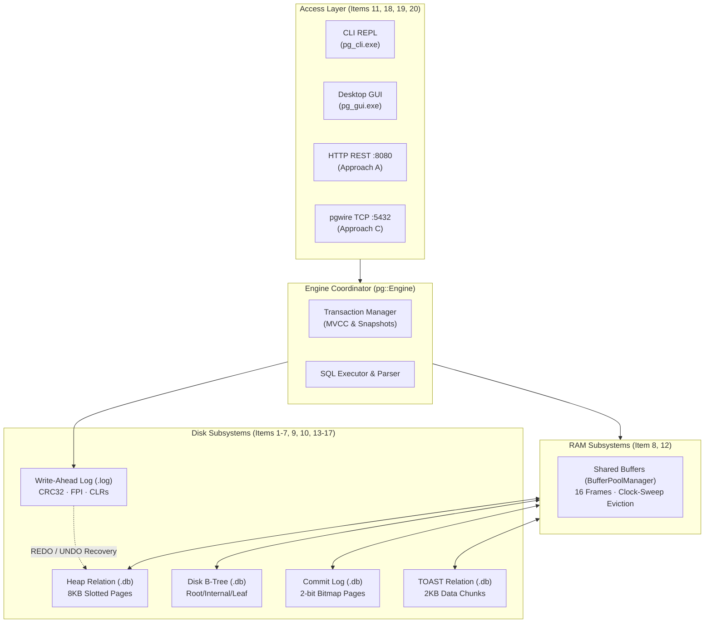
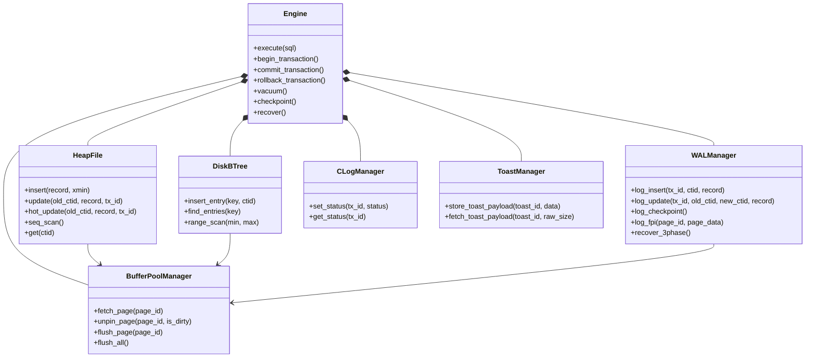

# PostgreSQL Storage Engine Architecture & Orientation

**Confidence**: `verified`  
**Citations**: [include/pg/engine.h:1-85](file:///c:/Users/jerie/Documents/GitHub/cpp-postgres/include/pg/engine.h), [src/engine.cpp:1-250](file:///c:/Users/jerie/Documents/GitHub/cpp-postgres/src/engine.cpp), [CMakeLists.txt:1-150](file:///c:/Users/jerie/Documents/GitHub/cpp-postgres/CMakeLists.txt)

---

## 1. Executive Overview

`cpp-postgres` is a production-accurate, zero-external-dependency relational storage engine implemented in C++20. It faithfully reproduces the exact internal disk formats, concurrency mechanisms, memory structures, and crash recovery algorithms utilized by PostgreSQL.

The architecture is partitioned into strict, decoupled layers:

---

## 2. Global Subsystem Invariants

The entire storage engine enforces seven architectural invariants:

1. **8KB Page Uniformity**: All disk structures (Heap, B-Tree, CLOG, TOAST) operate on fixed 8,192-byte page boundaries aligned to the OS block layer (`[include/pg/page.h:12]`).
2. **Buffer Pool Single Gateway**: Application subsystems never execute direct file I/O; all page accesses pin frames inside `BufferPoolManager` (`[src/heap.cpp:45]`).
3. **Write-Ahead Logging (WAL)**: A dirty page in RAM is never written to disk until its corresponding WAL log record has been flushed (`page.pd_lsn <= wal.flushed_lsn`) (`[src/wal.cpp:110]`).
4. **Append-Only MVCC**: Updates never mutate live data in place; they stamp `xmax` on the old tuple version and append a new version with `xmin` (`[src/heap.cpp:88]`).
5. **Secondary Index Decoupling**: B-Tree secondary indexes map `Key -> CTID` physical addresses without embedding tuple columns or MVCC headers (`[src/btree.cpp:15]`).
6. **Zero Index-Bloat HOT Updates**: Unindexed column updates residing on the same 8KB page construct line-pointer chains with zero index writes (`[src/heap.cpp:142]`).
7. **2-Bit CLOG Density**: Transaction commit states are packed into 2-bit bitmaps on disk, scaling to 32,768 transactions per 8KB page (`[src/clog.cpp:30]`).

---

## 3. Subsystem Dependency Matrix

