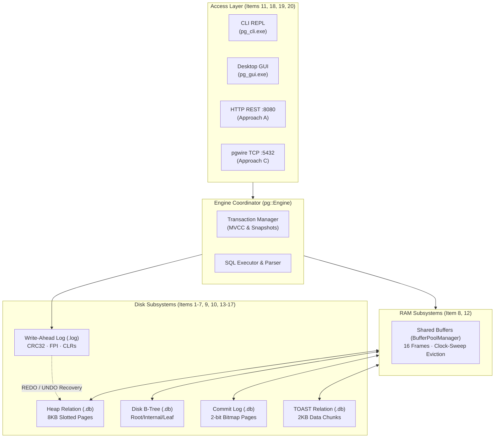
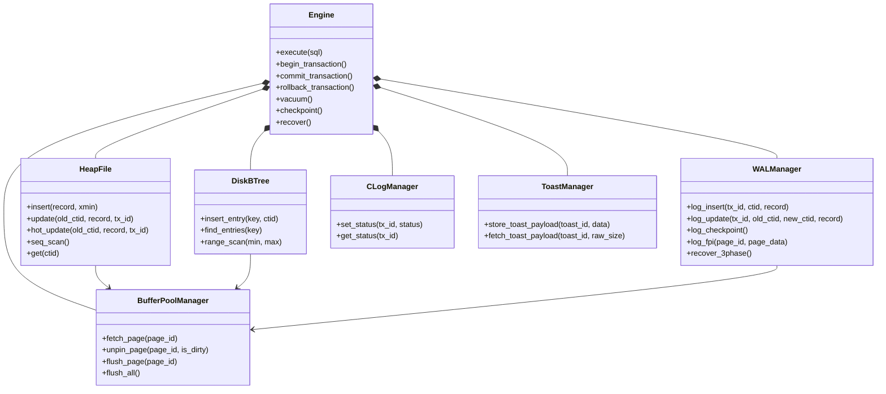

# PostgreSQL Storage Engine Architecture & Orientation

**Confidence**: `verified`  
**Citations**: [include/pg/engine.h:1-85](file:///c:/Users/jerie/Documents/GitHub/cpp-postgres/include/pg/engine.h), [src/engine.cpp:1-250](file:///c:/Users/jerie/Documents/GitHub/cpp-postgres/src/engine.cpp), [CMakeLists.txt:1-150](file:///c:/Users/jerie/Documents/GitHub/cpp-postgres/CMakeLists.txt)

---

## 1. Executive Overview

`cpp-postgres` is a zero-external-dependency relational storage engine implemented in C++20, written to teach PostgreSQL storage internals. It reproduces PostgreSQL's **mechanisms** — slotted pages, MVCC visibility rules, HOT chains, clock-sweep buffer replacement, WAL with full-page images, 2-bit CLOG bitmaps, and TOAST chunking — using deliberately narrowed struct layouts.

> **Implementation status.** The behavioural audit in
> `notes/2026-08-27-architecture-audit.md` found that several mechanisms
> documented here existed as code but were not wired into the running
> system, and that write-ahead durability and the single-gateway rule were
> not upheld. Those are fixed as of 2026-08-27; each chapter carries an
> *Implementation status* section where its behaviour changed, and the audit
> holds the per-finding status table.
>
> **Fidelity disclaimer.** This engine is *not* byte-compatible with a real PostgreSQL data directory, and several documented structures are smaller than PostgreSQL's. The single largest algorithmic divergence is crash recovery: `cpp-postgres` implements textbook **ARIES with an UNDO pass and CLRs**, whereas **PostgreSQL is redo-only and has no UNDO pass and no compensation log records at all** (see Item 16). Section 4 below is the authoritative fidelity ledger; every chapter ends with its own *PostgreSQL Fidelity Check*.

The architecture is partitioned into strict, decoupled layers:

---

## 2. Global Subsystem Invariants

The entire storage engine enforces seven architectural invariants:

1. **8KB Page Uniformity**: All disk structures (Heap, B-Tree, CLOG, TOAST) operate on fixed 8,192-byte page boundaries aligned to the OS block layer (`[include/pg/constants.h:9]`). *PostgreSQL parity*: `BLCKSZ` defaults to 8192 but is a compile-time option (1 KB – 32 KB); `cpp-postgres` hard-codes 8192.
2. **Buffer Pool Single Gateway**: Application subsystems never execute direct file I/O; all page accesses pin frames inside `BufferPoolManager` (`[src/heap.cpp:45]`).
3. **Write-Ahead Logging (WAL)**: A dirty page in RAM is never written to disk until its corresponding WAL log record has been flushed (`page.pd_lsn <= wal.flushed_lsn`) (`[src/wal.cpp:110]`).
4. **Append-Only MVCC**: Updates never rewrite a tuple's *payload* in place; they append a new version stamped with `xmin` and mark the old version by writing `xmax` into its header. Note that the header write **is** an in-place page mutation — which is precisely why the delete/update must be WAL-logged (`[src/heap.cpp:88]`).
5. **Secondary Index Decoupling**: B-Tree secondary indexes map `Key -> CTID` physical addresses without embedding tuple columns or MVCC headers (`[src/btree.cpp:15]`).
6. **Zero Index-Bloat HOT Updates**: Unindexed column updates residing on the same 8KB page construct line-pointer chains with zero index writes (`[src/heap.cpp:142]`).
7. **2-Bit CLOG Density**: Transaction commit states are packed into 2-bit bitmaps on disk, scaling to 32,768 transactions per 8KB page (`[src/clog.cpp:30]`). *PostgreSQL parity*: exact — `CLOG_XACTS_PER_PAGE` is also 32,768, and the four status codes match bit-for-bit.

---

## 3. Subsystem Dependency Matrix

---

## 4. PostgreSQL Fidelity Ledger

Verified against PostgreSQL `master` headers (`bufpage.h`, `itemid.h`, `htup_details.h`, `heaptoast.h`, `clog.h`, `xlogrecord.h`, `nbtree.h`).

### 4.1 Structures that match PostgreSQL exactly

| Structure | Value | PostgreSQL source |
|---|---|---|
| Line pointer size | 4 bytes | `ItemIdData` |
| Line-pointer state codes | `UNUSED=0, NORMAL=1, REDIRECT=2, DEAD=3` | `LP_UNUSED/LP_NORMAL/LP_REDIRECT/LP_DEAD` |
| `t_ctid` size | 6 bytes | `ItemPointerData` |
| `PD_ALL_VISIBLE` | `0x0004` | `bufpage.h` |
| CLOG transactions per page | 32,768 | `CLOG_XACTS_PER_PAGE` |
| CLOG status codes | `00/01/10/11` = in-progress/committed/aborted/sub-committed | `clog.h` |
| `HEAP_HOT_UPDATED` / `HEAP_ONLY_TUPLE` | `0x4000` / `0x8000` | `htup_details.h` (but in `t_infomask2`, not `t_infomask`) |
| Max heap tuples per 8KB page | 291 | `MaxHeapTuplesPerPage` — same number, reached by different arithmetic |
| pgwire protocol | v3.0, `SSLRequest` code 80877103 | `pqcomm.h` |

### 4.2 Structures that are narrower than PostgreSQL's

| Structure | cpp-postgres | PostgreSQL | Missing |
|---|---|---|---|
| Page header | 18 B | **24 B** (`SizeOfPageHeaderData`) | `pd_pagesize_version` (2 B), `pd_prune_xid` (4 B) |
| Line-pointer bit split | 16 / 14 / 2 (offset / len / flags) | **15 / 2 / 15** (`lp_off` / `lp_flags` / `lp_len`) | — |
| Tuple header | 16 B | **23 B** (`SizeofHeapTupleHeader`, MAXALIGNed to 24) | `t_cid` union (4 B), `t_infomask2` (2 B), `t_hoff` (1 B), `t_bits` null bitmap |
| Infomask | one 16-bit `infomask` | two words: `t_infomask` + `t_infomask2` | 16 visibility/lock flags incl. all hint bits |
| `HEAP_HASEXTERNAL` | `0x2000` | **`0x0004`** (`0x2000` is `HEAP_UPDATED`) | — |
| WAL record header | 35 B, custom | 24 B `XLogRecord` + rmgr block headers | resource managers, block references |
| WAL checksum | CRC-32 (IEEE 802.3) | **CRC-32C (Castagnoli)** | — |
| TOAST threshold | 2048 B per attribute | **2032 B per whole tuple** (`TOAST_TUPLE_THRESHOLD`) | — |
| TOAST chunk size | 2048 B | **1996 B** (`TOAST_MAX_CHUNK_SIZE`) | — |
| Buffer pool | 16 frames | 16,384 frames (128 MB `shared_buffers` default) | freelist, strategy rings, usage-count cap of 5 |
| B-tree node | parent pointer + right sibling | Lehman & Yao: metapage, high key, `btpo_prev`/`btpo_next`, **no parent pointers** | deduplication, fillfactor splits |

### 4.3 PostgreSQL mechanisms this engine does not model at all

- **Transaction ID wraparound and freezing** (`FrozenTransactionId`, `vacuum_freeze_min_age`, anti-wraparound autovacuum). `tx_id_t` here is a plain monotonic `uint32_t` that is never frozen.
- **Hint bits** (`HEAP_XMIN_COMMITTED`, `HEAP_XMAX_COMMITTED`, …) — PostgreSQL caches CLOG lookups in the tuple header; this engine hits CLOG on every visibility test.
- **Visibility map / free space map**, and therefore **index-only scans**.
- **MultiXactIds** and row-level locking (`SELECT … FOR UPDATE` also writes `xmax` in PostgreSQL).
- **Sub-transactions / savepoints**, despite CLOG reserving the `SUB_COMMITTED` code.
- **Autovacuum, the checkpointer, the WAL writer, and the background writer** as separate processes.
- **Streaming replication, logical decoding, replication slots.**
- **Isolation levels.** PostgreSQL defaults to Read Committed (new snapshot per statement) and offers Repeatable Read and Serializable (SSI); this engine implements one snapshot-per-transaction model only.
- **The query planner and executor** — no cost model, no join methods, no statistics.
