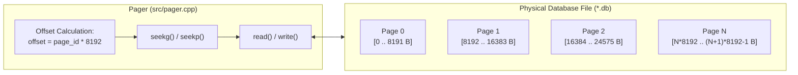
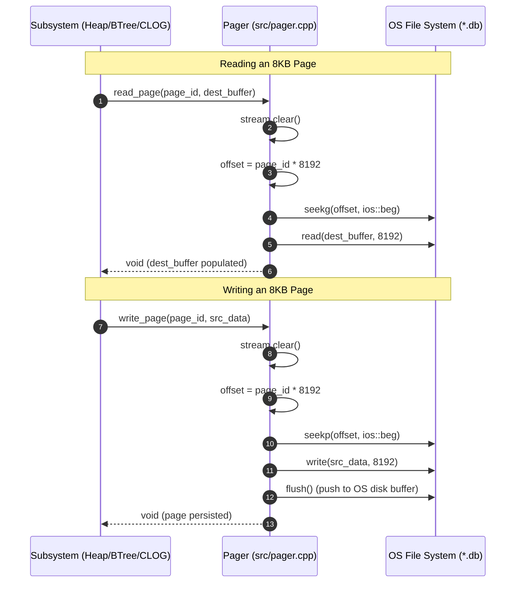

# Item 1: Pager & 8KB Fixed Page Disk I/O

**Confidence**: `verified`  
**Citations**: [include/pg/pager.h:1-62](file:///c:/Users/jerie/Documents/GitHub/cpp-postgres/include/pg/pager.h), [src/pager.cpp:1-85](file:///c:/Users/jerie/Documents/GitHub/cpp-postgres/src/pager.cpp), [tests/test_pager.cpp:1-95](file:///c:/Users/jerie/Documents/GitHub/cpp-postgres/tests/test_pager.cpp)

---

## 1. Architectural Role

The **Pager** is the lowest-level storage primitive in the database engine. It abstracts the host operating system's filesystem into a linear sequence of fixed-size **8,192-byte (8KB)** disk pages indexed by a 32-bit `page_id_t`.

---

## 2. Invariants & Formulas

1. **Exact Page Boundary Alignment**:
   $$\text{file\_offset} = \text{page\_id} \times 8192$$
   Every disk read and write transfers exactly $8,192\text{ bytes}$. No partial page I/O is ever permitted.
2. **Deterministic File Growth**:
   When `write_page(page_id, ...)` is called on an unallocated `page_id \ge \text{num\_pages()}`, the file automatically grows in discrete 8KB increments padded with zeros (`[src/pager.cpp:52]`).
3. **C++ Stream Flag Integrity**:
   Because reading past EOF in `std::fstream` sets `eofbit` and `failbit`, subsequent seek operations silently fail unless `stream.clear()` is invoked prior to any seek or write (`[src/pager.cpp:25]`).

---

## 3. Sequence Diagram: Reading & Writing Pages

