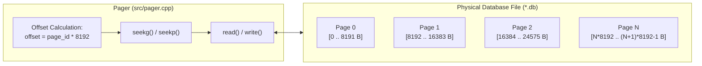
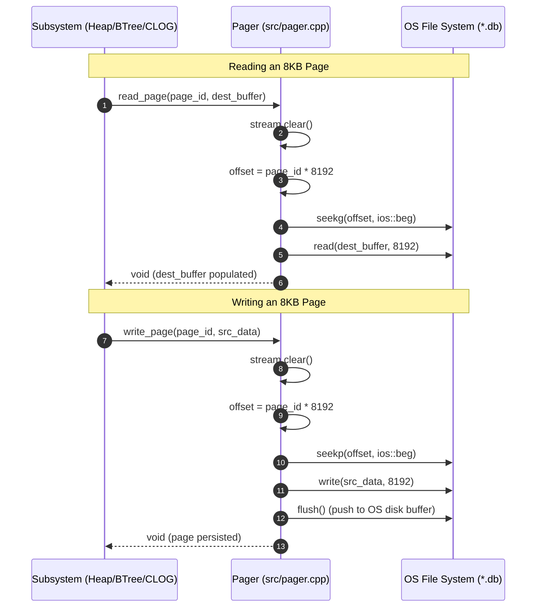

# Item 1: Pager & 8KB Fixed Page Disk I/O

**Confidence**: `verified`  
**Citations**: [include/pg/pager.h:1-62](file:///c:/Users/jerie/Documents/GitHub/cpp-postgres/include/pg/pager.h), [src/pager.cpp:1-85](file:///c:/Users/jerie/Documents/GitHub/cpp-postgres/src/pager.cpp), [tests/test_pager.cpp:1-95](file:///c:/Users/jerie/Documents/GitHub/cpp-postgres/tests/test_pager.cpp)

---

## 1. Architectural Role

The **Pager** is the lowest-level storage primitive in the database engine. It abstracts the host operating system's filesystem into a linear sequence of fixed-size **8,192-byte (8KB)** disk pages indexed by a 32-bit `page_id_t`.

---

## 2. Invariants & Formulas

1. **Exact Page Boundary Alignment**:
   $$\text{file\_offset} = \text{page\_id} \times 8192$$
   Every disk read and write transfers exactly $8,192\text{ bytes}$. No partial page I/O is ever permitted.
2. **Deterministic File Growth**:
   When `write_page(page_id, ...)` is called on an unallocated `page_id \ge \text{num\_pages()}`, the file automatically grows in discrete 8KB increments padded with zeros (`[src/pager.cpp:52]`).
3. **C++ Stream Flag Integrity**:
   Because reading past EOF in `std::fstream` sets `eofbit` and `failbit`, subsequent seek operations silently fail unless `stream.clear()` is invoked prior to any seek or write (`[src/pager.cpp:25]`).

---

## 3. Sequence Diagram: Reading & Writing Pages

---

## 4. PostgreSQL Fidelity Check

PostgreSQL's counterpart to the Pager is the **storage manager** (`smgr`), whose only implementation is `md.c` ("magnetic disk").

| Claim | Verdict |
|---|---|
| Relation file addressed as a linear array of fixed 8KB blocks | **Exact** |
| `offset = block_number * BLCKSZ`, whole blocks only, never partial I/O | **Exact** |
| Writing past the end extends the file in whole-block increments | **Exact in shape** — PostgreSQL's `mdextend()` zero-fills |
| `stream.clear()` before seek after EOF | **C++-specific** — an artifact of `std::fstream`, no PostgreSQL analogue |
| `flush()` after every write | **Divergent** — see below |

### What PostgreSQL layers on top

- **Segmentation.** A relation larger than 1 GB is split into `<relfilenode>`, `<relfilenode>.1`, `<relfilenode>.2`, … Block 200,000 lives in segment 1 at an offset computed modulo `RELSEG_SIZE`. This engine uses one unbounded file.
- **Forks.** Each relation has a *main* fork plus `_fsm` (free space map), `_vm` (visibility map) and, for unlogged tables, `_init`. Only the main fork exists here.
- **fsync is deferred, not per-write.** PostgreSQL writes with buffered `pwrite()` and hands the fsync obligation to the checkpointer through a shared request queue (`register_dirty_segment`), so durability is paid once per checkpoint rather than once per page. Flushing on every `write_page()`, as here, is far more conservative — and far slower — than PostgreSQL.
- **`relfilenode` vs OID.** Filenames are `relfilenode` numbers, which *change* under `VACUUM FULL`, `TRUNCATE` and `REINDEX`; they are not the table's OID.
- **Direct I/O and readahead.** `io_method` / `debug_io_direct`, and from v17 a streaming read interface that batches sequential block requests.

### Implementation status (2026-08-27)

The Pager no longer uses `std::fstream`. It sits on a raw descriptor (`pg::File`)
with positioned reads and writes, which gives it two things a stream cannot:

- **A real durability barrier.** `Pager::sync()` calls `fdatasync` (`_commit` on
  Windows). `std::fstream::flush()` only drains the userspace buffer into the OS
  page cache, so before this the WAL was not durable at all.
- **No sticky stream state.** Positioned I/O has no shared cursor, so a read that
  hits end-of-file cannot silently suppress a later write. That failure mode had
  been quietly discarding the WAL records written during crash recovery.

Still simplified: one file per relation with no 1GB segmentation, no forks, and
`fsync` at checkpoint rather than through a checkpointer's request queue.
