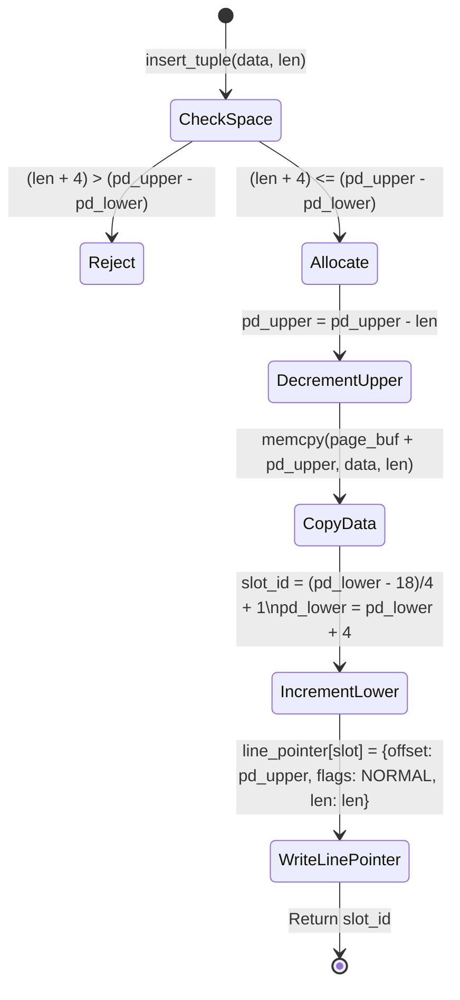

# Item 2: Slotted Page Architecture

**Confidence**: `verified`  
**Citations**: [include/pg/page.h:1-125](file:///c:/Users/jerie/Documents/GitHub/cpp-postgres/include/pg/page.h), [src/page.cpp:1-170](file:///c:/Users/jerie/Documents/GitHub/cpp-postgres/src/page.cpp), [tests/test_page.cpp:1-110](file:///c:/Users/jerie/Documents/GitHub/cpp-postgres/tests/test_page.cpp)

---

## 1. Physical Memory Layout

The **Slotted Page** architecture solves variable-length record management and in-place defragmentation. Within each 8,192-byte page, memory grows inward from both ends:

```text
┌────────────────────────────────────────────────────────────────────────────────────────┐
│ 8192-Byte Slotted Page Physical Memory Layout                                         │
├───────────────┬──────────────┬──────────────┬──────────────┬─────────────┬─────────────┤
│ PageHeader    │ Line Pointer │ Line Pointer │ Free Space   │ Tuple Data  │ Tuple Data  │
│ (18 Bytes)    │ Slot 1 (4B)  │ Slot 2 (4B)  │ (Contiguous) │ Version 2   │ Version 1   │
│ [0 .. 17]     │ [18 .. 21]   │ [22 .. 25]   │              │             │             │
└───────────────┴──────────────┴──────────────┴──────────────┴─────────────┴─────────────┘
0              18             22             pd_lower       pd_upper      8168          8192
▲                                            ▲              ▲                           ▲
└─────────── Growing Downward ───────────────┘              └───── Growing Upward ──────┘
```

---

## 2. Invariants & Mathematical Formulas

1. **Page Header Structure (18 Bytes)**:
   - `pd_lsn` (8 Bytes): LSN of the last WAL record that modified this page (`[include/pg/page.h:20]`).
   - `pd_flags` (2 Bytes): Page status flags (e.g. `PD_ALL_VISIBLE = 0x0004`).
   - `pd_lower` (2 Bytes): Byte offset marking the end of the line pointers array (initially 18).
   - `pd_upper` (2 Bytes): Byte offset marking the start of the youngest tuple data (initially 8192).
   - `pd_special` (2 Bytes): Reserved for index-specific metadata (8192 for heap pages).
   - `pd_prune_xid` (2 Bytes): Oldest unpruned XID.

2. **Line Pointer Bitfield Packing (4 Bytes)**:
   $$\text{Line Pointer (uint32\_t)} = (\text{offset} \ \& \ \text{0x7FFF}) \ | \ ((\text{flags} \ \& \ \text{0x03}) \ll 15) \ | \ ((\text{length} \ \& \ \text{0x7FFF}) \ll 17)$$
   - `lp_offset` (15 bits): Byte offset to tuple data.
   - `lp_flags` (2 bits): `00` = `UNUSED`, `01` = `NORMAL` (Live), `10` = `REDIRECT` (HOT chain), `11` = `DEAD`.
   - `lp_len` (15 bits): Byte length of tuple.

3. **Free Space Allocation Formula**:
   $$\text{Free Space Available} = \text{pd\_upper} - \text{pd\_lower} - 4$$
   Every tuple insertion requires both tuple payload memory ($\ge \text{len}$) and a new 4-byte line pointer in the header array.

---

## 3. Tuple Insertion State Machine


