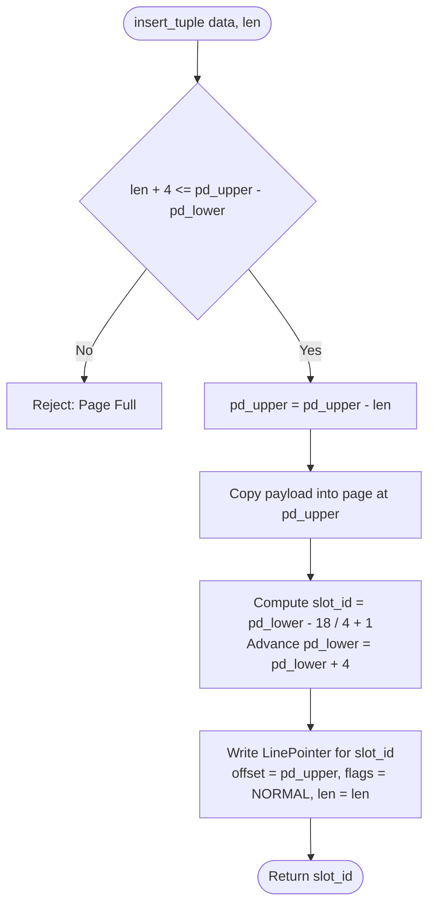

# Item 2: Slotted Page Architecture

**Confidence**: `verified`  
**Citations**: [include/pg/page.h:1-125](file:///c:/Users/jerie/Documents/GitHub/cpp-postgres/include/pg/page.h), [src/page.cpp:1-170](file:///c:/Users/jerie/Documents/GitHub/cpp-postgres/src/page.cpp), [tests/test_page.cpp:1-110](file:///c:/Users/jerie/Documents/GitHub/cpp-postgres/tests/test_page.cpp)

---

## 1. Physical Memory Layout

The **Slotted Page** architecture solves variable-length record management and in-place defragmentation. Within each 8,192-byte page, memory grows inward from both ends:

```text
┌────────────────────────────────────────────────────────────────────────────────────────┐
│ 8192-Byte Slotted Page Physical Memory Layout                                         │
├───────────────┬──────────────┬──────────────┬──────────────┬─────────────┬─────────────┤
│ PageHeader    │ Line Pointer │ Line Pointer │ Free Space   │ Tuple Data  │ Tuple Data  │
│ (18 Bytes)    │ Slot 1 (4B)  │ Slot 2 (4B)  │ (Contiguous) │ Version 2   │ Version 1   │
│ [0 .. 17]     │ [18 .. 21]   │ [22 .. 25]   │              │             │             │
└───────────────┴──────────────┴──────────────┴──────────────┴─────────────┴─────────────┘
0              18             22             pd_lower       pd_upper      8168          8192
▲                                            ▲              ▲                           ▲
└─────────── Growing Downward ───────────────┘              └───── Growing Upward ──────┘
```

---

## 2. Invariants & Mathematical Formulas

1. **Page Header Structure (18 Bytes — PostgreSQL uses 24)** (`[include/pg/page.h:41-48]`):
   - `pd_lsn` (8 Bytes): LSN of the last WAL record that modified this page (`[include/pg/page.h:42]`).
   - `pd_checksum` (2 Bytes): Page checksum (`[include/pg/page.h:43]`).
   - `pd_flags` (2 Bytes): Page status flags (e.g. `PD_ALL_VISIBLE = 0x0004`).
   - `pd_lower` (2 Bytes): Byte offset marking the end of the line pointers array (initially 18).
   - `pd_upper` (2 Bytes): Byte offset marking the start of the youngest tuple data (initially 8192).
   - `pd_special` (2 Bytes): Reserved for index-specific metadata (8192 for heap pages — same convention as PostgreSQL, where a heap page has no special area).

   PostgreSQL's `PageHeaderData` is **24 bytes** (`SizeOfPageHeaderData`). The first six fields are identical in order and width; PostgreSQL then adds two fields this engine omits:
   - `pd_pagesize_version` (2 Bytes): page size in the high byte, layout version in the low byte — the check that refuses to mount a data directory built with a different `BLCKSZ`.
   - `pd_prune_xid` (4 Bytes): hint holding the oldest XID on the page that might be prunable. This is what lets an ordinary `SELECT` decide cheaply whether HOT pruning is worth attempting (Item 7).

   `pd_flags` values match PostgreSQL exactly: `PD_HAS_FREE_LINES = 0x0001`, `PD_PAGE_FULL = 0x0002`, `PD_ALL_VISIBLE = 0x0004`.

2. **Line Pointer Layout (4 Bytes)** (`[include/pg/page.h:22-38]`):
   - `lp_offset` (uint16_t, 16 bits): Byte offset from start of page where tuple data begins.
   - `lp_len_flags` (uint16_t, 16 bits):
     - Lower 14 bits (`0x3FFF`): Byte length of tuple.
     - Upper 2 bits (`>> 14`): `ItemFlags` (`00` = `UNUSED`, `01` = `NORMAL` (Live), `10` = `REDIRECT` (HOT chain), `11` = `DEAD`).

   The **size (4 bytes) and the four state codes are identical to PostgreSQL**, but the bit split is not. PostgreSQL's `ItemIdData` is a single 32-bit bitfield triple:
   ```c
   unsigned lp_off:15,    /* offset to tuple from start of page */
            lp_flags:2,   /* LP_UNUSED / LP_NORMAL / LP_REDIRECT / LP_DEAD */
            lp_len:15;    /* byte length of tuple */
   ```
   15 bits is exactly enough to address any byte in a 32 KB page, which is why PostgreSQL caps `BLCKSZ` at 32 KB. This engine's 16/14/2 split gives the same practical range at 8 KB but is a different physical encoding.

   PostgreSQL also attaches meaning to the flag states that this engine does not yet enforce: `LP_REDIRECT` and `LP_UNUSED` must have `lp_len == 0`, and `LP_DEAD` is set by index scans (the `kill_prior_tuple` optimisation) as well as by pruning.

3. **Free Space Allocation Formula**:
   $$\text{Free Space Available} = \text{pd\_upper} - \text{pd\_lower} - 4$$
   Every tuple insertion requires both tuple payload memory ($\ge \text{len}$) and a new 4-byte line pointer in the header array.

   PostgreSQL's `PageGetFreeSpace()` computes the same difference, but two extra rules apply that this engine does not implement:
   - Every item is **MAXALIGNed** (8 bytes on 64-bit), so the true cost of a tuple is `MAXALIGN(len) + 4`, not `len + 4`.
   - `PageGetHeapFreeSpace()` additionally reports zero once the page already holds `MaxHeapTuplesPerPage` (291) line pointers, because no further line pointer can be addressed.

---

## 3. Tuple Insertion Algorithm



---

## 4. PostgreSQL Fidelity Check

| Claim | Verdict |
|---|---|
| Slotted layout, header + line pointers growing up, tuples growing down | **Exact** |
| `pd_lsn`, `pd_checksum`, `pd_flags`, `pd_lower`, `pd_upper`, `pd_special` order and widths | **Exact** |
| `PD_ALL_VISIBLE = 0x0004` | **Exact** |
| Line pointer = 4 bytes; states `UNUSED/NORMAL/REDIRECT/DEAD` = 0/1/2/3 | **Exact** |
| Page header is 18 bytes | **Simplified** — PostgreSQL is 24 (`pd_pagesize_version`, `pd_prune_xid` omitted) |
| Line-pointer bit split 16/14/2 | **Divergent** — PostgreSQL is 15/2/15 |
| `free = pd_upper - pd_lower - 4` | **Simplified** — PostgreSQL MAXALIGNs items and caps line pointers at 291 |
| Page checksum | **Not implemented** — `pd_checksum` is stored but never computed; PostgreSQL uses an FNV-1a-based 16-bit page checksum |

### Implementation status (2026-08-27)

`Page` is now a **view** over 8192 bytes it does not own, so callers work
directly inside a pinned buffer frame the way `BufferGetPage()` does. `PageBuffer`
owns storage where a page genuinely needs its own (recovery scratch, fresh pages,
tests).

`insert_tuple` no longer recycles `LP_DEAD` line pointers — only `LP_UNUSED`.
A DEAD pointer may still be the target of an index entry VACUUM has not cleaned
yet, and handing that slot to a new tuple makes the stale entry resolve to an
unrelated row. `Page::insert_tuple_at` was added for WAL redo, which must restore
a tuple to the exact slot the record names rather than letting the page choose.
