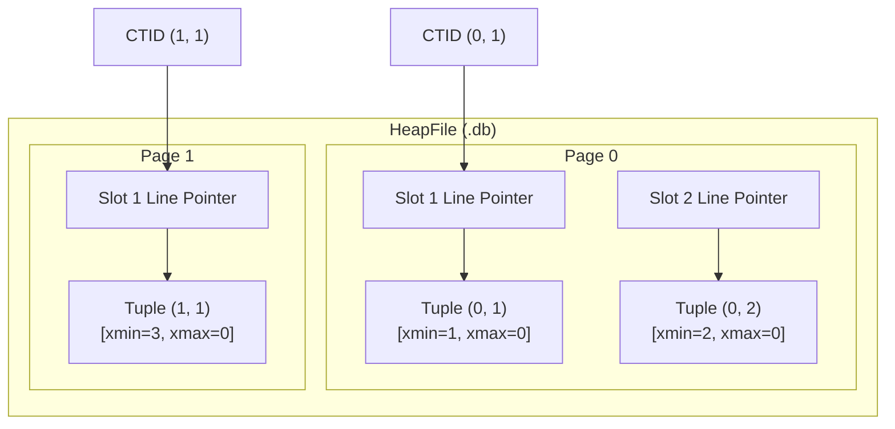
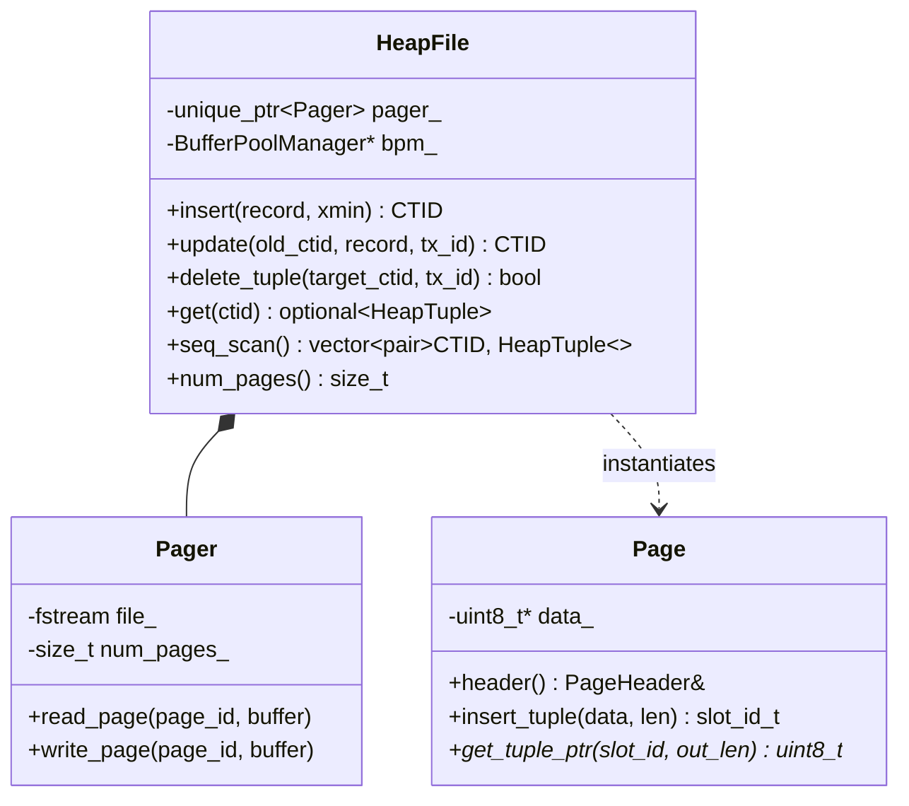

# Item 3: Tuples & Heap CTID Physical Addressing

**Confidence**: `verified`  
**Citations**: [include/pg/tuple.h:1-90](file:///c:/Users/jerie/Documents/GitHub/cpp-postgres/include/pg/tuple.h), [include/pg/heap.h:1-82](file:///c:/Users/jerie/Documents/GitHub/cpp-postgres/include/pg/heap.h), [src/heap.cpp:1-210](file:///c:/Users/jerie/Documents/GitHub/cpp-postgres/src/heap.cpp), [tests/test_heap.cpp:1-120](file:///c:/Users/jerie/Documents/GitHub/cpp-postgres/tests/test_heap.cpp)

---

## 1. Physical CTID Tuple Addressing

Every row version in the database is uniquely addressed by its **CTID (Current Tuple ID)**:

$$\text{CTID} = (\text{page\_id}, \text{slot\_id})$$

---

## 2. Invariants & Binary Layout

1. **TupleHeader Structure (16 Bytes)** (`[include/pg/tuple.h:42-47]`):
   - `xmin` (4 Bytes): Transaction ID that inserted this row version.
   - `xmax` (4 Bytes): Transaction ID that deleted or updated this row version (`0` if currently live).
   - `t_ctid` (6 Bytes): Forward pointer `CTID {page, slot}` to the newest row version (or self-reference `(page, slot)` if newest).
   - `infomask` (2 Bytes): Status flags (`HEAP_HASEXTERNAL = 0x2000`, `HEAP_HOT_UPDATED = 0x4000`, `HEAP_ONLY_TUPLE = 0x8000`).

2. **Physical Tuple Capacity Derivation**:
   For an 8KB page with 18-byte page header and 24-byte serialized heap tuples (16B header + 8B data `item_id + price`), the maximum row capacity per page is:
   $$\text{Max Tuples Per Page} = \left\lfloor \frac{8192 - 18}{24 + 4} \right\rfloor = \left\lfloor \frac{8174}{28} \right\rfloor = 291 \text{ tuples}$$

---

## 3. Class Diagram: HeapFile & Pager Relationship

