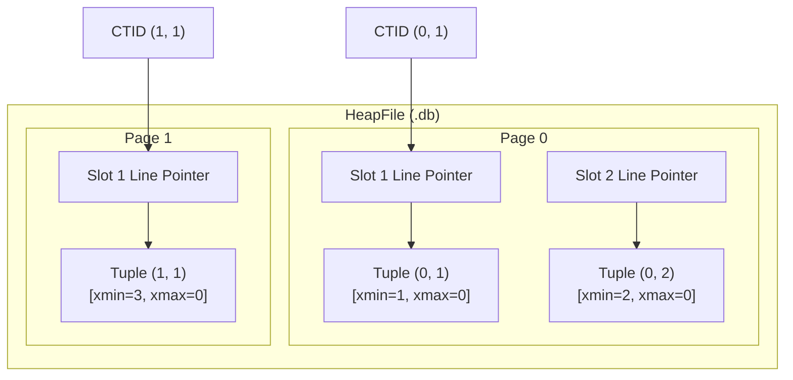
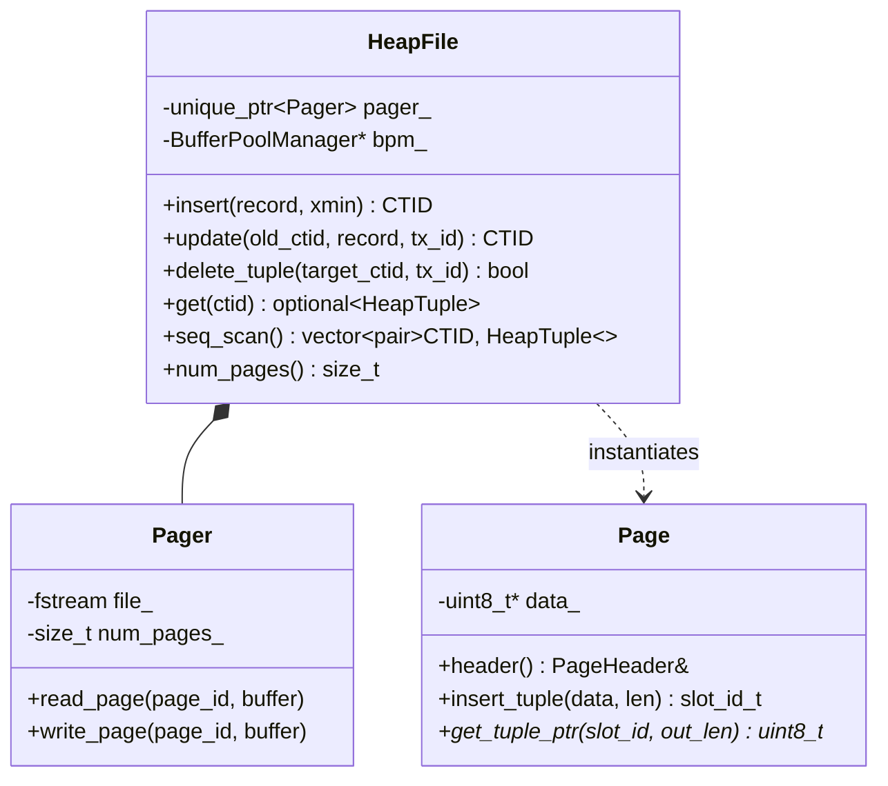

# Item 3: Tuples & Heap CTID Physical Addressing

**Confidence**: `verified`  
**Citations**: [include/pg/tuple.h:1-90](file:///c:/Users/jerie/Documents/GitHub/cpp-postgres/include/pg/tuple.h), [include/pg/heap.h:1-82](file:///c:/Users/jerie/Documents/GitHub/cpp-postgres/include/pg/heap.h), [src/heap.cpp:1-210](file:///c:/Users/jerie/Documents/GitHub/cpp-postgres/src/heap.cpp), [tests/test_heap.cpp:1-120](file:///c:/Users/jerie/Documents/GitHub/cpp-postgres/tests/test_heap.cpp)

---

## 1. Physical CTID Tuple Addressing

Every row version in the database is uniquely addressed by its **CTID** — in PostgreSQL an `ItemPointerData`, surfaced to SQL as the system column `ctid`:

$$\text{CTID} = (\text{page\_id}, \text{slot\_id})$$

---

## 2. Invariants & Binary Layout

1. **TupleHeader Structure (16 Bytes — PostgreSQL uses 23)** (`[include/pg/tuple.h:42-47]`):
   - `xmin` (4 Bytes): Transaction ID that inserted this row version.
   - `xmax` (4 Bytes): Transaction ID that deleted or updated this row version (`0` if currently live).
   - `t_ctid` (6 Bytes): Forward pointer `CTID {page, slot}` to the newest row version (or self-reference `(page, slot)` if newest). **Exact match** for PostgreSQL's `ItemPointerData` (4-byte block id + 2-byte offset).
   - `infomask` (2 Bytes): Status flags — see the correction in invariant 2.

   PostgreSQL's `HeapTupleHeaderData` is **23 bytes** before the null bitmap, MAXALIGNed to 24 in practice:

   | Field | Size | Present here? |
   |---|---|---|
   | `t_choice` union — `t_xmin`, `t_xmax`, then `t_cid`/`t_xvac` | 12 B | partly (no `t_cid`) |
   | `t_ctid` | 6 B | yes |
   | `t_infomask2` | 2 B | **no** |
   | `t_infomask` | 2 B | merged into one 16-bit word |
   | `t_hoff` | 1 B | **no** |
   | `t_bits[]` null bitmap | variable | **no** |

   `t_cid` carries correctness this engine does not reach: it is the *command id*, which is what stops a statement from seeing rows it inserted itself within the same transaction.

2. **Infomask correction.** This engine packs three flags into one `infomask` word. In PostgreSQL those flags live in two different words, and one of the three values is not PostgreSQL's:

   | Flag | cpp-postgres | PostgreSQL | PostgreSQL field |
   |---|---|---|---|
   | `HEAP_HASEXTERNAL` | `0x2000` | **`0x0004`** | `t_infomask` |
   | `HEAP_HOT_UPDATED` | `0x4000` | `0x4000` ✅ | **`t_infomask2`** |
   | `HEAP_ONLY_TUPLE` | `0x8000` | `0x8000` ✅ | **`t_infomask2`** |

   `0x2000` in PostgreSQL's `t_infomask` is `HEAP_UPDATED` ("this tuple is the product of an UPDATE"), an unrelated flag. The values chosen here are internally consistent but are not PostgreSQL's bit assignments.

   PostgreSQL additionally uses `t_infomask` for the **hint bits** `HEAP_XMIN_COMMITTED (0x0100)`, `HEAP_XMIN_INVALID (0x0200)`, `HEAP_XMAX_COMMITTED (0x0400)`, `HEAP_XMAX_INVALID (0x0800)` — a per-tuple cache of the CLOG answer, so a repeated visibility test costs zero CLOG page reads. This engine has no hint bits and consults CLOG every time (Item 13).

3. **Physical Tuple Capacity Derivation**:
   For an 8KB page with 18-byte page header and 24-byte serialized heap tuples (16B header + 8B data `item_id + price`), the maximum row capacity per page is:
   $$\text{Max Tuples Per Page} = \left\lfloor \frac{8192 - 18}{24 + 4} \right\rfloor = \left\lfloor \frac{8174}{28} \right\rfloor = 291 \text{ tuples}$$

   By coincidence this equals PostgreSQL's `MaxHeapTuplesPerPage`, which reaches 291 by different arithmetic:
   $$\left\lfloor \frac{8192 - 24}{\text{MAXALIGN}(23) + 4} \right\rfloor = \left\lfloor \frac{8168}{28} \right\rfloor = 291$$
   In PostgreSQL 291 is a hard structural ceiling on line pointers per heap page, not merely the capacity for one particular row width.

---

## 3. Class Diagram: HeapFile & Pager Relationship

---

## 4. PostgreSQL Fidelity Check

| Claim | Verdict |
|---|---|
| CTID = (block, offset), 6 bytes, offsets 1-based | **Exact** (`ItemPointerData`) |
| `t_ctid` self-references on the newest version, forward-points on update | **Exact** |
| `xmin` / `xmax` are 4-byte XIDs at the head of the tuple header | **Exact** |
| Tuple header is 16 bytes | **Simplified** — PostgreSQL is 23 B (`t_cid`, `t_infomask2`, `t_hoff`, `t_bits` omitted) |
| `HEAP_HASEXTERNAL = 0x2000` | **Wrong for PostgreSQL** — real value is `0x0004`; `0x2000` is `HEAP_UPDATED` |
| `HEAP_HOT_UPDATED` / `HEAP_ONLY_TUPLE` live in `infomask` | **Wrong field** — PostgreSQL stores both in `t_infomask2` |
| 291 tuples per page | **Coincidentally exact** — matches `MaxHeapTuplesPerPage` |
| `xmax == 0` means live | **Simplified** — PostgreSQL also writes `xmax` for row *locks* (`HEAP_XMAX_LOCK_ONLY`) and for `MultiXactId`s, neither of which deletes the row |
