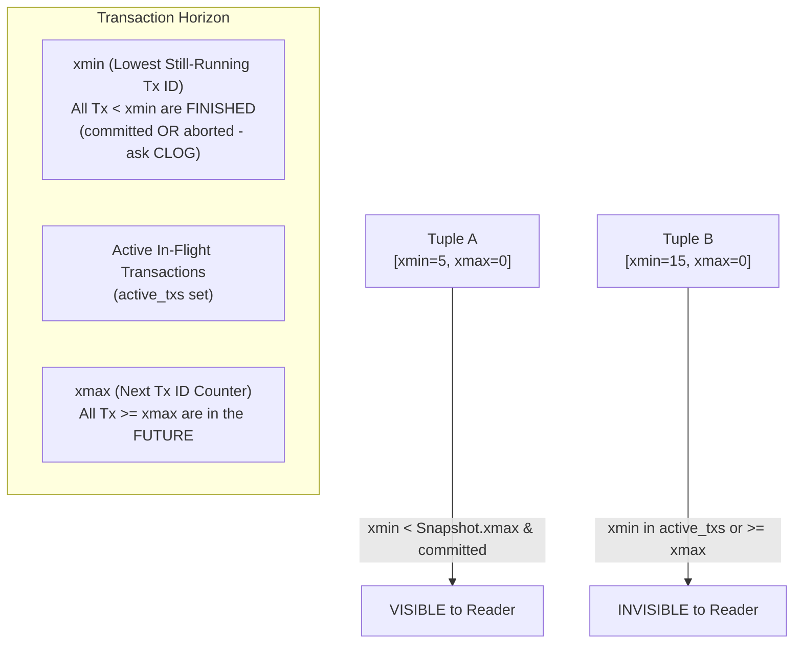
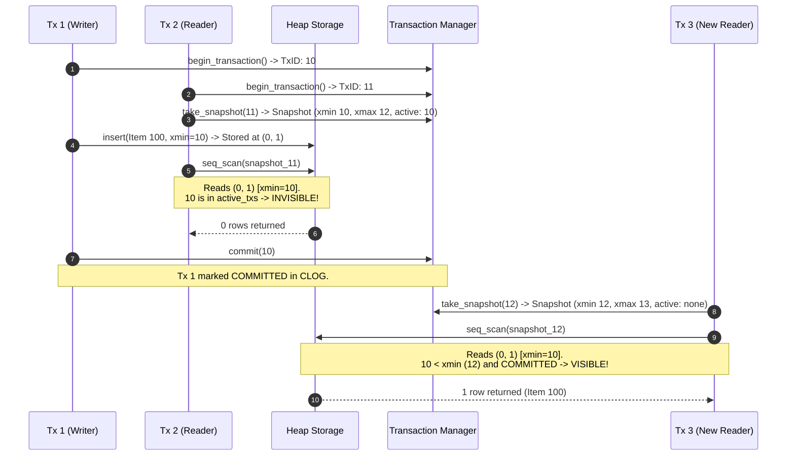

# Item 4: MVCC & Transaction Snapshot Visibility

**Confidence**: `verified`  
**Citations**: [include/pg/tx.h:1-75](file:///c:/Users/jerie/Documents/GitHub/cpp-postgres/include/pg/tx.h), [include/pg/mvcc.h:1-45](file:///c:/Users/jerie/Documents/GitHub/cpp-postgres/include/pg/mvcc.h), [src/tx.cpp:1-95](file:///c:/Users/jerie/Documents/GitHub/cpp-postgres/src/tx.cpp), [src/mvcc.cpp:1-75](file:///c:/Users/jerie/Documents/GitHub/cpp-postgres/src/mvcc.cpp), [tests/test_mvcc.cpp:1-135](file:///c:/Users/jerie/Documents/GitHub/cpp-postgres/tests/test_mvcc.cpp)

---

## 1. Multi-Version Concurrency Control (MVCC) Overview

PostgreSQL implements multi-version concurrency control using row-version header stamps (`xmin` and `xmax`). Readers never block writers, and writers never block readers.

Two clarifications the rest of this chapter depends on:

- **Snapshot Isolation is not the default.** PostgreSQL's default isolation level is **Read Committed**, which takes a *fresh snapshot at the start of every statement*. Snapshot Isolation in the textbook sense (one snapshot for the whole transaction) is PostgreSQL's `REPEATABLE READ`. `SERIALIZABLE` layers Serializable Snapshot Isolation (SSI) predicate-lock tracking on top of that. `cpp-postgres` implements exactly one model — one snapshot per transaction — which corresponds to `REPEATABLE READ`.
- **A snapshot's `xmin` does not mean "everything below is committed."** It means everything below is *finished* — committed **or** aborted. Whether a sub-`xmin` transaction committed still has to be answered from CLOG (Item 13). PostgreSQL's own comment on `SnapshotData` is that XIDs `< xmin` are "visible to the snapshot" only in the sense that no further in-progress test is needed.

---

## 2. Invariants & Visibility State Machine

A tuple version is visible to a `Snapshot` if and only if **both** of the following conditions hold (`[src/mvcc.cpp:25]`):

0. **Preliminary**: this engine evaluates every `xmin`/`xmax` by calling into CLOG. PostgreSQL first checks the tuple's **hint bits** (`HEAP_XMIN_COMMITTED`, `HEAP_XMAX_INVALID`, …) and only falls back to CLOG on a miss, then writes the answer back into the tuple header. That write is why a pure `SELECT` can dirty pages in PostgreSQL — a behaviour this engine does not exhibit.

1. **Creation Visibility (`xmin`)**:
   - `xmin == snapshot.current_tx_id` (created by current tx), OR
   - (`xmin < snapshot.xmax` AND `xmin` is NOT in `snapshot.active_txs` AND `status(xmin) == COMMITTED`).
2. **Deletion Invisibility / Retention (`xmax`)**:
   A tuple remains visible regarding its deletion state if:
   - `xmax == 0` (never deleted or updated), OR
   - `status(xmax) == ABORTED` (deleter transaction rolled back), OR
   - `status(xmax) == IN_PROGRESS` (deleter transaction is still running concurrently), OR
   - `xmax >= snapshot.xmax` (deleted in the future after this snapshot was taken), OR
   - `xmax` IS in `snapshot.active_txs` (deleter was in-flight when snapshot started).
   *(Note: If `xmax == snapshot.current_tx_id`, the deletion was executed by the current transaction itself, making the tuple invisible).*

   **Where PostgreSQL is harder than this.** The rule above assumes `xmax != 0` means "deleted or updated". In PostgreSQL `xmax` is overloaded:
   - `HEAP_XMAX_LOCK_ONLY (0x0080)` — `xmax` records a row **lock** (`SELECT … FOR UPDATE/SHARE`), not a deletion. The row is still live.
   - `HEAP_XMAX_IS_MULTI (0x1000)` — `xmax` is a `MultiXactId`, a handle for *several* transactions locking the same row, resolved through the `pg_multixact` SLRUs.
   - `t_cid` and `HEAP_COMBOCID (0x0020)` — within one transaction, a row inserted by command 1 must be invisible to command 1 itself but visible to command 2. This engine has no command ids, so intra-transaction statement ordering is not modelled.

   PostgreSQL's real implementation lives in `HeapTupleSatisfiesMVCC()` in `heapam_visibility.c`, and it is roughly 150 lines of exactly these special cases.

---

## 3. Sequence Diagram: Concurrent MVCC Reads and Writes

---

## 4. PostgreSQL Fidelity Check

| Claim | Verdict |
|---|---|
| MVCC via `xmin`/`xmax` stamps; readers do not block writers | **Exact** |
| Snapshot = (xmin, xmax, active_txs) triple | **Exact** — PostgreSQL's `SnapshotData` is `xmin`, `xmax`, `xip[]` |
| Visibility = "created by a committed, non-concurrent tx AND not deleted by one" | **Exact in shape** |
| "PostgreSQL implements Snapshot Isolation" | **Corrected** — that is `REPEATABLE READ`; the default is Read Committed, one snapshot *per statement* |
| "All Tx < snapshot.xmin are COMMITTED" | **Corrected** — they are *finished*; committed vs aborted still comes from CLOG |
| CLOG consulted on every visibility test | **Simplified** — PostgreSQL short-circuits through hint bits first |
| `xmax != 0` implies deleted/updated | **Simplified** — PostgreSQL also uses `xmax` for row locks and MultiXactIds |
| No command-id (`t_cid`) handling | **Missing** — affects visibility *within* a single transaction |
| No XID freezing / wraparound handling | **Missing** — PostgreSQL must freeze `xmin` before the 32-bit XID space wraps, or refuse writes |

### Implementation status (2026-08-27)

Transaction state now lives in a `Session`, one per connection, so two clients no
longer share a transaction and two snapshots can coexist — which is the situation
these visibility rules exist for. `TransactionManager` publishes each running
transaction's snapshot xmin (PostgreSQL's `PGPROC.xmin`) so the VACUUM horizon is
computed from snapshots rather than transaction ids.

A `LockManager` serialises writers on the same row. MVCC keeps readers out of the
way, but two transactions updating one row must not both succeed; with a
single-threaded executor there is nobody to wait for, so the conflict is reported
rather than silently losing the first write.

Still missing: command ids (`t_cid`), hint bits, MultiXacts, XID freezing.
