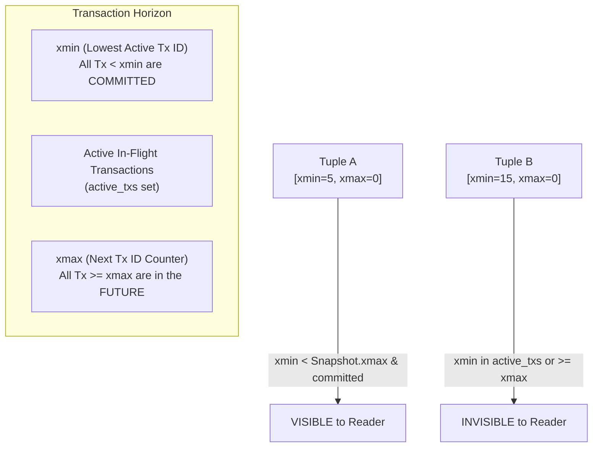
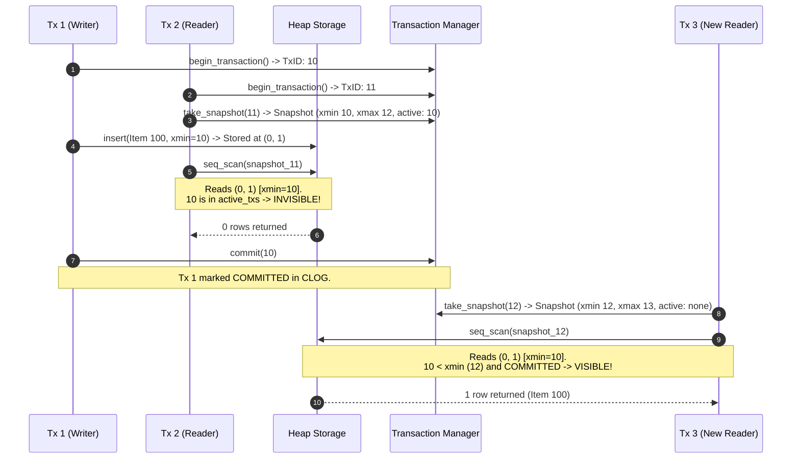

# Item 4: MVCC & Transaction Snapshot Visibility

**Confidence**: `verified`  
**Citations**: [include/pg/tx.h:1-75](file:///c:/Users/jerie/Documents/GitHub/cpp-postgres/include/pg/tx.h), [include/pg/mvcc.h:1-45](file:///c:/Users/jerie/Documents/GitHub/cpp-postgres/include/pg/mvcc.h), [src/tx.cpp:1-95](file:///c:/Users/jerie/Documents/GitHub/cpp-postgres/src/tx.cpp), [src/mvcc.cpp:1-75](file:///c:/Users/jerie/Documents/GitHub/cpp-postgres/src/mvcc.cpp), [tests/test_mvcc.cpp:1-135](file:///c:/Users/jerie/Documents/GitHub/cpp-postgres/tests/test_mvcc.cpp)

---

## 1. Multi-Version Concurrency Control (MVCC) Overview

PostgreSQL implements **Snapshot Isolation** using row-version header stamps (`xmin` and `xmax`). Readers never block writers, and writers never block readers.

---

## 2. Invariants & Visibility State Machine

A tuple version is visible to a `Snapshot` if and only if **both** of the following conditions hold (`[src/mvcc.cpp:25]`):

1. **Creation Visibility (`xmin`)**:
   - `xmin == snapshot.current_tx_id` (created by current tx), OR
   - (`xmin < snapshot.xmax` AND `xmin` is NOT in `snapshot.active_txs` AND `status(xmin) == COMMITTED`).
2. **Deletion Invisibility (`xmax`)**:
   - `xmax == 0` (never deleted/updated), OR
   - `xmax == snapshot.current_tx_id` AND NOT yet committed, OR
   - `xmax >= snapshot.xmax` (deleted in future), OR
   - `xmax` IS in `snapshot.active_txs` (deleted by active concurrent tx), OR
   - `status(xmax) == ABORTED` (deletion was rolled back).

---

## 3. Sequence Diagram: Concurrent MVCC Reads and Writes

