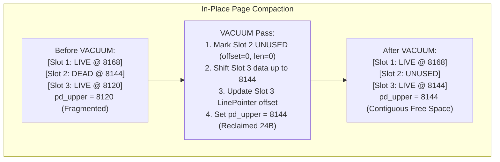
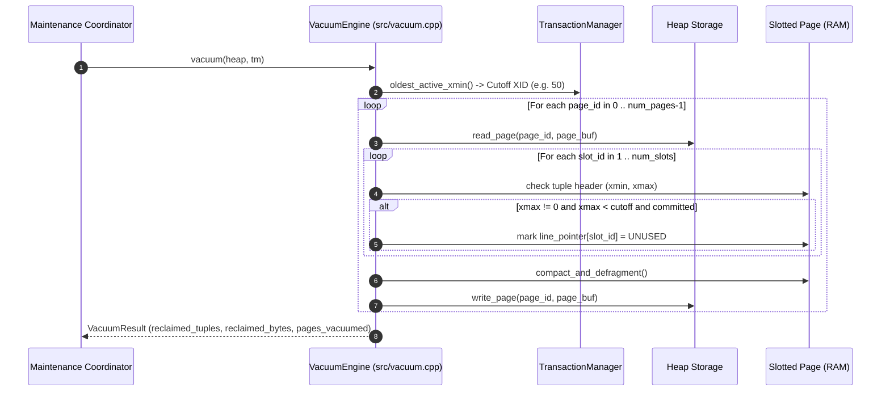
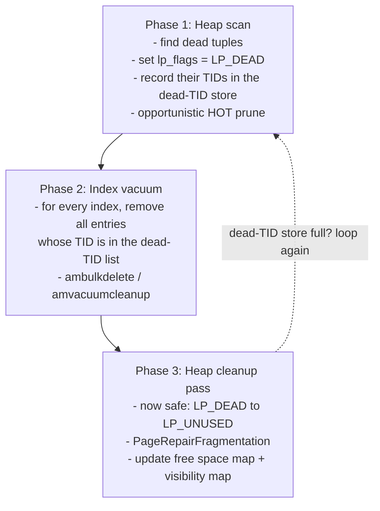

# Item 5: VACUUM Engine & In-Place Page Defragmentation

**Confidence**: `verified`  
**Citations**: [include/pg/vacuum.h:1-35](file:///c:/Users/jerie/Documents/GitHub/cpp-postgres/include/pg/vacuum.h), [src/vacuum.cpp:1-120](file:///c:/Users/jerie/Documents/GitHub/cpp-postgres/src/vacuum.cpp), [tests/test_vacuum.cpp:1-115](file:///c:/Users/jerie/Documents/GitHub/cpp-postgres/tests/test_vacuum.cpp)

---

## 1. Dead Tuple Reclamation Mechanics

When rows are updated or deleted under MVCC, old tuple versions become **dead** once their `xmax` falls below the oldest snapshot that could still see them — PostgreSQL's `OldestXmin`, computed across every backend and replication slot in the cluster:

$$\text{Dead Condition: } (\text{xmax} > 0) \ \land \ (\text{status}(\text{xmax}) = \text{COMMITTED}) \ \land \ (\text{xmax} < \text{oldest\_active\_xmin})$$

---

## 2. Invariants & CTID Stability

1. **CTID Slot Stability**: VACUUM never shifts or renumbers existing `slot_id` line pointer indexes. Slot 3 remains `(page, 3)`, guaranteeing that foreign references and secondary index entries are not corrupted (`[src/page.cpp:125]`).
2. **Compact Contiguous Allocation**: Surviving tuple payloads are slid upward towards the end of the 8KB page (`PAGE_SIZE = 8192`), coalescing all freed memory into a single contiguous block between `pd_lower` and `pd_upper`.

---

## 3. Sequence Diagram: Vacuum Page Lifecycle

---

## 4. PostgreSQL Fidelity Check

### 4.1 VACUUM is three phases in PostgreSQL, not one

The single-pass loop diagrammed above — *see a dead tuple, mark its line pointer `UNUSED`, defragment* — is only correct for a **table with no indexes**. As soon as an index exists, marking a slot `UNUSED` immediately would leave index entries pointing at a slot that a later insert can reuse, and the index would silently return the wrong row.

PostgreSQL therefore splits the work:

`LP_DEAD -> LP_UNUSED` only becomes legal *after* every index has been cleaned. When the dead-TID store fills up, PostgreSQL runs phases 2 and 3 and then resumes phase 1 — a large VACUUM can cycle several times.

### 4.2 What else PostgreSQL's VACUUM does

- **Freezing.** The primary reason VACUUM is mandatory, not optional. XIDs are 32-bit and wrap; VACUUM rewrites old `xmin` values as frozen (via `HEAP_XMIN_FROZEN` hint bits) so that ancient rows stay visible after wraparound. Left unrun long enough, PostgreSQL refuses new writes. **Not modelled here at all.**
- **Visibility map.** Two bits per heap page (`all-visible`, `all-frozen`) maintained by VACUUM. This is what makes index-only scans and page-skipping possible. **Not modelled.**
- **Free space map.** A separate `_fsm` fork recording per-page free space so inserts can find a home without scanning. **Not modelled** — this engine appends or scans linearly.
- **Truncation.** VACUUM can return trailing all-empty pages to the OS; otherwise space is reused inside the relation, never handed back. **Not modelled.**
- **HOT pruning happens outside VACUUM.** `heap_page_prune_opt()` runs during ordinary page access, guarded by the `pd_prune_xid` hint (Item 2). Most dead-tuple cleanup in a healthy PostgreSQL is done by SELECTs, not by VACUUM.
- **`VACUUM` vs `VACUUM FULL`.** Plain VACUUM defragments in place, exactly as modelled here. `VACUUM FULL` rewrites the entire relation into a new file and takes an `ACCESS EXCLUSIVE` lock — a different algorithm.
- **Autovacuum.** A launcher plus worker processes driven by dead-tuple thresholds. This engine vacuums only on explicit command.

### 4.3 Verdict table

| Claim | Verdict |
|---|---|
| Dead = `xmax` committed and below the global oldest xmin | **Exact** in principle (`OldestXmin`) |
| VACUUM never renumbers slot ids, preserving CTID stability for indexes | **Exact** — this is the core invariant PostgreSQL relies on |
| Surviving tuples slide toward the page end, coalescing free space | **Exact** — `PageRepairFragmentation()` |
| One pass, dead tuple straight to `UNUSED` | **Divergent** — safe only without indexes; PostgreSQL needs `LP_DEAD` -> index vacuum -> `LP_UNUSED` |
| Freezing / wraparound, visibility map, FSM, truncation, autovacuum | **Missing** |

### Implementation status (2026-08-27)

VACUUM is now the three-phase algorithm described above, not a single pass:

1. scan the heap, flag dead tuples `LP_DEAD`, collect their TIDs
2. remove every index entry pointing at a collected TID
3. demote `LP_DEAD` to `LP_UNUSED`, then compact

A dead HOT chain root becomes `LP_REDIRECT` rather than being freed, so the index
entry that points at it keeps working while the tuple bytes go away — and index
scans follow the redirect via `HeapFile::hot_search`.

It also runs through the buffer pool. Reading the relation directly while every
other subsystem went through the pool meant VACUUM acted on stale pages and its
work was later overwritten by whichever cached frame flushed last.

Still missing: freezing and wraparound handling, the visibility map, the free
space map fork, relation truncation, autovacuum.
