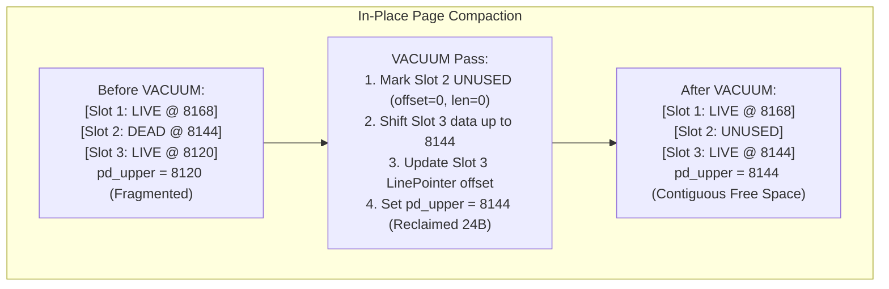
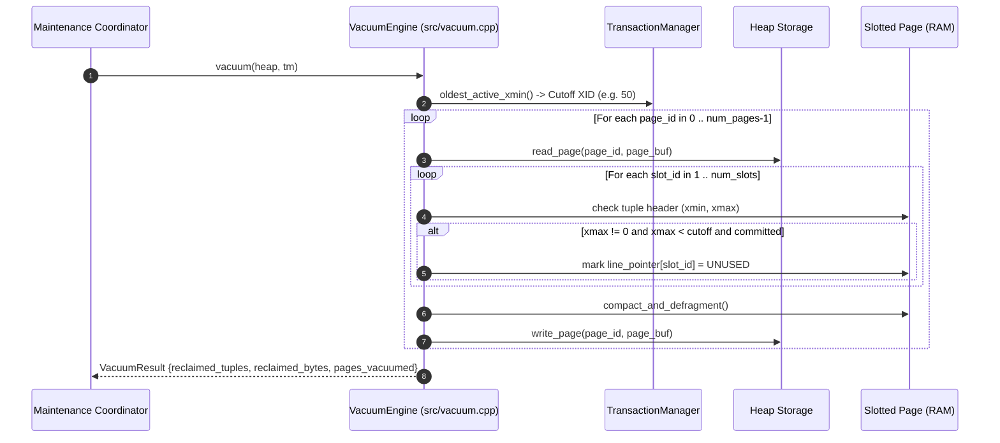

# Item 5: VACUUM Engine & In-Place Page Defragmentation

**Confidence**: `verified`  
**Citations**: [include/pg/vacuum.h:1-35](file:///c:/Users/jerie/Documents/GitHub/cpp-postgres/include/pg/vacuum.h), [src/vacuum.cpp:1-120](file:///c:/Users/jerie/Documents/GitHub/cpp-postgres/src/vacuum.cpp), [tests/test_vacuum.cpp:1-115](file:///c:/Users/jerie/Documents/GitHub/cpp-postgres/tests/test_vacuum.cpp)

---

## 1. Dead Tuple Reclamation Mechanics

When rows are updated or deleted under MVCC, old tuple versions become **dead** once their `xmax` falls below the oldest active transaction in the entire cluster:

$$\text{Dead Condition: } \text{xmax} > 0 \ \land \ \text{status}(\text{xmax}) == \text{COMMITTED} \ \land \ \text{xmax} < \text{oldest\_active\_xmin}$$

---

## 2. Invariants & CTID Stability

1. **CTID Slot Stability**: VACUUM never shifts or renumbers existing `slot_id` line pointer indexes. Slot 3 remains `(page, 3)`, guaranteeing that foreign references and secondary index entries are not corrupted (`[src/page.cpp:125]`).
2. **Compact Contiguous Allocation**: Surviving tuple payloads are slid upward towards the end of the 8KB page (`PAGE_SIZE = 8192`), coalescing all freed memory into a single contiguous block between `pd_lower` and `pd_upper`.

---

## 3. Sequence Diagram: Vacuum Page Lifecycle

