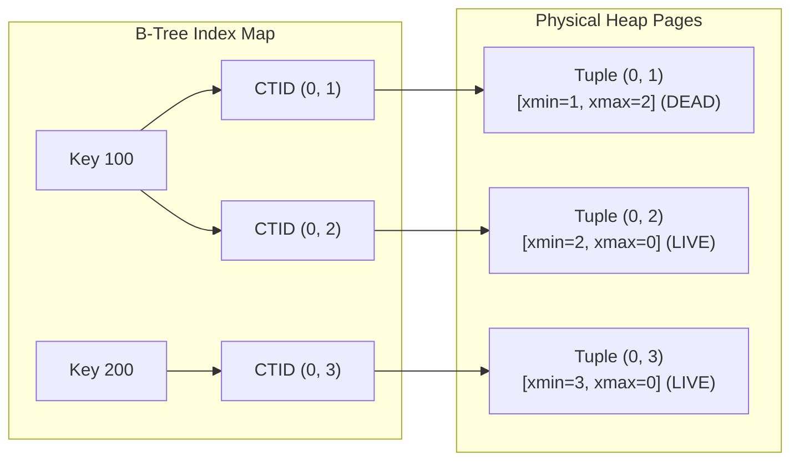
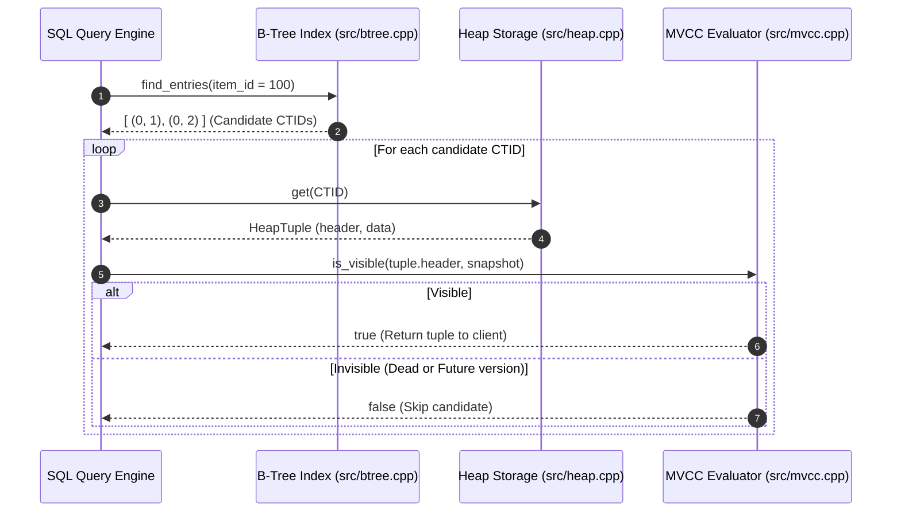

# Item 6: Secondary B-Tree Index Subsystem

**Confidence**: `verified`  
**Citations**: [include/pg/btree.h:1-69](file:///c:/Users/jerie/Documents/GitHub/cpp-postgres/include/pg/btree.h), [src/btree.cpp:1-85](file:///c:/Users/jerie/Documents/GitHub/cpp-postgres/src/btree.cpp), [tests/test_index.cpp:1-125](file:///c:/Users/jerie/Documents/GitHub/cpp-postgres/tests/test_index.cpp)

---

## 1. Index Decoupling & Multi-Version Addressing

In PostgreSQL, **every** index is a secondary index — there is no clustered/primary storage — and an index entry maps a key to a heap $\text{CTID}$. Critically, an index tuple carries **no MVCC header**: no `xmin`, no `xmax`. This is the property that forces the heap dereference in §2.

Two corrections to the stronger form of that claim:

- Index tuples **do** have a header. PostgreSQL's `IndexTupleData` is 8 bytes: `t_tid` (6 B, the heap CTID) plus `t_info` (2 B, holding the tuple size, a `INDEX_VAR_MASK` bit, and `INDEX_NULL_MASK`). When `INDEX_NULL_MASK` is set, a **null bitmap follows** — so index tuples do store null bitmaps, they just do not store visibility information.
- Index tuples **can** store extra columns. `CREATE INDEX … INCLUDE (cols)` (covering indexes, v11+) stores non-key payload columns in the leaf tuples specifically so that index-only scans can answer without touching the heap.

---

## 2. Invariants & Lookup Pipeline

1. **Multi-Version Key Duplication**: Because updates create new row versions at new physical CTIDs without deleting the old version, a single index key can map to multiple candidate CTIDs simultaneously (`[src/btree.cpp:22]`).
2. **Mandatory Heap MVCC Dereference**: The index lookup returns candidate CTIDs. The database must dereference each CTID against the physical Heap and evaluate snapshot visibility rules before returning tuples to the query caller (`[src/engine.cpp:140]`).

---

## 3. Sequence Diagram: Index Point Scan

---

## 4. PostgreSQL Fidelity Check

| Claim | Verdict |
|---|---|
| Index maps key -> CTID; the heap is the only source of row data | **Exact** |
| Index tuples carry no `xmin`/`xmax`, so every hit needs a heap visibility check | **Exact** — the defining property of PostgreSQL's index design |
| One key can map to several CTIDs because updates create new versions | **Exact** |
| "Index does not store null bitmaps" | **Corrected** — `IndexTupleData.t_info` has `INDEX_NULL_MASK` and a null bitmap follows when set |
| "Index does not store row columns" | **Corrected for modern PostgreSQL** — `INCLUDE` columns are stored in leaf tuples |

### Mechanisms PostgreSQL adds that this engine does not model

- **Index-only scans.** If the visibility map says every tuple on the target heap page is all-visible, PostgreSQL skips the heap fetch entirely and answers from the index tuple. Without a visibility map (Item 5) this engine can never do that — the heap dereference in §2 is genuinely mandatory *here*, but only usually mandatory in PostgreSQL.
- **`kill_prior_tuple` / `LP_DEAD` index hints.** When an index scan dereferences a CTID and finds the tuple dead to everyone, it flags that index entry `LP_DEAD` so later scans skip it without a heap read, and so the page can be cleaned without a full index vacuum.
- **B-tree deduplication (v13+).** Repeated keys are folded into a single *posting list* tuple holding a sorted TID array, which dramatically shrinks indexes on low-cardinality columns. In this engine every duplicate key costs a full entry.
- **Bitmap index scans.** For a wide match set the planner collects TIDs into a bitmap, sorts by physical page, and scans the heap in page order to convert random I/O into sequential I/O. This engine always does one random heap fetch per candidate.
- **Other access methods.** GiST, GIN, SP-GiST, BRIN and hash all exist behind the same `Key -> CTID` contract.
