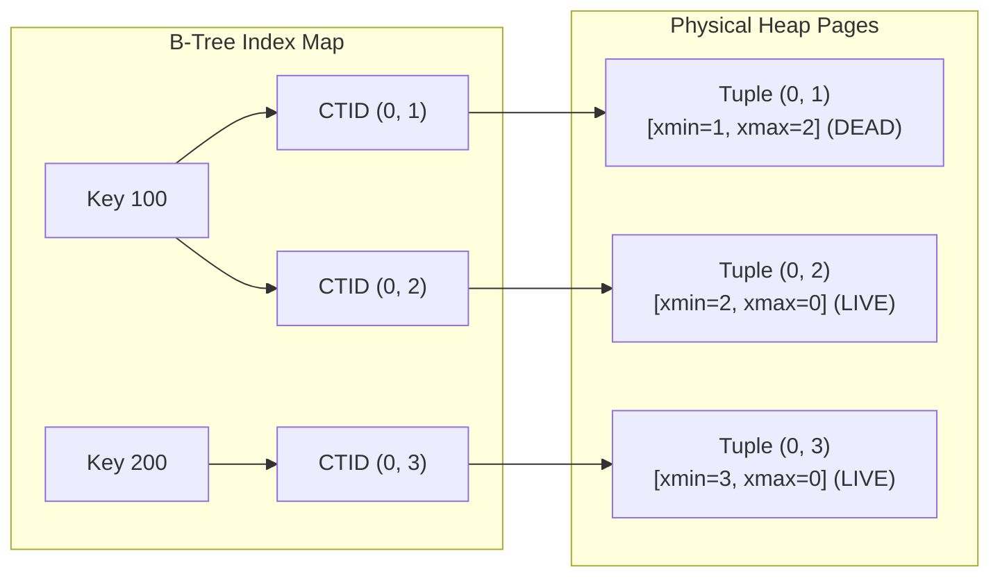
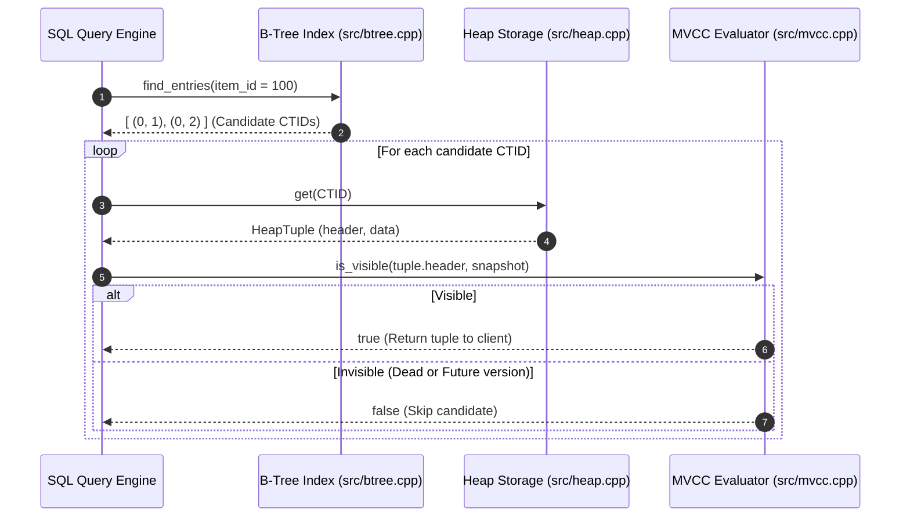

# Item 6: Secondary B-Tree Index Subsystem

**Confidence**: `verified`  
**Citations**: [include/pg/btree.h:1-69](file:///c:/Users/jerie/Documents/GitHub/cpp-postgres/include/pg/btree.h), [src/btree.cpp:1-85](file:///c:/Users/jerie/Documents/GitHub/cpp-postgres/src/btree.cpp), [tests/test_index.cpp:1-125](file:///c:/Users/jerie/Documents/GitHub/cpp-postgres/tests/test_index.cpp)

---

## 1. Index Decoupling & Multi-Version Addressing

In PostgreSQL, secondary indexes store **only** $(\text{Key} \rightarrow \text{CTID})$ mappings.
The index does **not** store row columns, null bitmaps, or MVCC transaction headers (`xmin`/`xmax`).

---

## 2. Invariants & Lookup Pipeline

1. **Multi-Version Key Duplication**: Because updates create new row versions at new physical CTIDs without deleting the old version, a single index key can map to multiple candidate CTIDs simultaneously (`[src/btree.cpp:22]`).
2. **Mandatory Heap MVCC Dereference**: The index lookup returns candidate CTIDs. The database must dereference each CTID against the physical Heap and evaluate snapshot visibility rules before returning tuples to the query caller (`[src/engine.cpp:140]`).

---

## 3. Sequence Diagram: Index Point Scan

