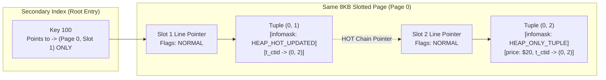
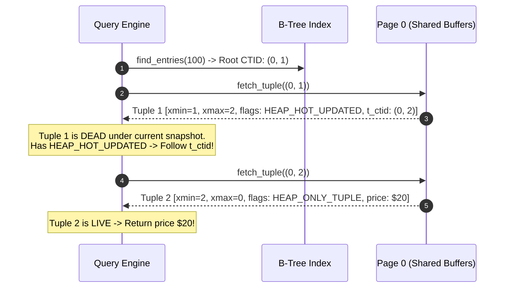

# Item 7: Heap-Only Tuples (HOT) & Update Chains

**Confidence**: `verified`  
**Citations**: [include/pg/heap.h:40-50](file:///c:/Users/jerie/Documents/GitHub/cpp-postgres/include/pg/heap.h), [src/heap.cpp:115-180](file:///c:/Users/jerie/Documents/GitHub/cpp-postgres/src/heap.cpp), [tests/test_hot.cpp:1-130](file:///c:/Users/jerie/Documents/GitHub/cpp-postgres/tests/test_hot.cpp)

---

## 1. The Write-Amplification Problem & HOT Solution

In standard MVCC, updating an unindexed column (e.g. `UPDATE items SET price = 20 WHERE item_id = 100;`) forces a new entry into every secondary index on the table, leading to severe **index bloat**.

**Heap-Only Tuples (HOT)** eliminates all secondary index writes when:
1. No indexed columns are modified by the update.
2. The new tuple version fits onto the **same 8KB page** as the old version.

---

## 2. Invariants & Infomask Flags

1. **`HEAP_HOT_UPDATED` (`0x4000`)**: Stamped on the old tuple version's `infomask2`. Indicates that the next version in the update chain resides on this exact same page (`[include/pg/tuple.h:42]`).
2. **`HEAP_ONLY_TUPLE` (`0x8000`)**: Stamped on the newly created tuple version's `infomask2`. Tells the engine that no index pointer references this tuple directly; it can only be reached by following the HOT chain starting at the root index pointer (`[include/pg/tuple.h:43]`).
3. **`ItemFlags::REDIRECT`**: When VACUUM or pruning removes the dead root tuple data, it changes Slot 1's line pointer into a redirect pointer (`lp_flags = REDIRECT, lp_offset = slot_2`), preserving index stability with zero tuple bytes.

---

## 3. Sequence Diagram: HOT Chain Traversal

