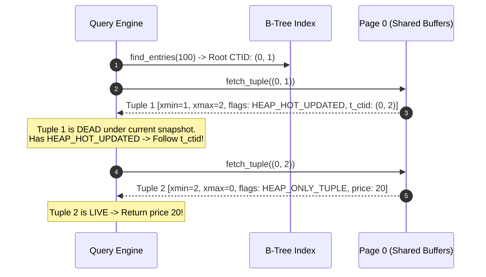

# Item 7: Heap-Only Tuples (HOT) & Update Chains

**Confidence**: `verified`  
**Citations**: [include/pg/heap.h:40-50](file:///c:/Users/jerie/Documents/GitHub/cpp-postgres/include/pg/heap.h), [src/heap.cpp:115-180](file:///c:/Users/jerie/Documents/GitHub/cpp-postgres/src/heap.cpp), [tests/test_hot.cpp:1-130](file:///c:/Users/jerie/Documents/GitHub/cpp-postgres/tests/test_hot.cpp)

---

## 1. The Write-Amplification Problem & HOT Solution

In standard MVCC, updating an unindexed column (e.g. `UPDATE items SET price = 20 WHERE item_id = 100;`) forces a new entry into every secondary index on the table, leading to severe **index bloat**.

**Heap-Only Tuples (HOT)** eliminates all secondary index writes when:
1. No indexed column of **any** index on the table is modified by the update.
2. The new tuple version fits onto the **same 8KB page** as the old version.

Both conditions are PostgreSQL's, exactly. Condition 2 is why `fillfactor` matters: lowering it below 100 reserves free space on each page at load time specifically to keep future updates HOT-eligible. Condition 1 is evaluated against the *union* of all indexed columns, which is why adding one index on a hot-updated column can collapse HOT for the whole table.

---

## 2. Invariants & Infomask Flags

1. **`HEAP_HOT_UPDATED` (`0x4000`)**: Stamped on the old tuple version. Indicates that the next version in the update chain resides on this exact same page (`[include/pg/tuple.h:51]`). *The value matches PostgreSQL, but PostgreSQL stores it in `t_infomask2`, not `t_infomask` — this engine has only one infomask word (Item 3).*
2. **`HEAP_ONLY_TUPLE` (`0x8000`)**: Stamped on the newly created tuple version. Tells the engine that no index pointer references this tuple directly; it can only be reached by following the HOT chain from the root line pointer (`[include/pg/tuple.h:52]`). *Same note: `t_infomask2` in PostgreSQL.*
3. **`ItemFlags::REDIRECT`**: When pruning removes the dead root tuple's data, it converts Slot 1's line pointer into a redirect (`lp_flags = REDIRECT, lp_offset = slot_2`), preserving index stability with zero tuple bytes. **This is exactly PostgreSQL's `LP_REDIRECT`**, and it is the reason the root line pointer of a HOT chain can never be reused: the index still points at it.
4. **Pruning is not VACUUM.** In PostgreSQL, HOT chain collapsing is done by `heap_page_prune_opt()` during ordinary page access — including plain `SELECT`s — guarded by the `pd_prune_xid` page-header hint (Item 2). VACUUM also prunes, but it is not the primary mechanism. Because this engine has no `pd_prune_xid` and no opportunistic prune path, HOT chains here are only collapsed by an explicit `VACUUM`.

---

## 3. Sequence Diagram: HOT Chain Traversal

---

## 4. PostgreSQL Fidelity Check

| Claim | Verdict |
|---|---|
| HOT applies when no indexed column changes and the new version fits on the same page | **Exact** |
| Old version gets `HEAP_HOT_UPDATED`, new version gets `HEAP_ONLY_TUPLE` | **Exact** (values `0x4000` / `0x8000` are PostgreSQL's) |
| `t_ctid` links the chain forward within the page | **Exact** |
| Index keeps pointing only at the root line pointer | **Exact** |
| Pruning converts the root line pointer to `LP_REDIRECT` | **Exact** |
| Those flags live in `infomask` | **Wrong field** — PostgreSQL puts both in `t_infomask2` |
| Pruning happens in VACUUM | **Incomplete** — PostgreSQL prunes opportunistically on page access via `heap_page_prune_opt()` |
| No `fillfactor` control | **Missing** — the main knob DBAs use to keep updates HOT |
| HOT chain cannot span pages | **Exact** — an update that must move to another page falls back to a normal update plus index insert |
