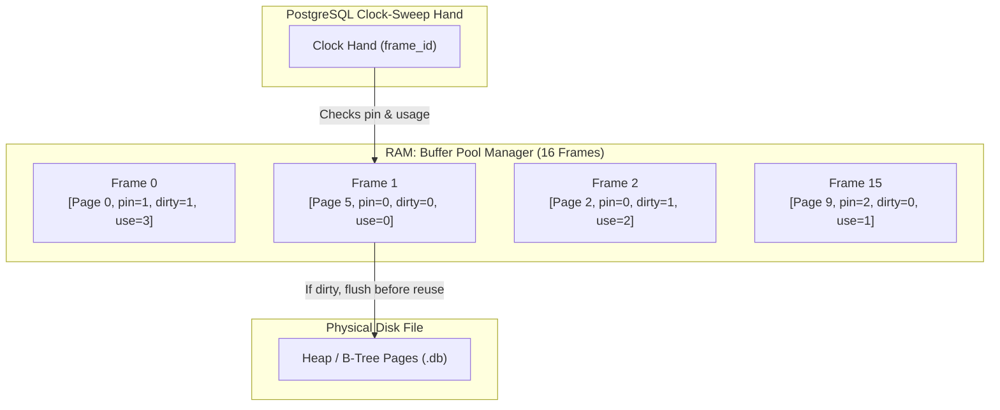
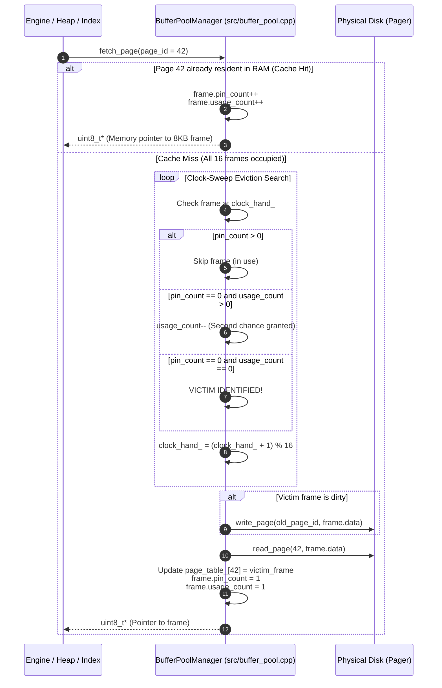

# Item 8: Shared Buffers & Clock-Sweep Replacement

**Confidence**: `verified`  
**Citations**: [include/pg/buffer_pool.h:1-75](file:///c:/Users/jerie/Documents/GitHub/cpp-postgres/include/pg/buffer_pool.h), [src/buffer_pool.cpp:1-125](file:///c:/Users/jerie/Documents/GitHub/cpp-postgres/src/buffer_pool.cpp), [tests/test_buffer_pool.cpp:1-120](file:///c:/Users/jerie/Documents/GitHub/cpp-postgres/tests/test_buffer_pool.cpp)

---

## 1. Buffer Pool Manager (Shared Buffers) Architecture

`BufferPoolManager` maintains a configurable pool of in-memory frames (defaulting to **16 frames**, each exactly 8,192 bytes) acting as an LRU-approximation cache between the execution engine and physical disk files.

---

## 2. Invariants & Clock-Sweep State Machine

1. **Pin Count Protection (`pin_count > 0`)**: Any frame currently pinned by an active query worker is immediately skipped by the clock-sweep hand; it can **never** be evicted while in use (`[src/buffer_pool.cpp:85]`).
2. **Second-Chance Algorithm (`usage_count`)**:
   - If `pin_count == 0` and `usage_count > 0`, the clock hand decrements `usage_count--` and advances to the next frame.
   - If `pin_count == 0` and `usage_count == 0`, the frame is selected as the eviction victim.
3. **Dirty Writeback Before Eviction**: If the victim frame has `is_dirty == true`, it is written to disk via `Pager::write_page()` before being repurposed for the new page.

---

## 3. Sequence Diagram: Page Fetch & Eviction Lifecycle

