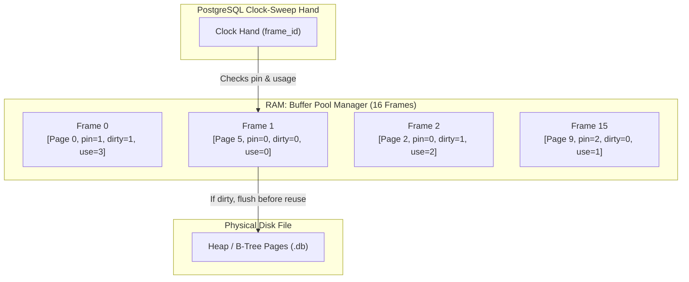
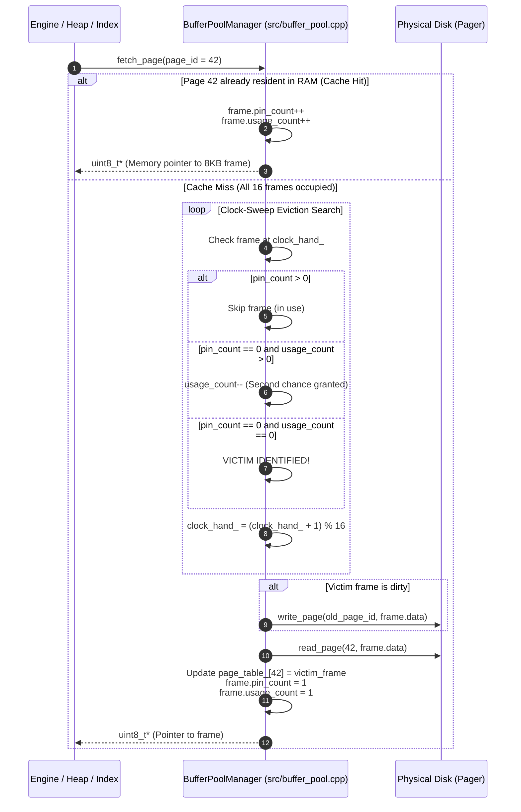

# Item 8: Shared Buffers & Clock-Sweep Replacement

**Confidence**: `verified`  
**Citations**: [include/pg/buffer_pool.h:1-75](file:///c:/Users/jerie/Documents/GitHub/cpp-postgres/include/pg/buffer_pool.h), [src/buffer_pool.cpp:1-125](file:///c:/Users/jerie/Documents/GitHub/cpp-postgres/src/buffer_pool.cpp), [tests/test_buffer_pool.cpp:1-120](file:///c:/Users/jerie/Documents/GitHub/cpp-postgres/tests/test_buffer_pool.cpp)

---

## 1. Buffer Pool Manager (Shared Buffers) Architecture

`BufferPoolManager` maintains a configurable pool of in-memory frames (defaulting to **16 frames**, each exactly 8,192 bytes) acting as an LRU-approximation cache between the execution engine and physical disk files.

PostgreSQL's equivalent is `shared_buffers`, defaulting to **128 MB = 16,384 buffers**. Sixteen frames here is a teaching size chosen so that eviction is observable in the GUI after a handful of inserts.

---

## 2. Invariants & Clock-Sweep State Machine

1. **Pin Count Protection (`pin_count > 0`)**: Any frame currently pinned by an active query worker is immediately skipped by the clock-sweep hand; it can **never** be evicted while in use (`[src/buffer_pool.cpp:85]`).
2. **Second-Chance Algorithm (`usage_count`)**:
   - If `pin_count == 0` and `usage_count > 0`, the clock hand decrements `usage_count--` and advances to the next frame.
   - If `pin_count == 0` and `usage_count == 0`, the frame is selected as the eviction victim.

   PostgreSQL's `StrategyGetBuffer()` is the same algorithm with one bound this engine lacks: `usage_count` saturates at **`BUF_USAGECOUNT_MAX = 5`**. Without a cap, a page touched ten thousand times would need ten thousand hand passes to become evictable, and the sweep degenerates. PostgreSQL also consults a **freelist** of never-used or explicitly freed buffers *before* starting the sweep.
3. **Dirty Writeback Before Eviction**: If the victim frame has `is_dirty == true`, it is written to disk via `Pager::write_page()` before being repurposed for the new page.
4. **WAL Ordering Applies to Eviction Too**: PostgreSQL's `FlushBuffer()` calls `XLogFlush(page.pd_lsn)` *before* the write, so evicting a dirty buffer can force a WAL flush. This is the same invariant as Item 9, enforced at the eviction site.

---

## 3. Sequence Diagram: Page Fetch & Eviction Lifecycle

---

## 4. PostgreSQL Fidelity Check

| Claim | Verdict |
|---|---|
| Fixed array of 8KB frames, hash table from page id to frame | **Exact** (`BufferDesc` array + `SharedBufHash`) |
| Clock-sweep with pin count and usage count | **Exact** (`StrategyGetBuffer`) |
| Pinned buffers are never evicted | **Exact** |
| Dirty victim is written before reuse | **Exact** |
| 16 frames | **Teaching size** — PostgreSQL defaults to 16,384 (128 MB) |
| `usage_count` unbounded | **Divergent** — PostgreSQL caps at `BUF_USAGECOUNT_MAX = 5` |
| Sweep starts immediately on miss | **Simplified** — PostgreSQL checks the freelist first |
| No WAL flush on eviction | **Divergent** — PostgreSQL's `FlushBuffer()` calls `XLogFlush()` first |

### Not modelled

- **Buffer access strategies (ring buffers).** Sequential scans of large tables, `COPY`, `CREATE TABLE AS` and VACUUM each run inside a small ring (`BufferAccessStrategy`) so a single big scan cannot flush the whole cache. Without this, one large scan in PostgreSQL would evict everything.
- **The background writer.** A dedicated process that trickles dirty buffers out ahead of the clock hand so foreground backends rarely have to write during eviction.
- **Local buffers.** Temporary tables use a per-backend local buffer pool, not shared buffers.
- **Buffer content locks and pin/refcount separation.** PostgreSQL splits a *pin* (the page will not be evicted) from a *content lock* (shared/exclusive access to the bytes), and tracks both in shared memory with atomic state words. This engine has a single-mutex model.
- **Double buffering.** PostgreSQL deliberately keeps `shared_buffers` modest and relies on the OS page cache underneath; sizing advice follows from that layering.

### Implementation status (2026-08-27)

Three changes bring the pool closer to the real thing:

- **`usage_count` is capped at `BUF_USAGECOUNT_MAX = 5`.** Uncapped, a hot page
  needed as many hand passes as it had hits, and the sweep gave up while frames
  sat unpinned and evictable — it threw "all frames are pinned" when none were.
  The cap is what makes the sweep terminate.
- **The WAL rule is enforced at eviction.** `write_frame` calls
  `WALManager::flush_up_to(page.lsn())` before any page reaches disk.
- **Pages are pinned across read-modify-write.** `PinnedPage` is an RAII pin, and
  `fetch_page` returns a view into the frame rather than a copy, so a caller
  mutates shared memory instead of a private copy it later writes back over
  whatever happened in between.

Still missing: strategy rings, a background writer, local buffers for temp
relations, and separate pin/content-lock states.
