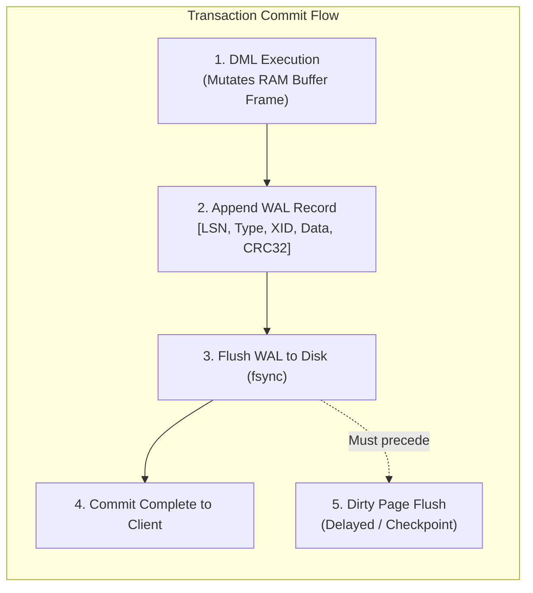
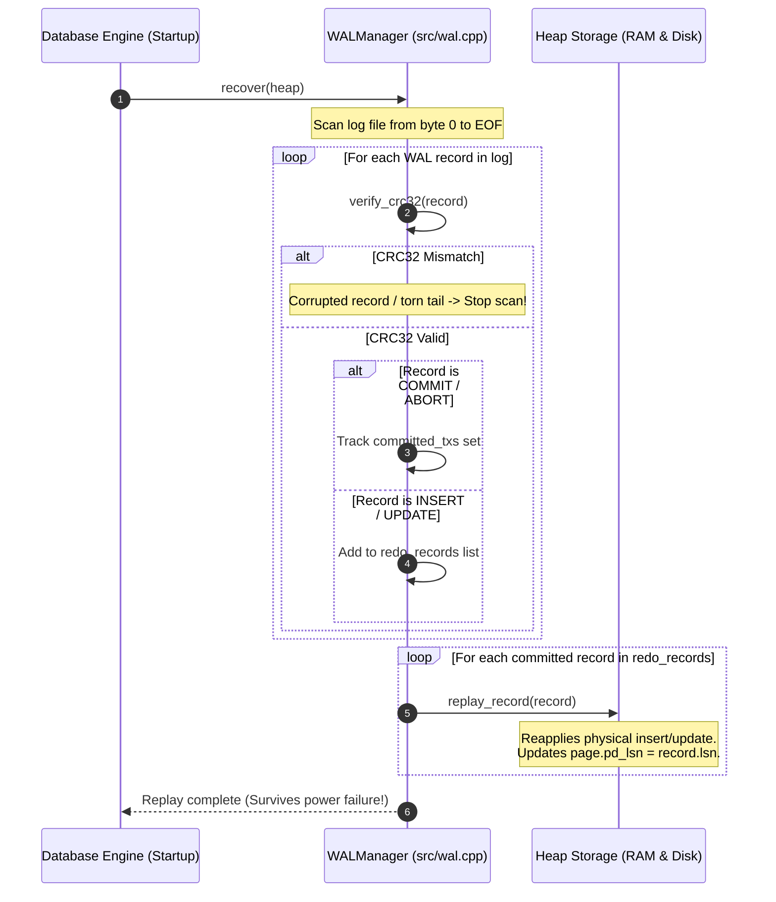

# Item 9: Write-Ahead Logging (WAL) & REDO Durability

**Confidence**: `verified`  
**Citations**: [include/pg/wal.h:1-95](file:///c:/Users/jerie/Documents/GitHub/cpp-postgres/include/pg/wal.h), [src/wal.cpp:1-180](file:///c:/Users/jerie/Documents/GitHub/cpp-postgres/src/wal.cpp), [tests/test_wal.cpp:1-135](file:///c:/Users/jerie/Documents/GitHub/cpp-postgres/tests/test_wal.cpp)

---

## 1. Write-Ahead Logging (WAL) Architecture

To guarantee **ACID Durability** and high write throughput, PostgreSQL converts random 8KB page writes into sequential, append-only log records in the Write-Ahead Log (`*.log`).

---

## 2. Invariants & Record Binary Layout

1. **The WAL Invariant**:
   $$\text{page.pd\_lsn} \le \text{wal.flushed\_lsn}$$
   A dirty page in RAM is never written to disk before all WAL records up to the page's `pd_lsn` have been flushed to disk (`[src/wal.cpp:110]`).
2. **Log Record Structure (Header + Payload + CRC32)**:
   - `lsn` (8 Bytes): Monotonically increasing Log Sequence Number.
   - `prev_lsn` (8 Bytes): Backward pointer for UNDO / transaction rollback chains.
   - `tx_id` (4 Bytes): Transaction ID.
   - `type` (1 Byte): `1`=INSERT, `2`=UPDATE, `3`=COMMIT, `4`=ABORT, `5`=CHECKPOINT, `6`=FPI, `7`=CLR.
   - `page_id` (4 Bytes), `slot_id` (2 Bytes).
   - `payload_len` (2 Bytes) + `payload` data.
   - `crc32` (4 Bytes): IEEE 802.3 polynomial checksum verifying data integrity against partial writes and disk corruptions.

---

## 3. Sequence Diagram: REDO Crash Recovery Pass

