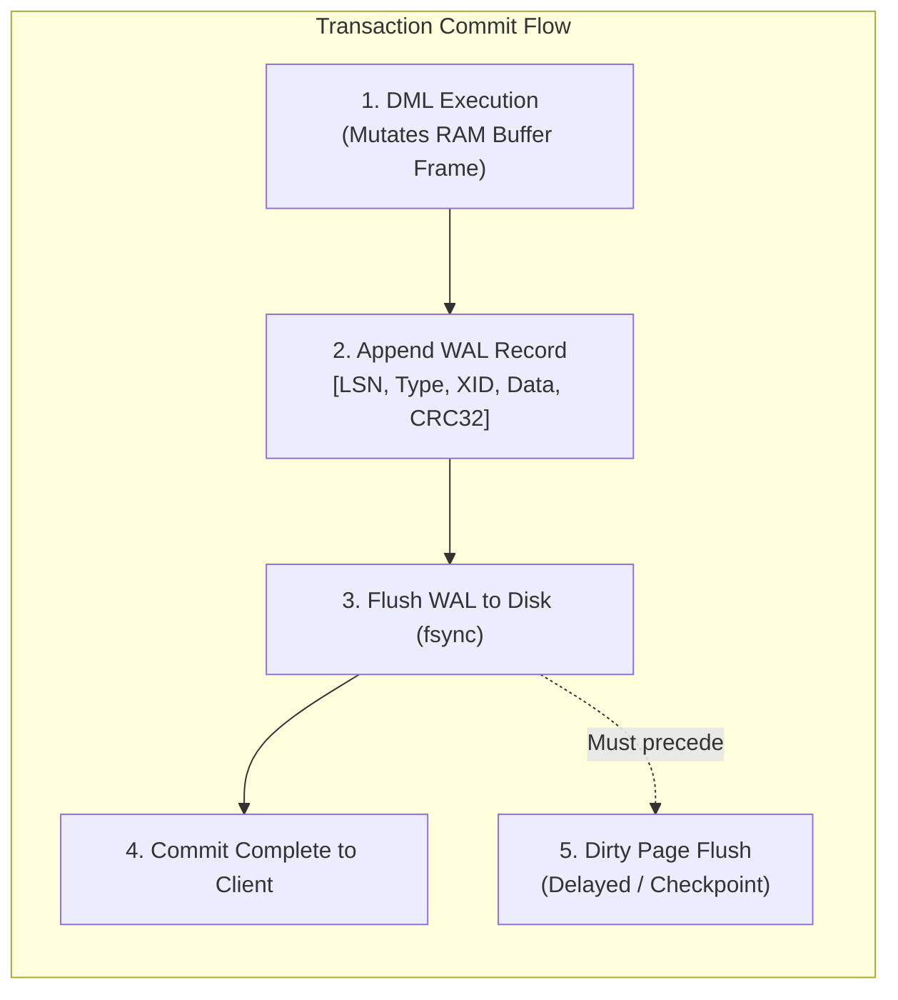
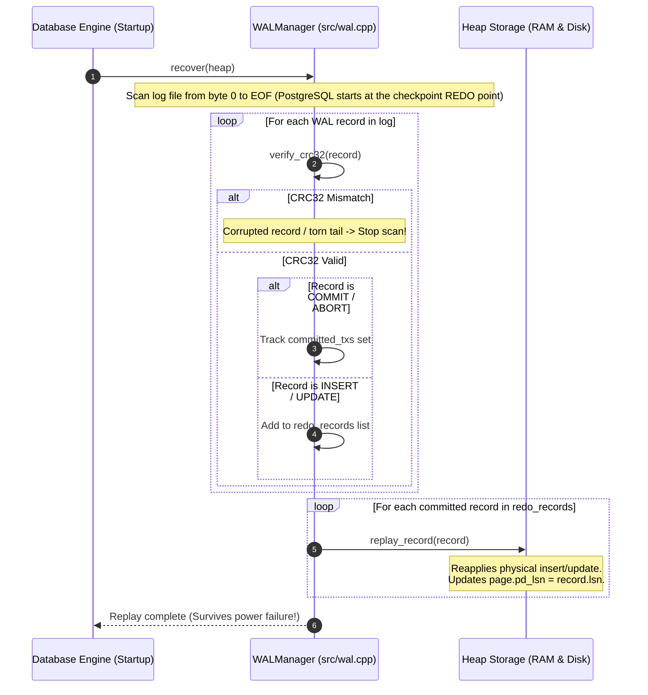

# Item 9: Write-Ahead Logging (WAL) & REDO Durability

**Confidence**: `verified`  
**Citations**: [include/pg/wal.h:1-95](file:///c:/Users/jerie/Documents/GitHub/cpp-postgres/include/pg/wal.h), [src/wal.cpp:1-180](file:///c:/Users/jerie/Documents/GitHub/cpp-postgres/src/wal.cpp), [tests/test_wal.cpp:1-135](file:///c:/Users/jerie/Documents/GitHub/cpp-postgres/tests/test_wal.cpp)

---

## 1. Write-Ahead Logging (WAL) Architecture

To guarantee **ACID Durability** and high write throughput, PostgreSQL converts random 8KB page writes into sequential, append-only log records in the Write-Ahead Log (`*.log`).

---

## 2. Invariants & Record Binary Layout

1. **The WAL Invariant**:
   $$\text{page.pd\_lsn} \le \text{wal.flushed\_lsn}$$
   A dirty page in RAM is never written to disk before all WAL records up to the page's `pd_lsn` have been flushed to disk (`[src/wal.cpp:110]`).
2. **Log Record Structure (35-Byte Header + Dynamic Payload — this engine's own format)** (`[include/pg/wal.h:35-47]`):
   - `lsn` (8 Bytes): Monotonically increasing Log Sequence Number. *In PostgreSQL an LSN is not a counter — it is a byte position in the logical WAL stream, which is why `pg_current_wal_lsn()` prints as `hex/hex`.*
   - `prev_lsn` (8 Bytes): Backward pointer for UNDO / transaction rollback chains. **This has no PostgreSQL analogue.** PostgreSQL's `xl_prev` links to the *immediately preceding record in the stream* and exists to detect stale/recycled WAL pages during recovery, not to drive rollback — PostgreSQL never rolls back from WAL (Item 16).
   - `tx_id` (4 Bytes): Transaction ID.
   - `type` (1 Byte): `1`=INSERT, `2`=UPDATE, `3`=COMMIT, `4`=ABORT, `5`=CHECKPOINT, `6`=FPI, `7`=CLR.
   - `page_id` (4 Bytes), `slot_id` (2 Bytes): Target heap page and line pointer.
   - `payload_len` (4 Bytes): Byte length of following payload (`uint32_t`).
   - `crc` (4 Bytes): CRC-32 (IEEE 802.3 polynomial) checksum verifying record integrity. *PostgreSQL has used **CRC-32C (Castagnoli)** since 9.5, chosen for the `SSE4.2` `crc32` instruction.*

   PostgreSQL's `XLogRecord` header is **24 bytes**: `xl_tot_len` (4), `xl_xid` (4), `xl_prev` (8), `xl_info` (1), `xl_rmid` (1), 2 bytes padding, `xl_crc` (4). Everything after that is resource-manager-specific and self-describing: `xl_rmid` names the resource manager (heap, btree, xact, …), and a chain of `XLogRecordBlockHeader` entries describes each page the record touches — including whether a full-page image is attached (Item 15). There is no fixed `page_id`/`slot_id` in PostgreSQL's header; a single record can modify several blocks in several relations.

---

## 3. Sequence Diagram: REDO Crash Recovery Pass

---

## 4. PostgreSQL Fidelity Check

| Claim | Verdict |
|---|---|
| WAL turns random page writes into sequential log writes | **Exact** |
| `page.pd_lsn <= flushed_lsn` before a dirty page reaches disk | **Exact** — the WAL rule, enforced in `FlushBuffer()`/`XLogFlush()` |
| Commit is acknowledged only after the WAL record is fsynced | **Exact by default** — `synchronous_commit = on`; PostgreSQL lets you trade this away (`off`, `local`, `remote_write`, `remote_apply`) |
| CRC per record, torn tail detected by CRC mismatch and scan stops | **Exact in shape** |
| Redo replays inserts/updates for committed transactions | **Exact in shape** |
| CRC-32 IEEE | **Divergent** — PostgreSQL uses CRC-32C |
| 35-byte fixed header with `page_id` + `slot_id` | **Divergent** — PostgreSQL: 24-byte `XLogRecord` + rmgr block headers, multi-block capable |
| `prev_lsn` used for undo chains | **No analogue** — PostgreSQL has no undo; `xl_prev` is a stream-integrity link |
| Recovery scans from byte 0 | **Divergent** — PostgreSQL starts at the checkpoint's REDO pointer from `pg_control` (Item 15) |
| LSN as an abstract counter | **Divergent** — a PostgreSQL LSN is a byte offset in the WAL stream |

### Not modelled

- **WAL segmentation.** PostgreSQL writes 16 MB segment files under `pg_wal/`, recycles them, and archives them (`archive_command`). One flat `.log` file here.
- **Resource managers.** Heap, btree, xact, clog, gist, … each register redo callbacks; `pg_waldump` decodes them.
- **WAL levels.** `minimal` / `replica` / `logical` change what gets logged; `wal_level = logical` is what makes logical decoding and CDC possible.
- **The WAL writer process**, group commit, and `commit_delay`.
- **Streaming replication.** The same WAL stream is shipped to standbys; `wal_sender`/`wal_receiver`, replication slots, and hot standby all ride on this file format.

### Implementation status (2026-08-27)

The write-ahead rule is now actually enforced, in three places that all had to
change together:

- **`log_commit` is durable.** `WALManager::flush` calls `File::sync()`, a real
  `fdatasync`/`_commit`. Previously it called `std::fstream::flush()`, which
  leaves the bytes in the OS page cache — a power cut lost committed work.
- **The record is written before the page changes.** `HeapFile` emits it while
  holding the page pinned, then applies the change, then stamps `pd_lsn`. The
  engine no longer logs after the fact, which was write-behind logging.
- **`pd_lsn` is set on every modification**, so the buffer pool can refuse to
  write a page out until the log covering it is durable.

Still divergent: CRC-32 rather than CRC-32C, a 35-byte fixed header rather than
`XLogRecord` plus rmgr block references, one log file rather than 16MB segments.
