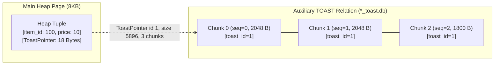
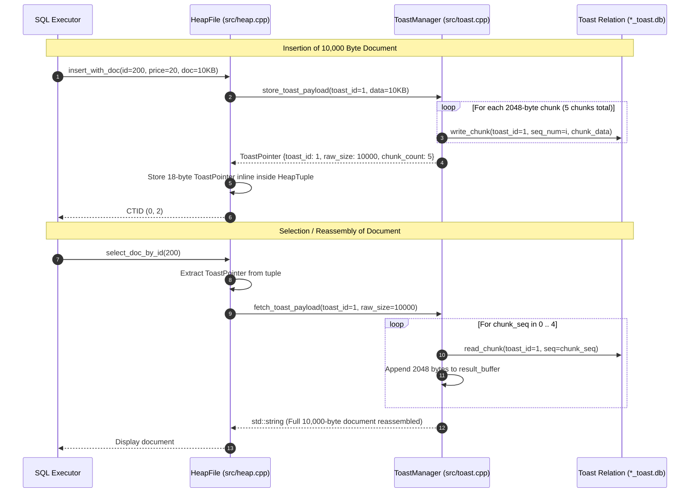

# Item 10: TOAST Oversized-Attribute Storage

**Confidence**: `verified`  
**Citations**: [include/pg/toast.h:1-65](file:///c:/Users/jerie/Documents/GitHub/cpp-postgres/include/pg/toast.h), [src/toast.cpp:1-120](file:///c:/Users/jerie/Documents/GitHub/cpp-postgres/src/toast.cpp), [tests/test_toast.cpp:1-115](file:///c:/Users/jerie/Documents/GitHub/cpp-postgres/tests/test_toast.cpp)

---

## 1. The TOAST Architecture

**TOAST (The Oversized-Attribute Storage Technique)** prevents large text, JSON, and binary attributes from degrading the row density of 8KB slotted heap pages.

When an attribute payload exceeds **2,048 bytes (2KB)**, the storage engine slices the payload into discrete 2,048-byte chunks stored in a dedicated auxiliary TOAST relation, replacing the inline data with a compact **18-byte `ToastPointer`**.

> **PostgreSQL's real numbers and real trigger.** Both constants here are round approximations, and the trigger condition is different in kind:
> - The threshold is `TOAST_TUPLE_THRESHOLD` = **2032 bytes**, and it is tested against the **size of the whole tuple**, not of one attribute. A row of six 500-byte columns gets toasted; a single 1 KB column in an otherwise narrow row does not.
> - The chunk size is `TOAST_MAX_CHUNK_SIZE` = **1996 bytes**, sized so that exactly four chunk tuples fit in an 8 KB TOAST page after the heap tuple header and `chunk_id`/`chunk_seq` columns.
> - **Compression comes first.** PostgreSQL's `heap_toast_insert_or_update()` loops: compress the largest attribute (pglz, or lz4 when `default_toast_compression = lz4`), re-measure the tuple; if still over threshold, push the largest attribute out of line; repeat. Out-of-line storage is the *fallback*, not the first move. This engine chunks uncompressed bytes directly.
> - Behaviour is per-column configurable via `ALTER TABLE … SET STORAGE`: `PLAIN` (never toast), `EXTENDED` (compress then externalize — the default), `EXTERNAL` (externalize without compressing, so substring reads stay cheap), `MAIN` (compress, externalize only as a last resort).

---

## 2. Invariants & Binary Layout

1. **ToastPointer Structure (18 Bytes)** (`[include/pg/toast.h:28-36]`):
   - `toast_id` (8 Bytes): Unique 64-bit identifier linking to the auxiliary relation (`uint64_t`).
   - `raw_size` (4 Bytes): Original uncompressed byte size of the attribute (`uint32_t`).
   - `chunk_count` (4 Bytes): Total number of auxiliary chunks ($\lceil \text{raw\_size} / 2048 \rceil$, `uint32_t`).
   - `flags` (2 Bytes): Compression and storage strategy flags (`uint16_t`).

   PostgreSQL's on-disk TOAST pointer is **also 18 bytes**, but the fields differ: a 1-byte `varattrib_1b_e` header, a 1-byte `va_tag`, then a 16-byte `varatt_external` of `va_rawsize` (int32), `va_extsize` (int32), `va_valueid` (Oid) and `va_toastrelid` (Oid). Two consequences of that layout:
   - PostgreSQL stores the *relation* OID in the pointer, so a detoast can find its TOAST table from the datum alone. This engine hard-wires a single TOAST relation.
   - `va_extsize` is the **stored** (post-compression) size and `va_rawsize` the original; when they differ, the value is compressed and the low bits of `va_rawsize` encode which algorithm. There is no chunk count — PostgreSQL derives it by scanning the TOAST index.
2. **ToastChunk Structure** (`[include/pg/toast.h:39-43]`):
   - `toast_id` (8 Bytes), `chunk_seq` (4 Bytes), `data` (`std::vector<uint8_t>`, storing up to 2,048-byte chunks).

   In PostgreSQL a TOAST table is an ordinary heap relation named `pg_toast.pg_toast_<oid>` with the schema `(chunk_id oid, chunk_seq int4, chunk_data bytea)`, plus a **unique B-tree index on `(chunk_id, chunk_seq)`**. Detoasting is therefore an index scan, and the chunks are themselves MVCC row versions with their own `xmin`/`xmax`, visible in `pg_class` and vacuumed like any other table. This engine keeps chunks in a bespoke file with a linear layout and no index.
3. **Sequential Scan Preservation**: Sequential scans over normal columns (e.g. `SELECT price FROM items;`) never read or load TOAST pages into shared buffers, avoiding massive I/O pollution (`[src/toast.cpp:65]`).

---

## 3. Sequence Diagram: Storing and Reassembling TOAST Data

---

## 4. PostgreSQL Fidelity Check

| Claim | Verdict |
|---|---|
| Oversized values move out of line to an auxiliary relation, replaced by a small pointer | **Exact** |
| Pointer is 18 bytes | **Exact size, different fields** (`varatt_external`) |
| Value is sliced into fixed-size chunks addressed by `(id, seq)` | **Exact** |
| Scans of non-TOASTed columns never touch TOAST pages | **Exact** — detoasting is lazy, driven by `pg_detoast_datum()` |
| Threshold 2048 bytes per attribute | **Wrong** — `TOAST_TUPLE_THRESHOLD` is **2032**, applied to the **whole tuple** |
| Chunk size 2048 bytes | **Wrong** — `TOAST_MAX_CHUNK_SIZE` is **1996** |
| No compression step | **Missing** — PostgreSQL compresses (pglz/lz4) before externalizing |
| Single hard-wired TOAST relation, no index | **Simplified** — PostgreSQL uses a real heap + unique index on `(chunk_id, chunk_seq)` |
| No storage strategies | **Missing** — `PLAIN` / `EXTENDED` / `EXTERNAL` / `MAIN` |
| No 1 GB limit modelling | **Missing** — a single TOASTed varlena tops out at 1 GB in PostgreSQL |
