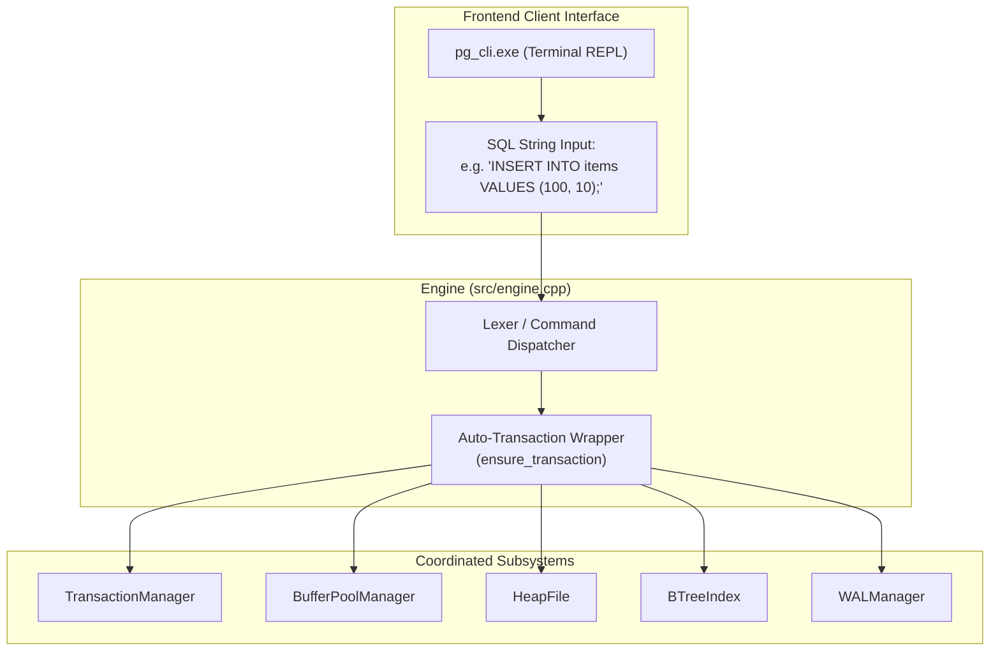
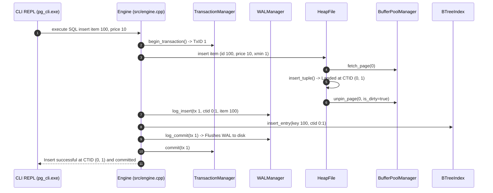

# Item 11: SQL REPL CLI & End-to-End Engine Capstone

**Confidence**: `verified`  
**Citations**: [include/pg/engine.h:1-85](file:///c:/Users/jerie/Documents/GitHub/cpp-postgres/include/pg/engine.h), [src/engine.cpp:1-250](file:///c:/Users/jerie/Documents/GitHub/cpp-postgres/src/engine.cpp), [src/main.cpp:1-95](file:///c:/Users/jerie/Documents/GitHub/cpp-postgres/src/main.cpp), [tests/test_repl.cpp:1-125](file:///c:/Users/jerie/Documents/GitHub/cpp-postgres/tests/test_repl.cpp)

---

## 1. Engine Coordination Architecture

The `pg::Engine` class provides a unified facade coordinating transactions, memory buffers, slotted heap tables, secondary indexes, WAL logging, and TOAST auxiliary relations.

---

## 2. Invariants & Execution Rules

1. **Auto-Transaction Invariant**: Every standalone DML statement executed outside of an explicit `BEGIN ... COMMIT` block automatically receives an implicit transaction ID, snapshot, and immediate WAL commit flush (`[src/engine.cpp:38]`). **Exactly PostgreSQL's behaviour** — every statement runs in a transaction whether you asked for one or not. One difference: PostgreSQL assigns an XID *lazily*, only when a statement first writes, so read-only statements consume no transaction id at all.
2. **Tabular ASCII Formatting**: Query outputs render PostgreSQL-standard tabular ASCII grids displaying `item_id`, `price`, `xmin`, `xmax`, and physical `CTID`. `xmin`, `xmax` and `ctid` are genuine PostgreSQL system columns — `SELECT ctid, xmin, xmax, * FROM items;` works against a real server — but PostgreSQL hides them unless named explicitly, whereas this engine always shows them.
3. **Physical Diagnostic Commands**:
   - `DUMP PAGE <id>;`: Outputs exact byte offsets, `pd_lower`, `pd_upper`, line pointer flag states, and hex dumps.
   - `STATUS;`: Outputs active buffer pool residency, cache hit rates, WAL flushed LSN, and transaction horizons.

---

## 3. Sequence Diagram: End-to-End Insert Pipeline

---

## 4. PostgreSQL Fidelity Check

| Claim | Verdict |
|---|---|
| Every statement runs inside a transaction, implicit if not declared | **Exact** (PostgreSQL assigns the XID lazily on first write) |
| `xmin`, `xmax`, `ctid` are queryable system columns | **Exact** |
| A single coordinator object owning heap, index, WAL, buffers, CLOG, TOAST | **Architecturally divergent** — PostgreSQL is multi-process, one backend per connection, coordinating through shared memory |

### The whole upper half of PostgreSQL is out of scope here

This engine's "Lexer / Command Dispatcher" recognises a fixed statement vocabulary against a single hard-coded `items(item_id int, price int)` schema. PostgreSQL between the wire and the storage layer has:

- **A real parser** (`gram.y`) producing a parse tree, then analysis/rewrite (view expansion, rules, row-level security).
- **A cost-based planner** — join order search, `Seq Scan` vs `Index Scan` vs `Bitmap Heap Scan`, nested loop / hash / merge joins, all costed against `pg_statistic` histograms and MCV lists collected by `ANALYZE`.
- **An executor** built from pluggable plan nodes, with parallel workers and JIT compilation of expressions.
- **A system catalog** — `pg_class`, `pg_attribute`, `pg_index`, … which are themselves ordinary heap tables read through the same buffer manager, cached in the relcache/syscache.
- **The type system** — `pg_type`, operator classes, collations, extensions.

None of that exists here, which is the point: this project is the storage engine underneath, not the database.
