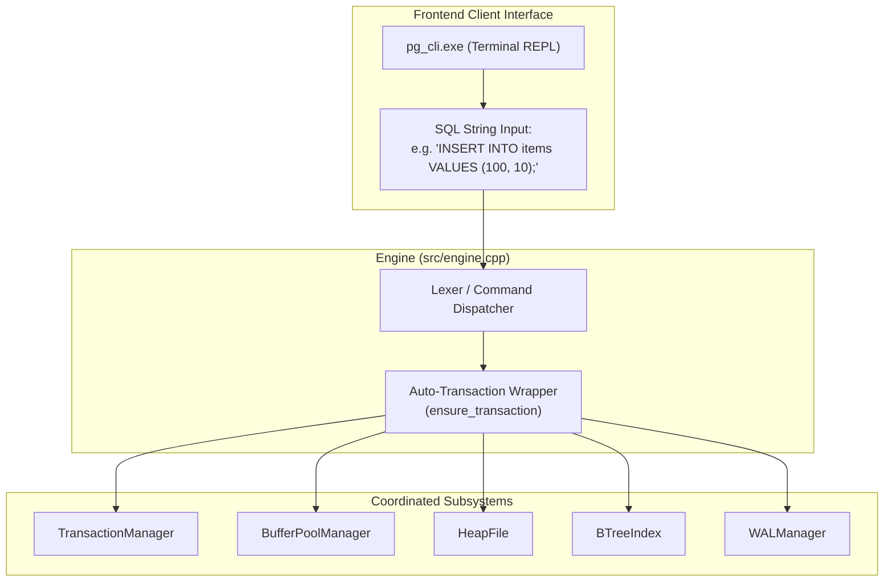

# Item 11: SQL REPL CLI & End-to-End Engine Capstone

**Confidence**: `verified`  
**Citations**: [include/pg/engine.h:1-85](file:///c:/Users/jerie/Documents/GitHub/cpp-postgres/include/pg/engine.h), [src/engine.cpp:1-250](file:///c:/Users/jerie/Documents/GitHub/cpp-postgres/src/engine.cpp), [src/main.cpp:1-95](file:///c:/Users/jerie/Documents/GitHub/cpp-postgres/src/main.cpp), [tests/test_repl.cpp:1-125](file:///c:/Users/jerie/Documents/GitHub/cpp-postgres/tests/test_repl.cpp)

---

## 1. Engine Coordination Architecture

The `pg::Engine` class provides a unified facade coordinating transactions, memory buffers, slotted heap tables, secondary indexes, WAL logging, and TOAST auxiliary relations.



---

## 2. Invariants & Execution Rules

1. **Auto-Transaction Invariant**: Every standalone DML statement executed outside of an explicit `BEGIN ... COMMIT` block automatically receives an implicit transaction ID, snapshot, and immediate WAL commit flush (`[src/engine.cpp:38]`).
2. **Tabular ASCII Formatting**: Query outputs render PostgreSQL-standard tabular ASCII grids displaying `item_id`, `price`, `xmin`, `xmax`, and physical `CTID`.
3. **Physical Diagnostic Commands**:
   - `DUMP PAGE <id>;`: Outputs exact byte offsets, `pd_lower`, `pd_upper`, line pointer flag states, and hex dumps.
   - `STATUS;`: Outputs active buffer pool residency, cache hit rates, WAL flushed LSN, and transaction horizons.

---

## 3. Sequence Diagram: End-to-End Insert Pipeline

```mermaid
sequenceDiagram
    autonumber
    participant CLI as CLI REPL (pg_cli.exe)
    participant Eng as Engine (src/engine.cpp)
    participant TM as TransactionManager
    participant WAL as WALManager
    participant Heap as HeapFile
    participant BPM as BufferPoolManager
    participant Idx as BTreeIndex

    CLI->>Eng: execute("INSERT INTO items VALUES (100, 10);")
    Eng->>TM: begin_transaction() -> TxID: 1
    Eng->>Heap: insert(Item {100, $10}, xmin=1)
    Heap->>BPM: fetch_page(0)
    Heap->>Heap: insert_tuple() -> Landed at CTID (0, 1)
    Heap->>BPM: unpin_page(0, is_dirty=true)
    Eng->>WAL: log_insert(tx_id=1, ctid=(0, 1), Item {100, 10})
    Eng->>Idx: insert_entry(key=100, ctid=(0, 1))
    Eng->>WAL: log_commit(tx_id=1) -> Flushes WAL to disk
    Eng->>TM: commit(tx_id=1)
    Eng-->>CLI: "[Tx 1] INSERT: Landed at CTID (0, 1)... Transaction committed."
```
