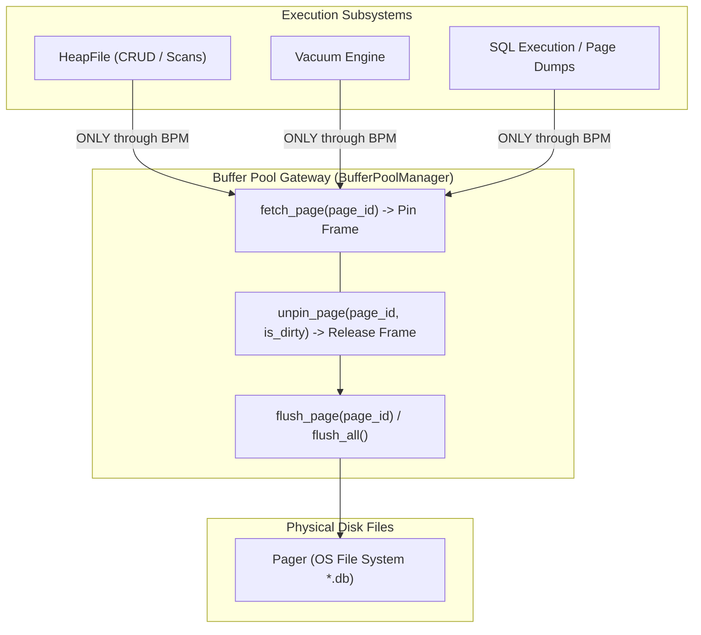
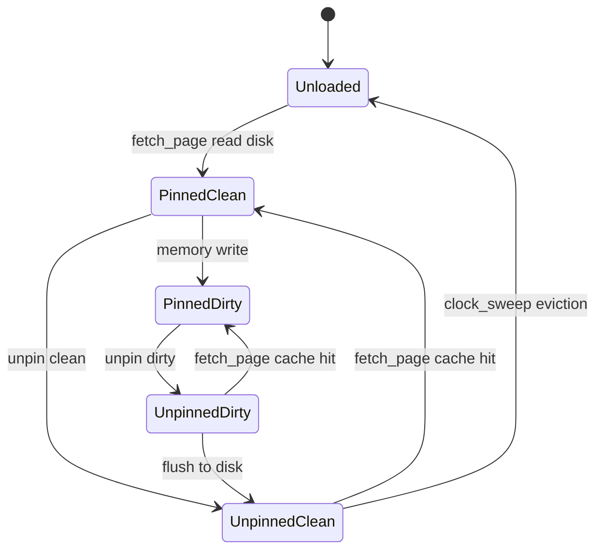

# Item 12: Buffer Pool Single Gateway Invariant

**Confidence**: `verified`  
**Citations**: [include/pg/heap.h:65-75](file:///c:/Users/jerie/Documents/GitHub/cpp-postgres/include/pg/heap.h), [src/heap.cpp:25-65](file:///c:/Users/jerie/Documents/GitHub/cpp-postgres/src/heap.cpp), [tests/test_buffer_integration.cpp:1-125](file:///c:/Users/jerie/Documents/GitHub/cpp-postgres/tests/test_buffer_integration.cpp)

---

## 1. The Single Gateway Principle

In a production database engine, **no subsystem is ever permitted to bypass shared buffers**.
Item 12 eliminates all direct `Pager::read_page()` and `Pager::write_page()` calls from `HeapFile` and `Engine`.

PostgreSQL holds the same rule for ordinary relation access, with named exceptions worth knowing:
- **Temporary tables** use per-backend *local* buffers (`localbuf.c`), not shared buffers.
- **WAL** has its own `wal_buffers` ring and never travels through the shared buffer pool.
- **Bulk operations** (`COPY`, `CREATE INDEX`, `ALTER TABLE` rewrites) go through the buffer manager but inside a restricted `BufferAccessStrategy` ring so they cannot evict the working set.
- A handful of paths talk to the storage manager (`smgr`) directly — relation extension, `mdtruncate`, and (from v17) the streaming read interface, which still lands in shared buffers but issues the I/O differently.

---

## 2. Invariants & Pin/Unpin Lifecycle State Machine

1. **Mandatory Symmetrical Unpinning**: Every `fetch_page()` call **must** have an exactly matching `unpin_page()` invocation in the same call stack (`[src/heap.cpp:55]`).
2. **Dirty Flag Propagation**: If any tuple bytes, line pointers, or page header offsets are modified in RAM, `unpin_page(page_id, is_dirty=true)` must be passed to ensure the buffer pool schedules disk writeback.

---

## 4. PostgreSQL Fidelity Check

| Claim | Verdict |
|---|---|
| All relation page access flows through the buffer manager | **Exact for ordinary access** |
| Every `fetch_page` is matched by an `unpin_page` | **Exact** — PostgreSQL's `ReadBuffer` / `ReleaseBuffer` discipline, with `ResourceOwner` tracking to catch leaks |
| Dirtiness is declared by the caller at unpin time | **Divergent in mechanism** — PostgreSQL calls `MarkBufferDirty()` at the moment of mutation, while holding the exclusive content lock, and that call is what pairs with WAL logging |
| Pin/unpin is the only lock | **Simplified** — PostgreSQL separates the *pin* (page stays resident) from the *content lock* (`LW_SHARED`/`LW_EXCLUSIVE` on the bytes); the state machine above conflates them |
| No local buffers / no strategy rings | **Missing** — see §1 |

### Implementation status (2026-08-27)

The gateway is now real. A relation owns exactly one `BufferPoolManager` and
there is no path around it: `HeapFile` builds one in its constructor if none is
injected, and `Vacuum` and WAL recovery both go through it. Previously VACUUM,
CLOG and TOAST each used their own `Pager` directly, which is how the cached copy
and the on-disk copy drifted apart.

`PinnedPage` replaces the fetch-copy-unpin-refetch-copy-back pattern: the pin is
held for the whole read-modify-write, so nothing can interleave between the read
and the write-back. Dirtiness is still declared by the caller, via
`PinnedPage::mark_dirty()`.

Still outside the gateway: CLOG and TOAST keep their own pagers.
