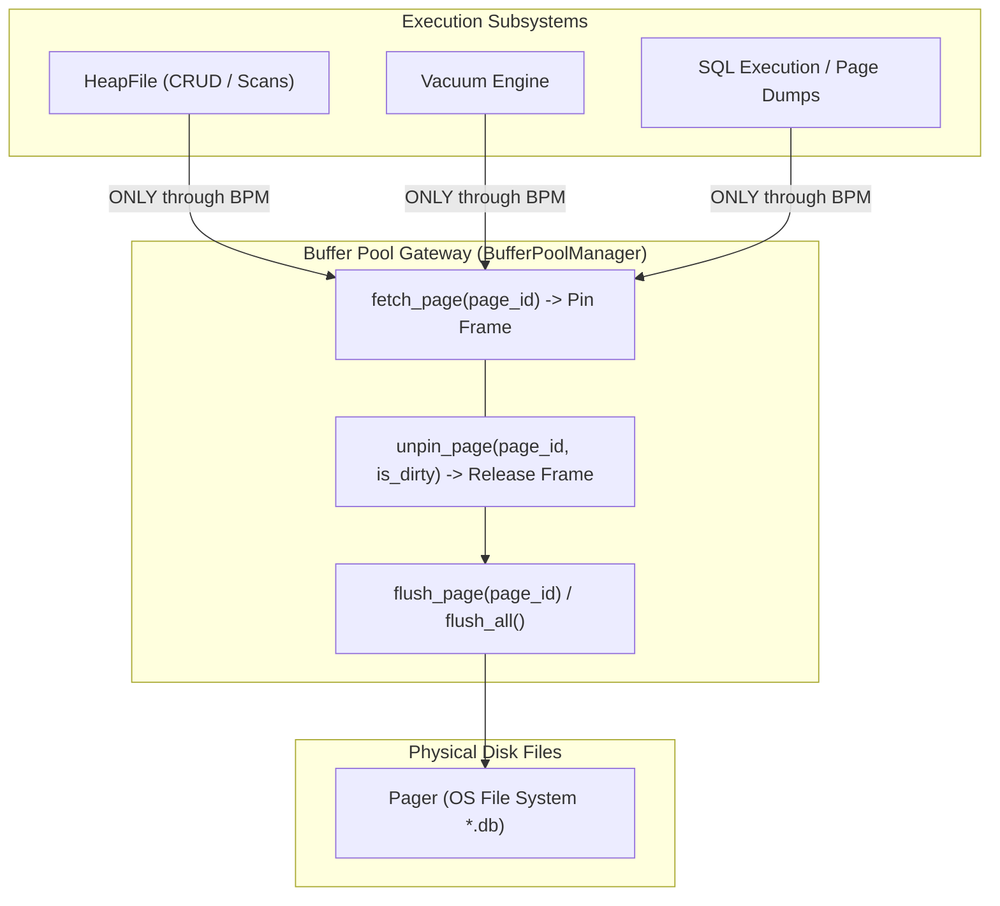
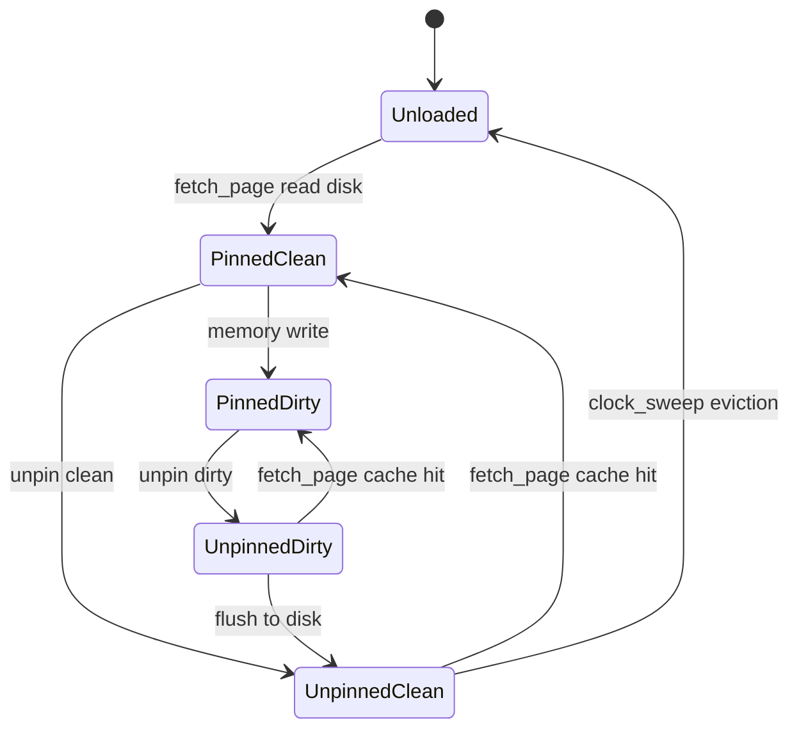

# Item 12: Buffer Pool Single Gateway Invariant

**Confidence**: `verified`  
**Citations**: [include/pg/heap.h:65-75](file:///c:/Users/jerie/Documents/GitHub/cpp-postgres/include/pg/heap.h), [src/heap.cpp:25-65](file:///c:/Users/jerie/Documents/GitHub/cpp-postgres/src/heap.cpp), [tests/test_buffer_integration.cpp:1-125](file:///c:/Users/jerie/Documents/GitHub/cpp-postgres/tests/test_buffer_integration.cpp)

---

## 1. The Single Gateway Principle

In a production database engine, **no subsystem is ever permitted to bypass shared buffers**.
Item 12 eliminates all direct `Pager::read_page()` and `Pager::write_page()` calls from `HeapFile` and `Engine`.

---

## 2. Invariants & Pin/Unpin Lifecycle State Machine

1. **Mandatory Symmetrical Unpinning**: Every `fetch_page()` call **must** have an exactly matching `unpin_page()` invocation in the same call stack (`[src/heap.cpp:55]`).
2. **Dirty Flag Propagation**: If any tuple bytes, line pointers, or page header offsets are modified in RAM, `unpin_page(page_id, is_dirty=true)` must be passed to ensure the buffer pool schedules disk writeback.

