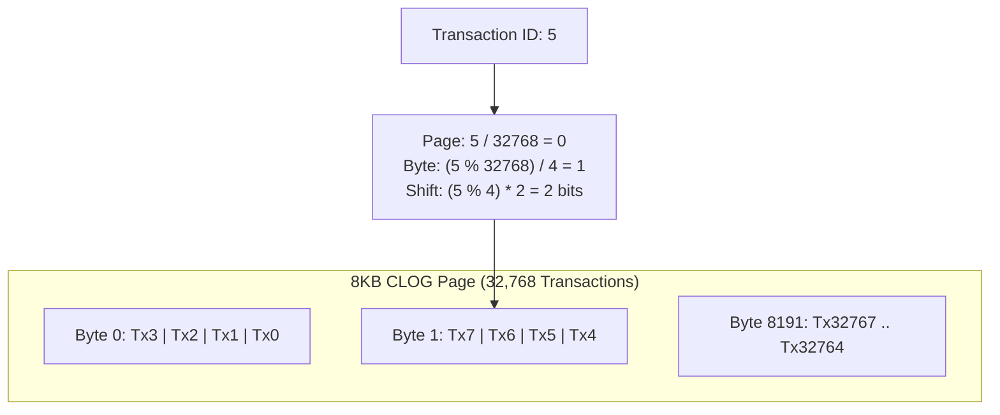
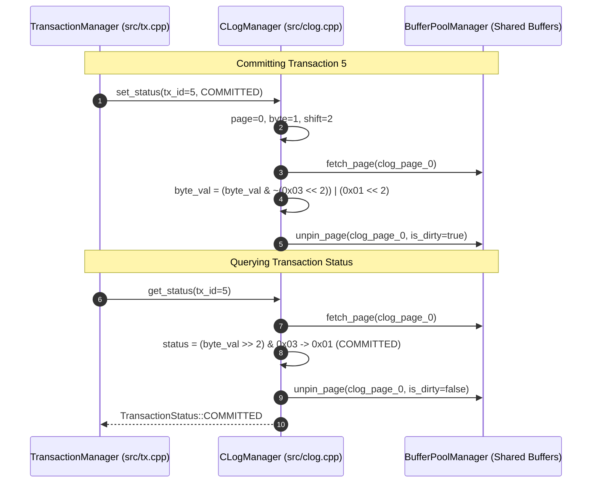

# Item 13: CLOG Commit Status 2-Bit Bitmap Pages

**Confidence**: `verified`  
**Citations**: [include/pg/clog.h:1-55](file:///c:/Users/jerie/Documents/GitHub/cpp-postgres/include/pg/clog.h), [src/clog.cpp:1-110](file:///c:/Users/jerie/Documents/GitHub/cpp-postgres/src/clog.cpp), [tests/test_clog.cpp:1-125](file:///c:/Users/jerie/Documents/GitHub/cpp-postgres/tests/test_clog.cpp)

---

## 1. The Commit Log (CLOG) Architecture

PostgreSQL avoids having to revisit every tuple a transaction touched at commit time by persisting one commit *state* per transaction into dedicated 8KB **commit log** bitmap pages — the `pg_xact` directory (named `pg_clog` before PostgreSQL 10; the internal API is still `clog.c`).

Each transaction is encoded using exactly **2 bits**:

$$\text{00} = \text{IN-PROGRESS} \qquad \text{01} = \text{COMMITTED} \qquad \text{10} = \text{ABORTED} \qquad \text{11} = \text{SUB-COMMITTED}$$

---

## 2. Invariants & Mathematical Mapping Formulas

1. **Transaction Density Derivation**:
   $$\text{Transactions Per Page} = 8192 \text{ bytes} \times 4 \text{ tx/byte} = 32768 \text{ transactions}$$
2. **Exact Bit Offset Formula**:
   $$\text{clog\_page} = \lfloor \text{tx\_id} / 32768 \rfloor$$
   $$\text{byte\_offset} = \lfloor (\text{tx\_id} \bmod 32768) / 4 \rfloor$$
   $$\text{bit\_shift} = (\text{tx\_id} \bmod 4) \times 2$$
3. **Instant Visibility on Restart**: CLOG pages are flushed on commit and loaded on startup, enabling instantaneous MVCC snapshot visibility checks without requiring full WAL log replay (`[src/clog.cpp:45]`).

   **PostgreSQL does not fsync CLOG at commit.** The durability of a commit rests entirely on the WAL commit record; the CLOG bit is set in a shared-memory SLRU buffer and written out lazily, normally at checkpoint. If the server crashes between the two, redo re-applies the commit record and re-sets the bit. Fsyncing CLOG per commit would add a second synchronous write to every transaction for no durability gain.

---

## 3. Sequence Diagram: CLOG Commit and Status Lookup

---

## 4. PostgreSQL Fidelity Check

| Claim | Verdict |
|---|---|
| 2 bits per transaction, packed 4 per byte | **Exact** |
| 32,768 transactions per 8KB page | **Exact** — `CLOG_XACTS_PER_PAGE` |
| Status codes `00`/`01`/`10`/`11` = in-progress / committed / aborted / sub-committed | **Exact** — `TRANSACTION_STATUS_*` in `clog.h` |
| Page / byte / shift arithmetic | **Exact** |
| Read-modify-write of the 2-bit field under a page pin | **Exact in shape** |
| "CLOG pages are flushed on commit" | **Wrong** — durability comes from the WAL commit record; CLOG is an SLRU written at checkpoint |
| Name "CLOG" | **Dated** — the directory is `pg_xact` since PostgreSQL 10 |

### Mechanisms PostgreSQL layers on top

- **Hint bits.** The first reader that resolves a transaction's status through CLOG writes the answer back into the tuple's `t_infomask` (`HEAP_XMIN_COMMITTED`, `HEAP_XMAX_COMMITTED`, …), so subsequent visibility checks skip CLOG entirely. Without them, CLOG would be the hottest structure in the system — which is exactly what happens in this engine.
- **SLRU segmentation and truncation.** CLOG lives in 256 KB segment files (32 pages each) under a generic simple-LRU cache. VACUUM advances `datfrozenxid`, and old segments are **deleted** — the commit log is not kept forever. Without freezing (Item 5), this engine's CLOG grows without bound.
- **`SUB_COMMITTED` is real.** PostgreSQL uses `0x03` for a subtransaction that has committed but whose top-level parent has not; `pg_subtrans` records the parent link. This engine reserves the code but has no subtransactions.
- **Two-phase commit.** `PREPARE TRANSACTION` state lives in `pg_twophase`, outside CLOG.
