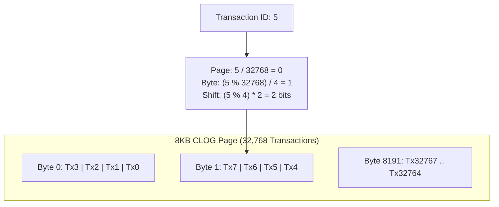
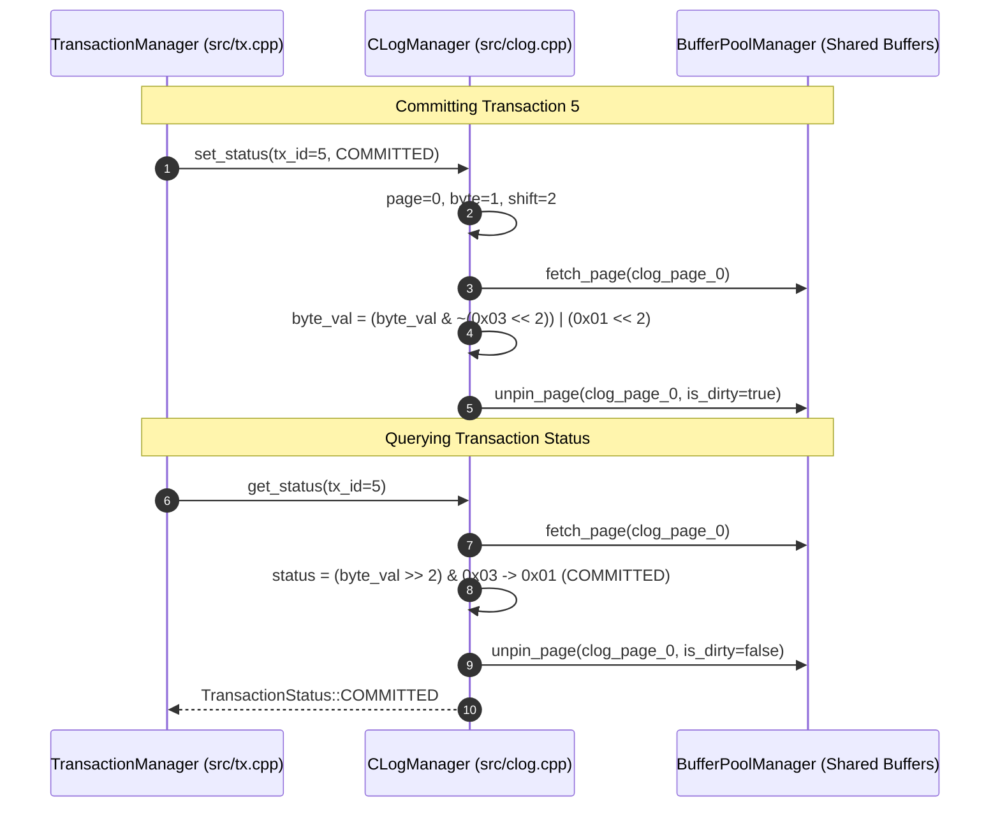

# Item 13: CLOG Commit Status 2-Bit Bitmap Pages

**Confidence**: `verified`  
**Citations**: [include/pg/clog.h:1-55](file:///c:/Users/jerie/Documents/GitHub/cpp-postgres/include/pg/clog.h), [src/clog.cpp:1-110](file:///c:/Users/jerie/Documents/GitHub/cpp-postgres/src/clog.cpp), [tests/test_clog.cpp:1-125](file:///c:/Users/jerie/Documents/GitHub/cpp-postgres/tests/test_clog.cpp)

---

## 1. The Commit Log (CLOG) Architecture

PostgreSQL avoids in-place tuple updates upon transaction commit by persisting transaction states into dedicated 8KB **CLOG (Commit Log)** bitmap pages.

Each transaction is encoded using exactly **2 bits**:

$$\text{00} = \text{IN-PROGRESS} \qquad \text{01} = \text{COMMITTED} \qquad \text{10} = \text{ABORTED} \qquad \text{11} = \text{SUB-COMMITTED}$$

---

## 2. Invariants & Mathematical Mapping Formulas

1. **Transaction Density Derivation**:
   $$\text{Transactions Per Page} = 8192 \text{ bytes} \times 4 \text{ tx/byte} = 32768 \text{ transactions}$$
2. **Exact Bit Offset Formula**:
   $$\text{clog\_page} = \lfloor \text{tx\_id} / 32768 \rfloor$$
   $$\text{byte\_offset} = \lfloor (\text{tx\_id} \bmod 32768) / 4 \rfloor$$
   $$\text{bit\_shift} = (\text{tx\_id} \bmod 4) \times 2$$
3. **Instant Visibility on Restart**: CLOG pages are flushed on commit and loaded on startup, enabling instantaneous MVCC snapshot visibility checks without requiring full WAL log replay (`[src/clog.cpp:45]`).

---

## 3. Sequence Diagram: CLOG Commit and Status Lookup

