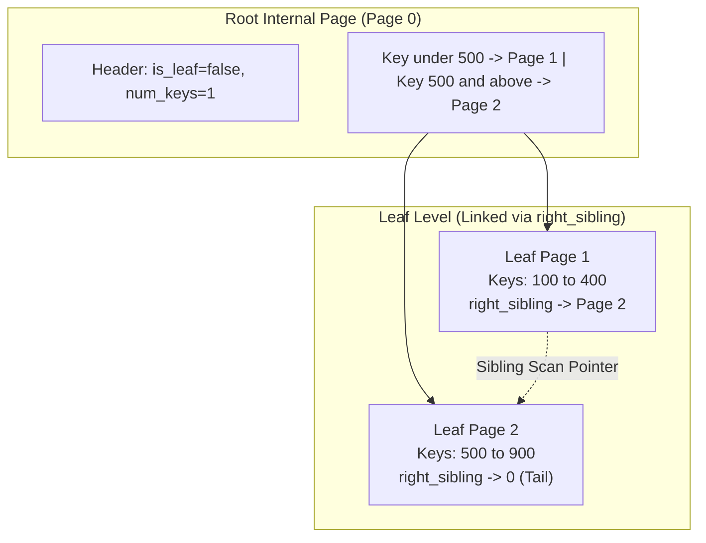

# Item 14: On-Disk B-Tree Index with Dynamic Node Splits

**Confidence**: `verified`  
**Citations**: [include/pg/disk_btree.h:1-125](file:///c:/Users/jerie/Documents/GitHub/cpp-postgres/include/pg/disk_btree.h), [src/disk_btree.cpp:1-400](file:///c:/Users/jerie/Documents/GitHub/cpp-postgres/src/disk_btree.cpp), [tests/test_disk_btree.cpp:1-200](file:///c:/Users/jerie/Documents/GitHub/cpp-postgres/tests/test_disk_btree.cpp)

---

## 1. Disk-Resident B-Tree Architecture

> **Implementation status.** As of 2026-09-05 (Finding 2.3 remediation), `DiskBTree` is now the primary secondary index used by `Engine`, replacing the in-memory multimap. It implements the abstract `Index` interface (`include/pg/index.h`), including `remove_entry()` for three-phase VACUUM index cleanup, `num_entries()`, `num_unique_keys()`, `dump()`, and dedicated buffer pool caching (`bpm_owned_`) with dirty page flushing on checkpoint and clean shutdown. $O(1)$ engine startup opens `<db_prefix>_index.db` directly without heap scanning.

`DiskBTree` stores hierarchical B-Tree nodes on dedicated **8,192-byte disk pages**. Nodes split dynamically when overflowing, promoting median keys up to parent internal nodes.

This is a textbook B+Tree. PostgreSQL's `nbtree` is a **Lehman & Yao B-link tree**, which differs structurally — see §4.

---

## 2. Invariants & Binary Page Formats

1. **B-Tree Page Header (12 Bytes — this engine's own format)** (`[include/pg/disk_btree.h:20]`):
   - `is_leaf` (1 Byte): `true` for leaf pages, `false` for internal routing nodes.
   - `num_keys` (2 Bytes): Number of active key entries in this node.
   - `right_sibling` (4 Bytes): `page_id_t` linking to the right sibling page for fast linear range scans.
   - `parent_page_id` (4 Bytes): `page_id_t` of the parent router node. **PostgreSQL has no parent pointers.** A descending search pushes the blocks it passed through onto a stack, and a split walks that stack back up; this is deliberate, because a parent pointer would have to be rewritten in every child on every split, which cannot be done atomically under concurrency.
2. **Entry Binary Layouts**:
   - **Leaf Entry (10 Bytes)** (`[include/pg/disk_btree.h:39-42]`): `key` (4B int32) + `ctid` (6B CTID `{page, slot}`).
   - **Internal Router Entry (8 Bytes)** (`[include/pg/disk_btree.h:44-48]`): `key` (4B int32) + `child_page_id` (4B `page_id_t`).
3. **Median Split Algorithm**: When a leaf exceeds capacity ($N \ge 64$, `BTREE_MAX_LEAF_KEYS`), the median entry at $N/2$ is promoted to the parent node, splitting the keys evenly into a newly allocated 8KB sibling page (`[src/disk_btree.cpp:125]`).

   PostgreSQL splits on **byte occupancy against `fillfactor`** (default 90 for leaves), not on a fixed key count, and it does not use a plain median: `_bt_findsplitloc()` scores candidate split points, and detects **rightmost-page appends** to split 90/10 instead of 50/50 so that monotonically increasing keys (a `serial` primary key) do not leave every page half empty.

---

## 3. Sequence Diagram: Leaf Split & Key Insertion

---

## 4. PostgreSQL Fidelity Check

| Claim | Verdict |
|---|---|
| B+Tree on 8KB pages; keys only in internal nodes, payload in leaves | **Exact in shape** |
| Leaf pages chained for range scans | **Exact in spirit** — PostgreSQL chains them **doubly** (`btpo_prev` *and* `btpo_next`) |
| Split allocates a sibling and pushes a separator up | **Exact in shape** |
| `parent_page_id` stored in each node | **Divergent** — PostgreSQL stores no parent pointers; it uses a descent stack |
| Split at a fixed 64-key limit, promoting the median | **Divergent** — PostgreSQL splits on `fillfactor` bytes, with a 90/10 rule for rightmost appends |
| 12-byte custom node header | **Divergent** — PostgreSQL reuses the standard 24-byte page header and puts B-tree state in the *special area* (`BTPageOpaqueData`, 16 bytes) at the page end |

### What PostgreSQL's nbtree adds

- **Metapage at block 0.** Holds the root block number and tree level, so the root can move without any other page changing. The "fast root" pointer lets a mostly-empty tree skip levels.
- **High keys.** Every page stores an upper bound for its own key range as item 1. Combined with the right-link, this is what makes the tree a **B-link tree**: a reader that arrives at a page mid-split notices the searched key exceeds the high key and simply *moves right*, so searches never block on splits.
- **Page deletion is two-stage.** Emptied pages are marked half-dead, then deleted, then held until no snapshot could still be following a link into them, then recycled via the FSM. Compare: this engine never reclaims a B-tree page.
- **Deduplication (v13+).** Equal keys are folded into posting-list tuples carrying a sorted TID array.
- **Suffix truncation.** Separator keys pushed into internal pages are truncated to the shortest distinguishing prefix, so internal pages fan out further.
- **Concurrency.** Latch coupling on descent, per-page `LWLock`s, and vacuum interlocks — all absent here, where a single engine mutex serialises everything.
