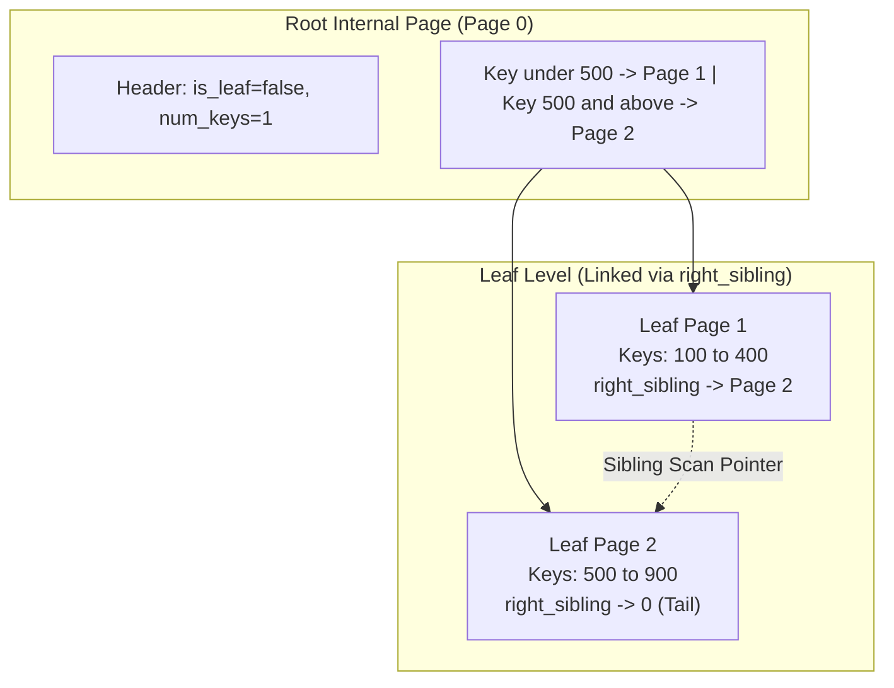
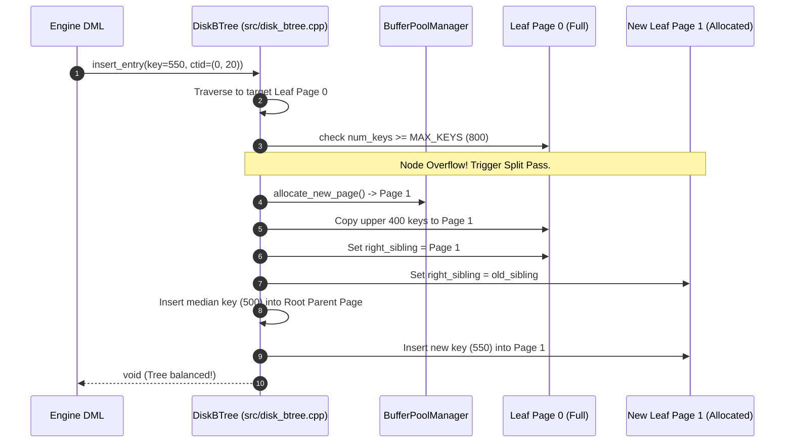

# Item 14: On-Disk B-Tree Index with Dynamic Node Splits

**Confidence**: `verified`  
**Citations**: [include/pg/disk_btree.h:1-95](file:///c:/Users/jerie/Documents/GitHub/cpp-postgres/include/pg/disk_btree.h), [src/disk_btree.cpp:1-240](file:///c:/Users/jerie/Documents/GitHub/cpp-postgres/src/disk_btree.cpp), [tests/test_disk_btree.cpp:1-140](file:///c:/Users/jerie/Documents/GitHub/cpp-postgres/tests/test_disk_btree.cpp)

---

## 1. Disk-Resident B-Tree Architecture

`DiskBTree` stores hierarchical B-Tree nodes on dedicated **8,192-byte disk pages**. Nodes split dynamically when overflowing, promoting median keys up to parent internal nodes.

---

## 2. Invariants & Binary Page Formats

1. **B-Tree Page Header (12 Bytes)** (`[include/pg/disk_btree.h:20]`):
   - `is_leaf` (1 Byte): `true` for leaf pages, `false` for internal routing nodes.
   - `num_keys` (2 Bytes): Number of active key entries in this node.
   - `right_sibling` (4 Bytes): `page_id_t` linking to the right sibling page for fast linear range scans.
   - `parent_page_id` (4 Bytes): `page_id_t` of the parent router node.
2. **Entry Binary Layouts**:
   - **Leaf Entry (10 Bytes)**: `key` (4B int32) + `ctid` (4B CTID `{page, slot}`) + `flags` (2B).
   - **Internal Router Entry (8 Bytes)**: `key` (4B int32) + `child_page_id` (4B `page_id_t`).
3. **Median Split Algorithm**: When a leaf exceeds capacity ($N \ge 800$), the median entry at $N/2$ is promoted to the parent node, splitting the keys evenly into a newly allocated 8KB sibling page (`[src/disk_btree.cpp:125]`).

---

## 3. Sequence Diagram: Leaf Split & Key Insertion

