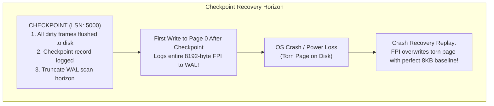
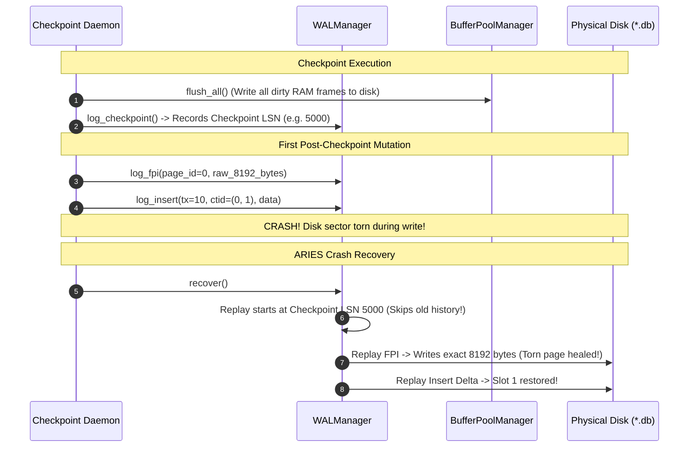

# Item 15: WAL Checkpoints & Full-Page Images (FPI)

**Confidence**: `verified`  
**Citations**: [include/pg/wal.h:20-60](file:///c:/Users/jerie/Documents/GitHub/cpp-postgres/include/pg/wal.h), [src/wal.cpp:115-180](file:///c:/Users/jerie/Documents/GitHub/cpp-postgres/src/wal.cpp), [tests/test_checkpoint.cpp:1-130](file:///c:/Users/jerie/Documents/GitHub/cpp-postgres/tests/test_checkpoint.cpp)

---

## 1. Checkpoint & Torn-Page Protection

**Checkpoints** truncate the recovery horizon so that crash recovery does not need to scan WAL logs from the beginning of time.

**Full-Page Images (FPI)** prevent catastrophic corruption caused by **torn pages** (when the OS crashes in the middle of writing an 8KB page, leaving a half-written 4KB sector on disk).

---

## 2. Invariants & Mechanics

1. **Dirty Buffer Coalescing**: `log_checkpoint()` invokes `BufferPoolManager::flush_all()`, writing all modified RAM frames to disk before appending the `CHECKPOINT` record (`[src/wal.cpp:135]`).
2. **First-Write FPI Invariant**: The first transaction to modify any page following a checkpoint must write a full 8,192-byte snapshot of the page into WAL (`RecordType::FPI = 6`). Subsequent writes to that page only log compact delta records until the next checkpoint (`[src/wal.cpp:150]`).
3. **Torn-Page Healing**: During recovery, replaying an FPI record unconditionally restores the physical 8KB page byte-for-byte, healing torn sectors before delta REDO logs are applied.

---

## 3. Sequence Diagram: Checkpoint & Torn Page Healing

