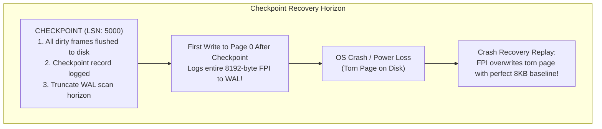
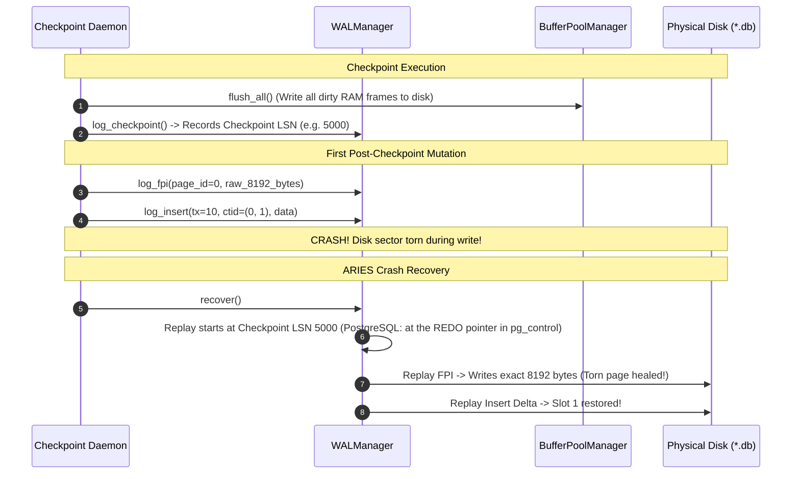

# Item 15: WAL Checkpoints & Full-Page Images (FPI)

**Confidence**: `verified`  
**Citations**: [include/pg/wal.h:20-60](file:///c:/Users/jerie/Documents/GitHub/cpp-postgres/include/pg/wal.h), [src/wal.cpp:115-180](file:///c:/Users/jerie/Documents/GitHub/cpp-postgres/src/wal.cpp), [tests/test_checkpoint.cpp:1-130](file:///c:/Users/jerie/Documents/GitHub/cpp-postgres/tests/test_checkpoint.cpp)

---

## 1. Checkpoint & Torn-Page Protection

**Checkpoints** truncate the recovery horizon so that crash recovery does not need to scan WAL logs from the beginning of time.

**Full-Page Images (FPI)** prevent catastrophic corruption caused by **torn pages** (when the OS crashes in the middle of writing an 8KB page, leaving a half-written 4KB sector on disk).

---

## 2. Invariants & Mechanics

1. **Dirty Buffer Coalescing**: `log_checkpoint()` invokes `BufferPoolManager::flush_all()`, writing all modified RAM frames to disk before appending the `CHECKPOINT` record (`[src/wal.cpp:135]`).

   **The REDO point is not the checkpoint record's LSN.** PostgreSQL records the current insert position as the *REDO pointer* **before** it starts flushing buffers, flushes over a long window (`checkpoint_completion_target`, default 0.9 of the interval, to avoid an I/O spike), then writes the checkpoint record at the end and stores the REDO pointer in `pg_control`. Recovery restarts from that earlier REDO pointer, not from the checkpoint record — because pages dirtied during the flush window may have been written before their WAL was durable. Collapsing the two, as the diagram below does, is safe here only because `flush_all()` is synchronous and nothing else is running.
2. **First-Write FPI Invariant**: The first transaction to modify any page following a checkpoint must write a full 8,192-byte snapshot of the page into WAL (`RecordType::FPI = 6`). Subsequent writes to that page only log compact delta records until the next checkpoint (`[src/wal.cpp:150]`).

   **Exactly PostgreSQL's rule**, controlled by the `full_page_writes` GUC (on by default; safe to disable only on storage with atomic 8KB writes, e.g. ZFS). Two differences in mechanism: PostgreSQL attaches the image to the *same* WAL record that performs the modification, as a backup block inside `XLogRecordBlockHeader`, rather than emitting a separate FPI record; and it strips the page's free space ("hole" between `pd_lower` and `pd_upper`) before logging, optionally compressing the remainder (`wal_compression`). This is why WAL volume spikes immediately after every checkpoint and then decays — the standard argument for spacing checkpoints further apart.
3. **Torn-Page Healing**: During recovery, replaying an FPI record unconditionally restores the physical 8KB page byte-for-byte, healing torn sectors before delta REDO logs are applied.

---

## 3. Sequence Diagram: Checkpoint & Torn Page Healing

---

## 4. PostgreSQL Fidelity Check

| Claim | Verdict |
|---|---|
| Checkpoints bound recovery time by flushing dirty buffers and recording a restart position | **Exact** |
| First write to a page after a checkpoint carries a full-page image | **Exact** — `full_page_writes` |
| FPI replay overwrites the page unconditionally, healing torn writes | **Exact** |
| FPIs are replayed before subsequent delta records for that page | **Exact** |
| Recovery restarts at the checkpoint record's LSN | **Divergent** — PostgreSQL restarts at the **REDO pointer**, captured before the flush window |
| Checkpoint = synchronous `flush_all()` | **Simplified** — PostgreSQL spreads writes across `checkpoint_completion_target` via the checkpointer process |
| Separate `FPI` record type | **Divergent** — PostgreSQL attaches backup blocks to the modifying record itself |
| Full 8192 bytes logged | **Divergent** — PostgreSQL removes the free-space hole and can compress (`wal_compression`) |

### Not modelled

- **`pg_control`**, the 8 KB file holding the last checkpoint location, the database state (`in production` / `in archive recovery` / …), and the `BLCKSZ`/version fingerprint. Recovery begins by reading it.
- **Checkpoint triggers**: `checkpoint_timeout`, `max_wal_size`, explicit `CHECKPOINT`, shutdown, and the distinct **restartpoint** used on a standby.
- **LSN-skip during replay.** PostgreSQL compares `page.pd_lsn` against the record's LSN and skips records already reflected on the page. This engine replays unconditionally.
- **Recovery targets** — PITR, `recovery_target_time`, timelines.

### Implementation status (2026-08-27)

Full-page images are now actually written. `log_fpi` existed before but had no
caller outside a test, so the torn-page protection described here was dead code.
`HeapFile::maybe_log_fpi` now emits one on the first modification of a page after
each checkpoint, guarded by `WALManager::needs_fpi`.

`log_checkpoint` also orders its work correctly now: flush every dirty frame,
`fsync` the relation, and only then append the checkpoint record — so a recovery
starting at that record can trust every page before it.

Still simplified: the redo point and the checkpoint record LSN are the same here
(safe only because the flush is synchronous), and the whole 8KB is logged rather
than removing the free-space hole.
