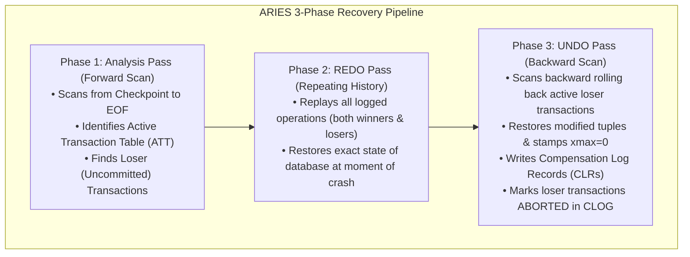
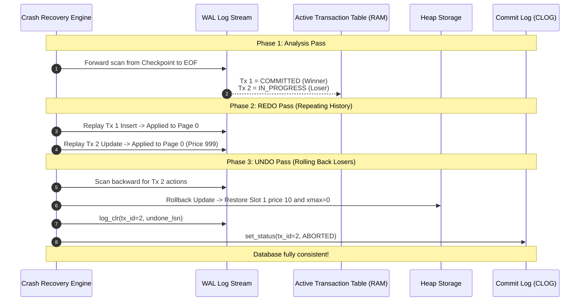
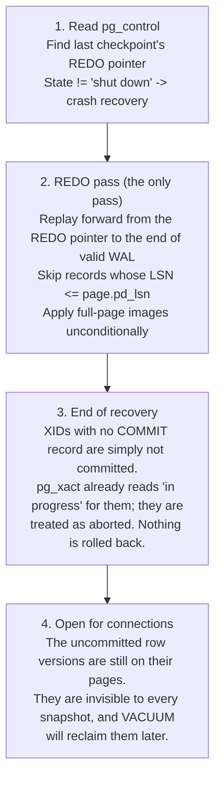

# Item 16: ARIES 3-Phase Crash Recovery & UNDO Pass

> ### ⚠️ Fidelity warning — read this first
>
> **PostgreSQL does not do this.** PostgreSQL's crash recovery is **redo-only**. There is no UNDO pass, there are no compensation log records, and no `ATT`-driven rollback of uncommitted work. `cpp-postgres` implements textbook ARIES here as a teaching exercise; this chapter documents *this engine*, and §4 explains what PostgreSQL does instead and why.
>
> The claim in earlier revisions of this chapter that "PostgreSQL employs the ARIES model" was wrong.

**Confidence**: `verified`  
**Citations**: [include/pg/wal.h:70-95](file:///c:/Users/jerie/Documents/GitHub/cpp-postgres/include/pg/wal.h), [src/wal.cpp:160-240](file:///c:/Users/jerie/Documents/GitHub/cpp-postgres/src/wal.cpp), [tests/test_undo.cpp:1-135](file:///c:/Users/jerie/Documents/GitHub/cpp-postgres/tests/test_undo.cpp)

---

## 1. The 3-Phase ARIES Recovery Algorithm

`cpp-postgres` employs the **ARIES (Algorithms for Recovery and Isolation Exploiting Semantics)** model to restore consistency after an unexpected system crash or power outage:

---

## 2. Invariants & Compensation Log Records (CLRs)

1. **Repeating History**: REDO is executed unconditionally for all transactions (committed and uncommitted) before UNDO runs. This guarantees that uncommitted mutations, page splits, and allocations are brought into physical memory before being rolled back (`[src/wal.cpp:190]`). *PostgreSQL shares this half — it also repeats history for winners and losers alike — and then simply stops.*
2. **Compensation Log Record (CLR)**: When an operation is rolled back during the UNDO pass, a `CLR` (`type = 7`) is written to WAL with an `undo_next_lsn` pointer. CLRs are **never undone**, preventing infinite recovery loops if the system crashes during recovery itself (`[src/wal.cpp:215]`).
3. **CLOG Status Finalization**: Once an uncommitted transaction is rolled back, its status is finalized to `ABORTED` (`0x02`) in CLOG.

---

## 3. Sequence Diagram: ARIES Crash Recovery Walkthrough

---

## 4. PostgreSQL Fidelity Check — why PostgreSQL has no UNDO

### 4.1 What PostgreSQL actually does on restart

There is no Analysis pass building an Active Transaction Table for rollback purposes, no backward scan, and no CLR record type in `xlogrecord.h`.

### 4.2 Why it can get away with it

Because **MVCC already provides rollback**. An aborted transaction's row versions were never visible to anyone: `HeapTupleSatisfiesMVCC()` asks CLOG about `xmin`, gets `ABORTED`, and treats the tuple as though it had never existed. Undoing the physical write buys nothing — the only cost is the dead space, which VACUUM reclaims on its own schedule (Item 5).

This makes `ROLLBACK` an O(1) operation in PostgreSQL, at runtime *and* at recovery: set two bits in `pg_xact`, done. A `ROLLBACK` of a transaction that updated ten million rows costs the same as one that updated none.

### 4.3 What it pays for that

The trade is the one this whole engine is built around: dead tuples accumulate in the heap and must be vacuumed, and the indexes bloat alongside them. An undo-based engine (Oracle, MySQL/InnoDB) instead keeps the heap clean and pays on rollback and on long-running-read reconstruction. PostgreSQL's `zheap` project prototyped exactly the ARIES-style undo design in this chapter — with an undo log, discard worker, and in-place updates — and it was never merged into core.

### 4.4 Verdict table

| Claim | Verdict |
|---|---|
| WAL, LSNs, checkpoints, full-page images, "repeating history" in redo | **Exact — PostgreSQL is genuinely ARIES-influenced here** |
| Redo applies to committed *and* uncommitted transactions | **Exact** |
| PostgreSQL "employs the ARIES model" | **Wrong** — PostgreSQL implements the redo half only |
| Phase 1 Analysis building an ATT of losers | **Not in PostgreSQL** — no such pass exists |
| Phase 3 UNDO, backward scan, tuple restoration, `xmax = 0` rewrite | **Not in PostgreSQL** — aborted work is left in place and reclaimed by VACUUM |
| Compensation Log Records with `undo_next_lsn` | **Not in PostgreSQL** — no CLR record type exists |
| Aborted transactions end up `ABORTED` in the commit log | **Exact in outcome**, reached without any rollback work |
| Recovery is idempotent under a crash-during-recovery | **Exact in outcome** — PostgreSQL gets this from LSN comparison against `pd_lsn`, not from CLRs |

### 4.5 Also not modelled

- **`pg_control` state machine** and the `DB_SHUTDOWNED` vs `DB_IN_PRODUCTION` distinction that decides whether recovery runs at all.
- **`pd_lsn` skip test.** PostgreSQL skips a redo record when `record.lsn <= page.pd_lsn`, which is what makes replay idempotent.
- **Continuous recovery.** The same code path drives archive recovery, PITR, and hot standby — recovery in PostgreSQL is not a startup-only special case.
