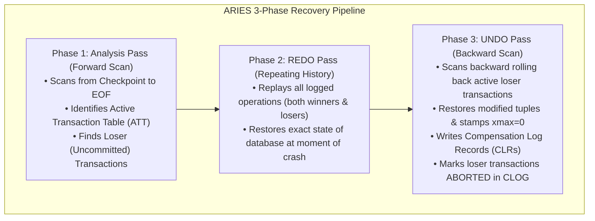
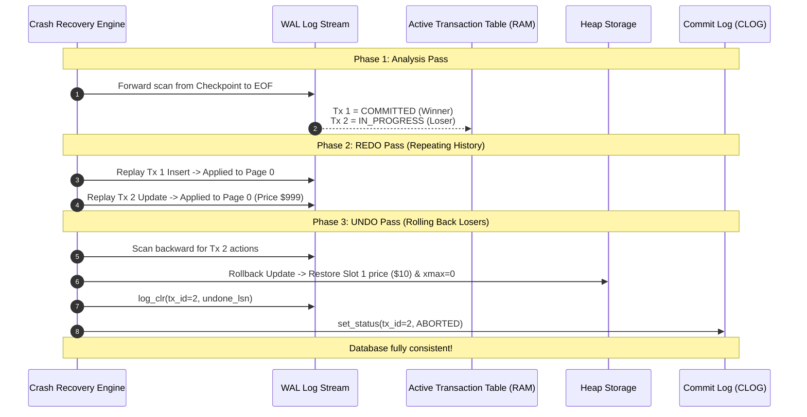

# Item 16: ARIES 3-Phase Crash Recovery & UNDO Pass

**Confidence**: `verified`  
**Citations**: [include/pg/wal.h:70-95](file:///c:/Users/jerie/Documents/GitHub/cpp-postgres/include/pg/wal.h), [src/wal.cpp:160-240](file:///c:/Users/jerie/Documents/GitHub/cpp-postgres/src/wal.cpp), [tests/test_undo.cpp:1-135](file:///c:/Users/jerie/Documents/GitHub/cpp-postgres/tests/test_undo.cpp)

---

## 1. The 3-Phase ARIES Recovery Algorithm

PostgreSQL employs the **ARIES (Algorithms for Recovery and Isolation Exploiting Semantics)** model to restore consistency after an unexpected system crash or power outage:

---

## 2. Invariants & Compensation Log Records (CLRs)

1. **Repeating History**: REDO is executed unconditionally for all transactions (committed and uncommitted) before UNDO runs. This guarantees that uncommitted mutations, page splits, and allocations are brought into physical memory before being rolled back (`[src/wal.cpp:190]`).
2. **Compensation Log Record (CLR)**: When an operation is rolled back during the UNDO pass, a `CLR` (`type = 7`) is written to WAL with an `undo_next_lsn` pointer. CLRs are **never undone**, preventing infinite recovery loops if the system crashes during recovery itself (`[src/wal.cpp:215]`).
3. **CLOG Status Finalization**: Once an uncommitted transaction is rolled back, its status is finalized to `ABORTED` (`0x02`) in CLOG.

---

## 3. Sequence Diagram: ARIES Crash Recovery Walkthrough

