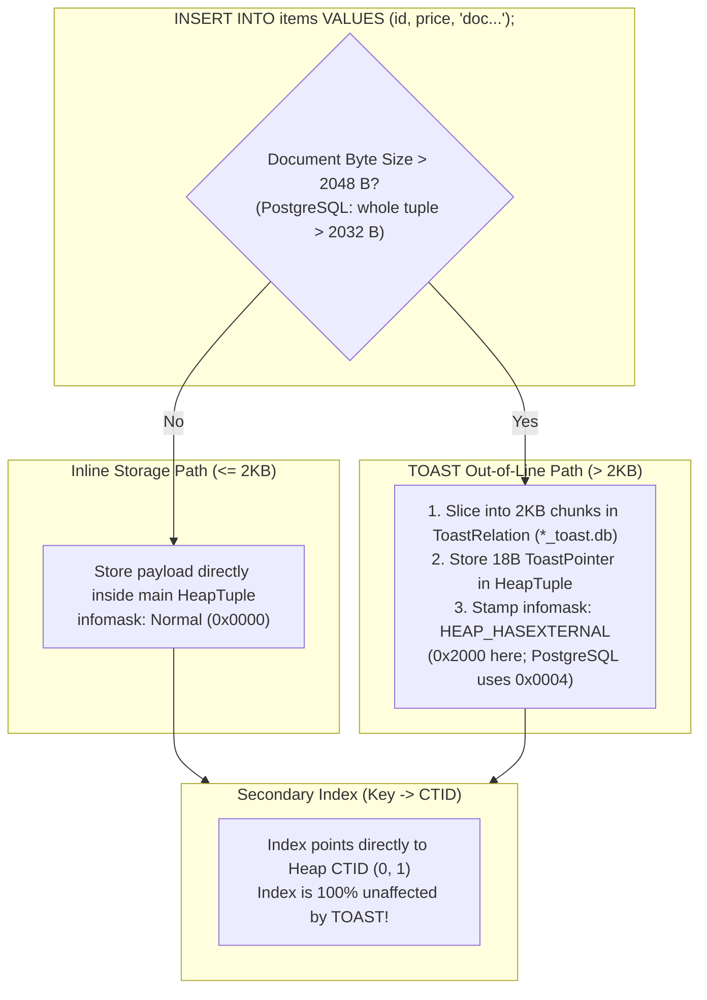
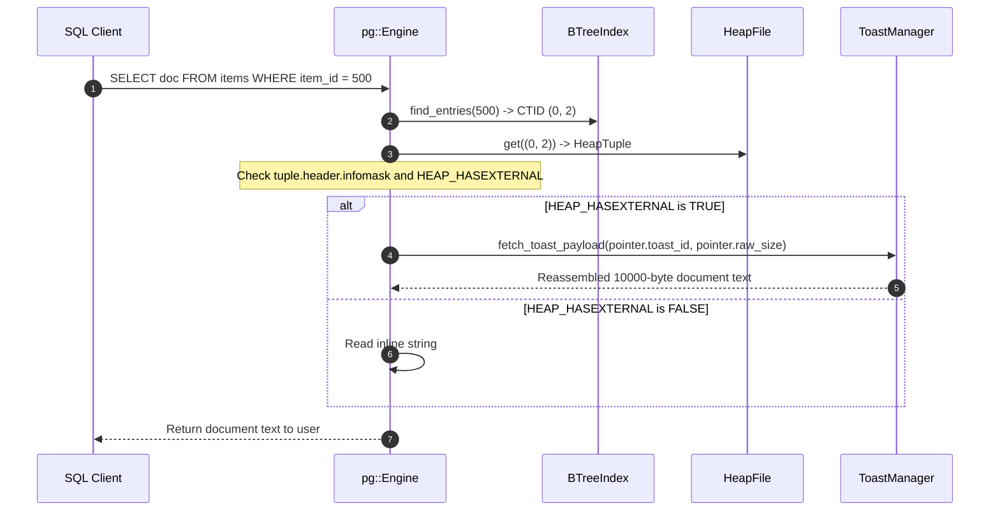

# Item 17: TOAST Heap + Index Full Integration

**Confidence**: `verified`  
**Citations**: [include/pg/tuple.h:40-55](file:///c:/Users/jerie/Documents/GitHub/cpp-postgres/include/pg/tuple.h), [src/engine.cpp:180-245](file:///c:/Users/jerie/Documents/GitHub/cpp-postgres/src/engine.cpp), [tests/test_toast_integration.cpp:1-135](file:///c:/Users/jerie/Documents/GitHub/cpp-postgres/tests/test_toast_integration.cpp)

---

## 1. Transparent Inline vs Out-of-Line Routing

Item 17 integrates the TOAST subsystem transparently into the main SQL execution pipeline, B-Tree index scans, and cross-file durability across restarts.

---

## 2. Invariants & Infomask Flags

1. **`HEAP_HASEXTERNAL`**: Stamped on `TupleHeader::infomask`. Signals to sequential scans and index fetchers that the tuple's trailing bytes contain an 18-byte `ToastPointer` rather than inline text (`[include/pg/tuple.h:44]`). This engine uses `0x2000`; **PostgreSQL's `HEAP_HASEXTERNAL` is `0x0004`**, and `0x2000` is `HEAP_UPDATED` (see Item 3). In PostgreSQL the flag is a fast-path hint only — the authoritative marker is the varlena datum's own 1-byte header (`VARATT_IS_EXTERNAL`), which is what `pg_detoast_datum()` actually tests.
2. **Zero Index Decoupling Impact**: Because the secondary index stores $(\text{item\_id} \rightarrow \text{CTID})$, the index node size is strictly 10 bytes regardless of whether the indexed row contains a 10-byte string or a 100-megabyte document.

   This holds because the index key here is the small `item_id`. It is **not** a general PostgreSQL property: if you index the *toastable* column itself, the B-tree stores the value inline in the index tuple, detoasted (though it may stay compressed). PostgreSQL caps a B-tree entry at roughly a third of a page and raises `index row size ... exceeds btree version 4 maximum 2704` past that — the reason large-text indexing normally goes through an expression index on a hash, or a GIN full-text index.
3. **Cross-Relation Durability**: On engine restart, the main heap relation (`*_heap.db`) and auxiliary TOAST relation (`*_toast.db`) are reopened simultaneously, ensuring data consistency.

---

## 3. Sequence Diagram: Transparent TOAST Query Execution

---

## 4. PostgreSQL Fidelity Check

| Claim | Verdict |
|---|---|
| TOAST is transparent to the executor; detoast happens on attribute access | **Exact** |
| A flag on the tuple marks the presence of external attributes | **Exact in shape** |
| Index entries are unaffected when the indexed column is not the toasted one | **Exact** |
| `HEAP_HASEXTERNAL = 0x2000` | **Wrong for PostgreSQL** — `0x0004`; `0x2000` is `HEAP_UPDATED` |
| The flag is what drives detoasting | **Simplified** — PostgreSQL dispatches on the varlena header (`VARATT_IS_EXTERNAL`) per datum |
| "Index is 100% unaffected by TOAST" | **True for this schema only** — indexing a toastable column stores the value in the index tuple, subject to the ~2704-byte B-tree limit |
| Heap and TOAST relations opened together at startup | **Exact in spirit** — PostgreSQL links them via `pg_class.reltoastrelid` |

### Not modelled

- **TOAST relations are real tables.** Chunks carry their own MVCC headers, are vacuumed, and appear in `pg_class` / `pg_toast`. An `UPDATE` that does not touch the toasted column **reuses the existing chunks** — PostgreSQL copies the pointer into the new row version rather than rewriting the value, which is a large part of why wide-column updates are cheap.
- **Slice access.** `substr()` on an `EXTERNAL`-storage column fetches only the chunks it needs, via the `(chunk_id, chunk_seq)` index. This engine always reassembles the whole value.
- **Compression state.** PostgreSQL tracks compressed vs raw size in the pointer itself (Item 10).
