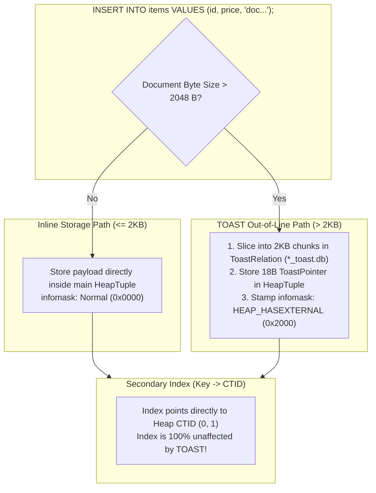
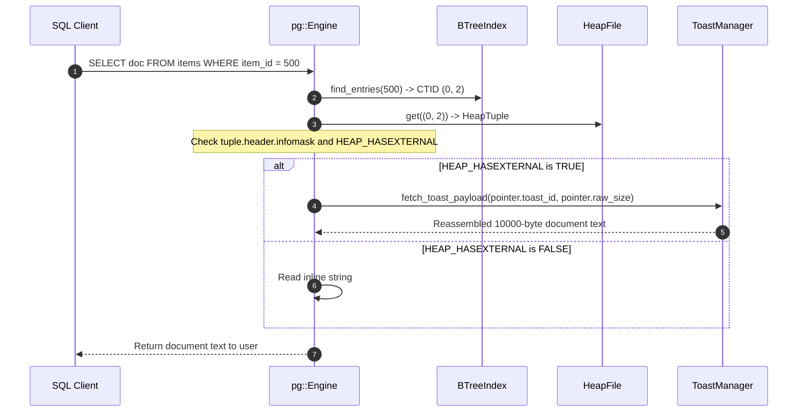

# Item 17: TOAST Heap + Index Full Integration

**Confidence**: `verified`  
**Citations**: [include/pg/tuple.h:40-55](file:///c:/Users/jerie/Documents/GitHub/cpp-postgres/include/pg/tuple.h), [src/engine.cpp:180-245](file:///c:/Users/jerie/Documents/GitHub/cpp-postgres/src/engine.cpp), [tests/test_toast_integration.cpp:1-135](file:///c:/Users/jerie/Documents/GitHub/cpp-postgres/tests/test_toast_integration.cpp)

---

## 1. Transparent Inline vs Out-of-Line Routing

Item 17 integrates the TOAST subsystem transparently into the main SQL execution pipeline, B-Tree index scans, and cross-file durability across restarts.

---

## 2. Invariants & Infomask Flags

1. **`HEAP_HASEXTERNAL` (`0x2000`)**: Stamped on `TupleHeader::infomask`. Signals to sequential scans and index fetchers that the tuple's trailing bytes contain an 18-byte `ToastPointer` rather than inline text (`[include/pg/tuple.h:44]`).
2. **Zero Index Decoupling Impact**: Because the secondary index stores $(\text{item\_id} \rightarrow \text{CTID})$, the index node size is strictly 10 bytes regardless of whether the indexed row contains a 10-byte string or a 100-megabyte document.
3. **Cross-Relation Durability**: On engine restart, the main heap relation (`*_heap.db`) and auxiliary TOAST relation (`*_toast.db`) are reopened simultaneously, ensuring data consistency.

---

## 3. Sequence Diagram: Transparent TOAST Query Execution

