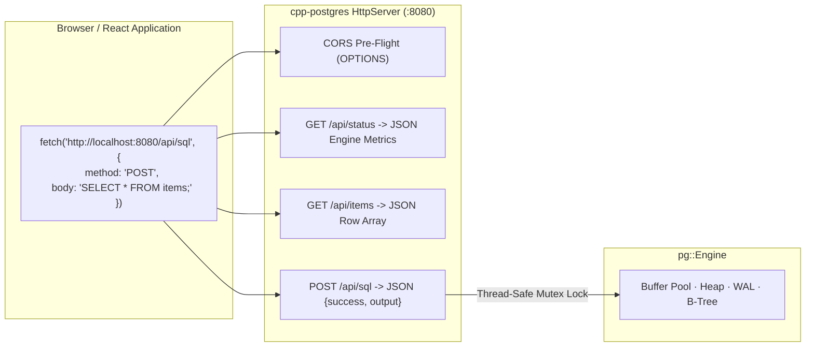
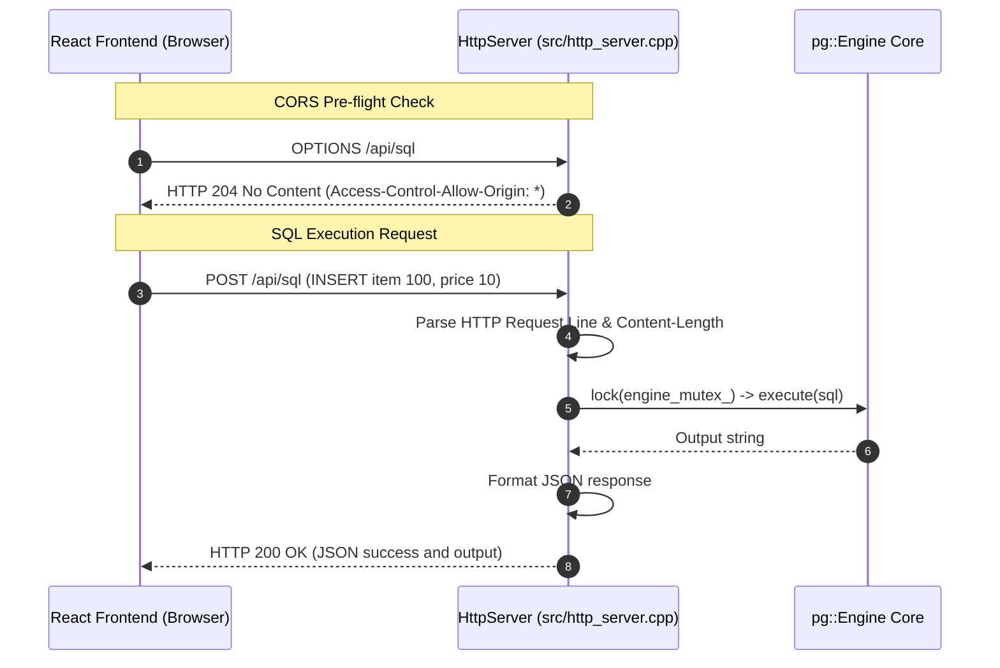

# Item 18: Embedded HTTP/REST API Server (Approach A)

**Confidence**: `verified`  
**Citations**: [include/pg/http_server.h:1-45](file:///c:/Users/jerie/Documents/GitHub/cpp-postgres/include/pg/http_server.h), [src/http_server.cpp:1-210](file:///c:/Users/jerie/Documents/GitHub/cpp-postgres/src/http_server.cpp), [tests/test_http_server.cpp:1-125](file:///c:/Users/jerie/Documents/GitHub/cpp-postgres/tests/test_http_server.cpp)

---

## 1. 2-Tier Architecture & Web Integration

Item 18 implements **Approach A: Direct Embedded HTTP/REST Server**.
The database binary embeds a lightweight, non-blocking Winsock2 HTTP 1.1 server listening on port `8080`, allowing web applications (e.g. React, Vue, cURL) to query the database directly via JSON.

**This has no PostgreSQL counterpart** — PostgreSQL speaks only the frontend/backend protocol on 5432 (Item 19), and HTTP access is provided by external projects (PostgREST, pgHttp, Supabase's API layer) sitting in front of it. Item 18 is a convenience for the desktop demo, not a modelled PostgreSQL subsystem.

> Note that `Access-Control-Allow-Origin: *` on an endpoint that executes arbitrary SQL with no authentication is only acceptable because this daemon is intended to bind loopback on a developer machine. It must not be exposed on a routable interface.



---

## 2. Invariants & REST Endpoints

1. **Full CORS Support**: Automatically handles `OPTIONS` requests and emits headers allowing cross-origin requests from any local frontend port:
   - `Access-Control-Allow-Origin: *`
   - `Access-Control-Allow-Methods: GET, POST, OPTIONS, PUT, DELETE`
   - `Access-Control-Allow-Headers: Content-Type, Authorization`
2. **JSON Response Contract**:
   - `POST /api/sql`: Executes arbitrary SQL and returns `{ "success": true, "sql": "...", "output": "..." }`.
   - `GET /api/items`: Streams live table rows directly as structured JSON objects:
     ```json
     {
       "items": [
         { "item_id": 100, "price": 10, "xmin": 1, "xmax": 0, "ctid": "(0, 1)" }
       ]
     }
     ```
3. **Thread Safety**: All incoming HTTP worker threads synchronize access to `pg::Engine` using `std::mutex engine_mutex_`.

---

## 3. Sequence Diagram: React Browser Query via HTTP



---

## 4. PostgreSQL Fidelity Check

Not applicable — no PostgreSQL analogue. See Item 19 for the subsystem that *is* protocol-accurate.
