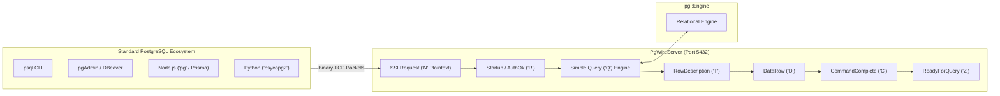
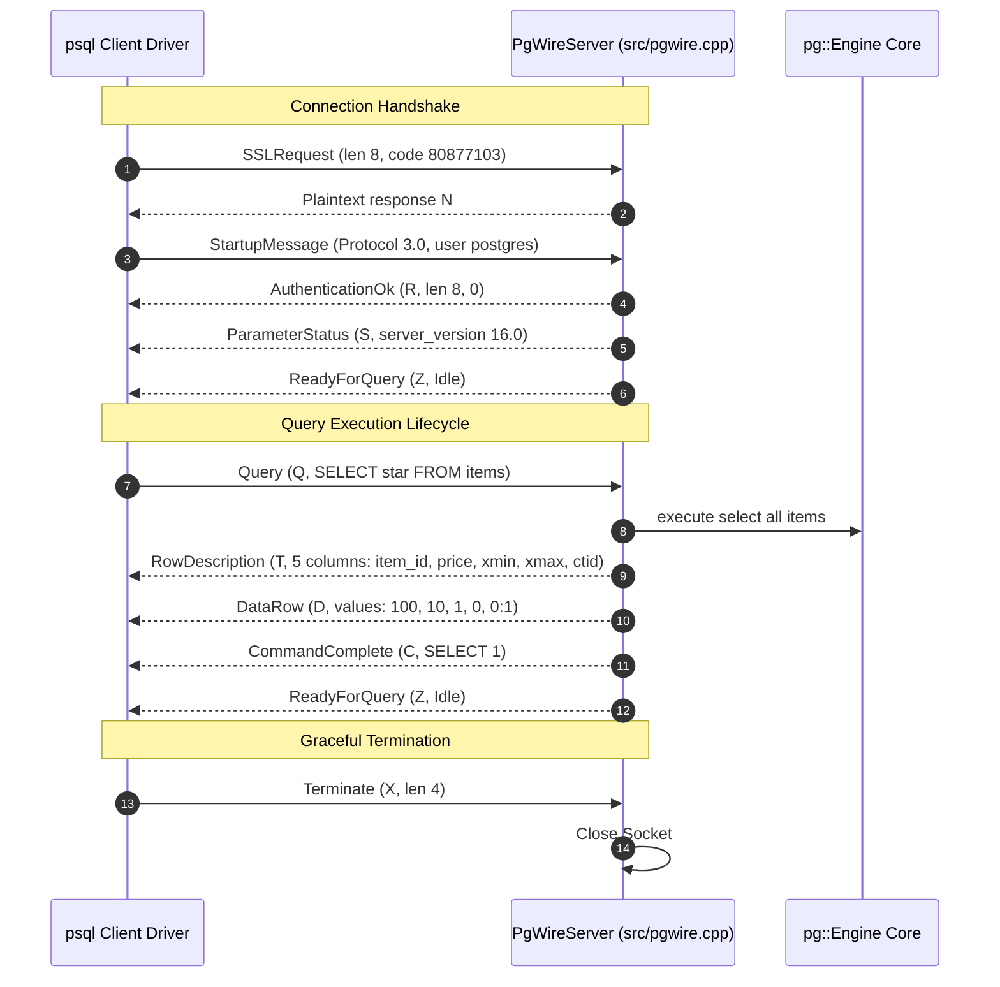

# Item 19: PostgreSQL Wire Protocol Server (Approach C)

**Confidence**: `verified`  
**Citations**: [include/pg/pgwire.h:1-55](file:///c:/Users/jerie/Documents/GitHub/cpp-postgres/include/pg/pgwire.h), [src/pgwire.cpp:1-320](file:///c:/Users/jerie/Documents/GitHub/cpp-postgres/src/pgwire.cpp), [tests/test_pgwire.cpp:1-160](file:///c:/Users/jerie/Documents/GitHub/cpp-postgres/tests/test_pgwire.cpp)

---

## 1. Enterprise 3-Tier Integration Architecture

Item 19 implements **Approach C: Native PostgreSQL Frontend/Backend Protocol v3.0**.
Listening on TCP port `5432`, `PgWireServer` transforms `cpp-postgres` into a drop-in PostgreSQL server compatible with standard PostgreSQL CLI tools, GUI clients, drivers, and ORMs.

---

## 2. Invariants & Packet Framing

1. **Big-Endian Integer Serialization**: All 16-bit and 32-bit fields are transmitted in Network Byte Order (`htonl`/`htons`) (`[src/pgwire.cpp:15]`).
2. **Binary Message Format**:
   - StartupMessage -> AuthenticationOk (R, len 8, 0) -> ParameterStatus (S) -> ReadyForQuery (Z, I).
   - A real PostgreSQL backend also sends **BackendKeyData (`K`, PID + secret)** between the last `ParameterStatus` and `ReadyForQuery`; it is what a client needs in order to issue a `CancelRequest` on a second connection. Most drivers tolerate its absence, but `pg_cancel_backend`-style cancellation cannot work without it.
   - Query (Q) -> RowDescription (T) -> DataRow (D)* -> CommandComplete (C) -> ReadyForQuery (Z).
3. **Transaction State Synchronization**: The ReadyForQuery (Z) packet transmits I when idle and T when an active transaction block is open. PostgreSQL defines a third state, **`E`** — in a transaction block that has hit an error, where every statement is rejected until `ROLLBACK`. That is the state `psql` reports as `!`.

---

## 3. Sequence Diagram: PostgreSQL Wire Protocol Handshake & Query

---

## 4. PostgreSQL Fidelity Check

| Claim | Verdict |
|---|---|
| Protocol v3.0, `SSLRequest` code 80877103, `N` to decline TLS | **Exact** |
| Message framing: 1-byte type tag + int32 length (length includes itself, excludes the tag) | **Exact** |
| Big-endian / network byte order throughout | **Exact** |
| Simple Query flow `Q -> T -> D* -> C -> Z` | **Exact** |
| `Z` carries `I` / `T` transaction status | **Incomplete** — `E` (failed transaction block) also exists |
| Startup: `R` -> `S`* -> `Z` | **Incomplete** — a real backend sends `K` (BackendKeyData) before `Z` |

### Not implemented

- **Extended query protocol** (`P` Parse / `B` Bind / `D` Describe / `E` Execute / `S` Sync) — used by every driver that supports prepared statements or server-side parameter binding, including JDBC and `psycopg` by default.
- **Authentication beyond `AuthenticationOk`** — no `scram-sha-256`, no `md5`, no TLS. Any client that connects is trusted.
- **`COPY` sub-protocol** (`G`/`H`/`d`/`c`), **`N` NoticeResponse**, **`A` NotificationResponse** (`LISTEN`/`NOTIFY`), **`CancelRequest`**.
- **Catalog queries.** `psql` backslash commands (`\d`, `\dt`) issue `pg_catalog` queries; without those tables they will fail even though the connection succeeds.
