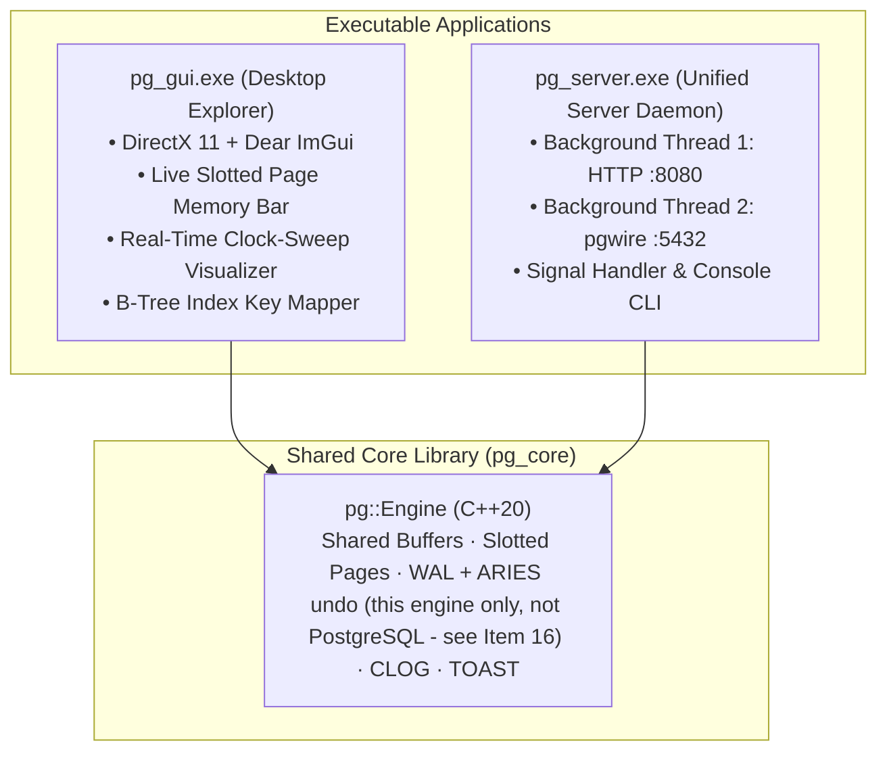
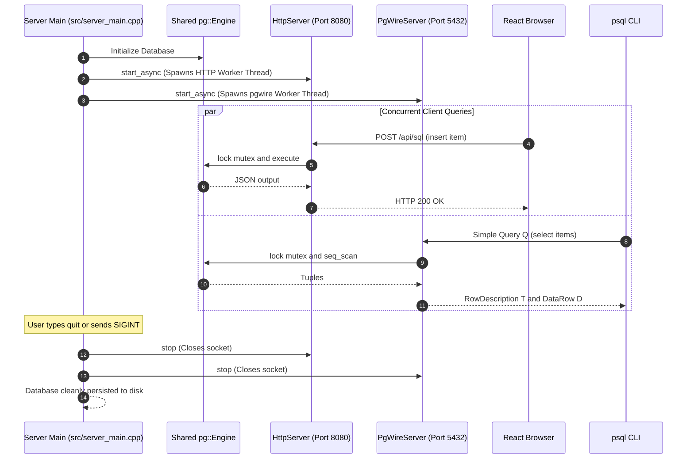

# Item 20: Native Desktop GUI & Unified Server Daemon

**Confidence**: `verified`  
**Citations**: [src/gui/main_gui.cpp:1-480](file:///c:/Users/jerie/Documents/GitHub/cpp-postgres/src/gui/main_gui.cpp), [src/server_main.cpp:1-75](file:///c:/Users/jerie/Documents/GitHub/cpp-postgres/src/server_main.cpp), [CMakeLists.txt:100-150](file:///c:/Users/jerie/Documents/GitHub/cpp-postgres/CMakeLists.txt)

---

## 1. Unified Applications Overview

Item 20 delivers two standalone executable artifacts:
1. **`pg_gui.exe` (3.89 MB)**: A self-contained Windows desktop GUI application built with **Dear ImGui + DirectX 11 + Win32**, providing visual memory inspectors for 8KB slotted pages, clock-sweep buffer frames, on-disk B-Tree graphs, and an interactive SQL scratchpad.
2. **`pg_server.exe`**: A multi-protocol daemon running both **Approach A (HTTP REST :8080)** and **Approach C (pgwire TCP :5432)** concurrently on background threads, wired to a shared `pg::Engine`.



---

## 2. Desktop GUI Feature Breakdown

```text
┌────────────────────────────────────────────────────────────────────────────────────────┐
│  🐘 CPP-POSTGRES STORAGE ENGINE DESKTOP EXPLORER                         [ _ □ ✕ ]   │
├──────────────────────────┬─────────────────────────────────────────────────────────────┤
│ 📝 SQL QUERY WORKSPACE   │ 🔬 PHYSICAL STORAGE ENGINE VISUALIZERS                      │
│ ┌──────────────────────┐ │ [📄 8KB Slotted Page] [🧠 Shared Buffers] [🌲 Disk B-Tree]  │
│ │ SELECT * FROM items; │ │ ─────────────────────────────────────────────────────────── │
│ └──────────────────────┘ │ Page 0 Header (18B) | pd_lower: 30B | pd_upper: 8120B      │
│ [▶ Run F5] [BEGIN]      │ [■■■ Line Pointers] [        Free Space        ] [■■ Tuples] │
│ [COMMIT]   [ROLLBACK]   │ ┌────────┬────────┬────────┬───────────────────────────────┐ │
│ [STATUS]   [VACUUM]     │ │ Slot # │ Offset │ Length │ Live Tuple Details            │ │
│                         │ ├────────┼────────┼────────┼───────────────────────────────┤ │
│ 📋 LIVE TABLE VIEW      │ │ Slot 1 │ 8168   │ 24 B   │ [LIVE] id=100, price=10       │ │
│ ┌─────┬───────┬────┬───┐│ │ Slot 2 │ 8144   │ 24 B   │ [HOT REDIRECT] -> (0, 3)      │ │
│ │ id  │ price │xmin│CTI││ │ Slot 3 │ 8120   │ 24 B   │ [HEAP-ONLY TUPLE] id=100, 20  │ │
│ ├─────┼───────┼────┼───┤│ └────────┴────────┴────────┴───────────────────────────────┘ │
│ │ 100 │ 20    │ 4  │0,3││                                                             │
│ │ 200 │ 5     │ 2  │0,2││ 🧠 Shared Buffers Tab: Live Clock-Sweep & Pin Tracking       │
│ └─────┴───────┴────┴───┘│ 🌲 Disk B-Tree Tab: Key -> Candidate CTID Mapping           │
│                         │ 🚦 CLOG Tab: 2-bit Transaction Status Bitmaps               │
│ 📊 OUTPUT LOG CONSOLE   │ 📜 WAL Tab: Crash Recovery & Checkpoints (see Item 16)       │
│                         │ 🍞 TOAST Tab: 2KB Chunk Auxiliary Table Inspector           │
└──────────────────────────┴─────────────────────────────────────────────────────────────┘
```

---

## 3. Sequence Diagram: Dual Server Daemon Operation



---

## 4. PostgreSQL Fidelity Check

Both binaries are original to this project; PostgreSQL ships `postgres`/`postmaster` plus `psql`, and its GUIs (pgAdmin, DBeaver) are separate projects speaking the wire protocol.

Two labels in the diagrams above are worth reading precisely:

- **"ARIES undo"** describes *this engine*. PostgreSQL's WAL is ARIES-influenced but redo-only — no undo pass, no CLRs (Item 16).
- **"Page 0 Header (18B)"** in the GUI mock is this engine's header. PostgreSQL's is 24 bytes (Item 2).

The `pg_server.exe` process model — one process, two listener threads, one shared `pg::Engine` behind a mutex — is also structurally unlike PostgreSQL, which forks a dedicated backend process per connection and coordinates through shared memory and lightweight locks. The single global mutex here means exactly one statement runs at a time, so none of the MVCC concurrency documented in Item 4 is actually exercised in parallel.
