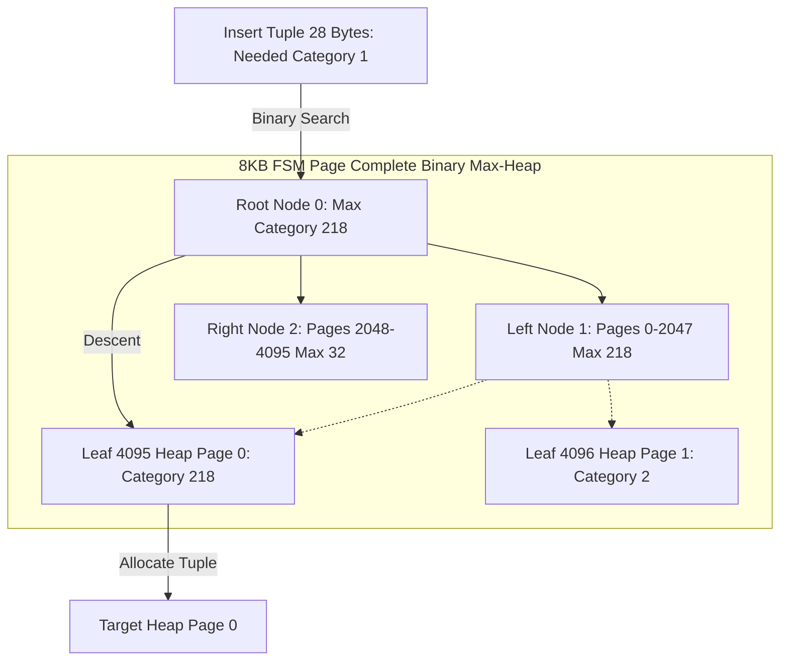
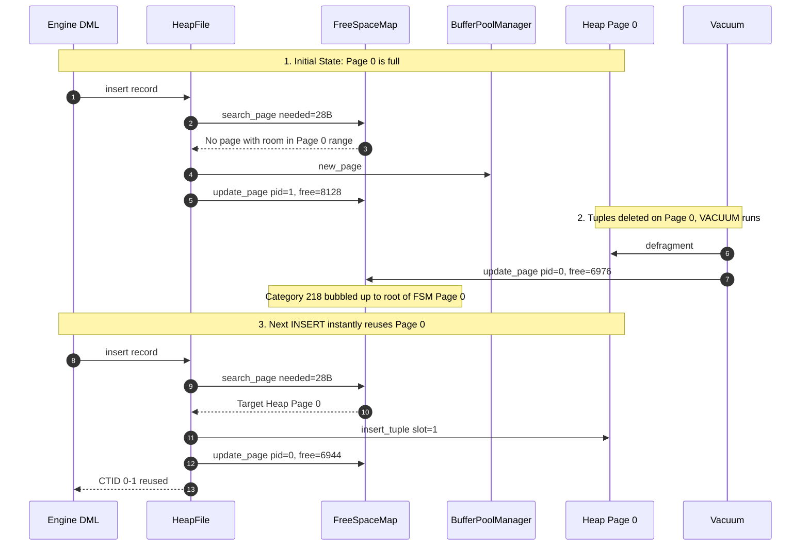

# Item 21: Free Space Map (FSM) Binary Max-Heap Tree

**Confidence**: `verified`  
**Citations**: [include/pg/fsm.h:1-75](file:///c:/Users/jerie/Documents/GitHub/cpp-postgres/include/pg/fsm.h), [src/fsm.cpp:1-125](file:///c:/Users/jerie/Documents/GitHub/cpp-postgres/src/fsm.cpp), [src/heap.cpp:55-120](file:///c:/Users/jerie/Documents/GitHub/cpp-postgres/src/heap.cpp), [tests/test_fsm.cpp:1-180](file:///c:/Users/jerie/Documents/GitHub/cpp-postgres/tests/test_fsm.cpp)

---

## 1. Free Space Map Architecture

In a production RDBMS, tuple insertion cannot afford to sequentially probe table pages looking for room, nor can it simply append to the end of the file and leave holes reclaimed by VACUUM permanently stranded.

PostgreSQL solves this with the **Free Space Map (FSM)** companion fork (`<relfilenode>_fsm`). The FSM organizes the free space of every heap page into a binary max-heap tree stored inside dedicated 8KB disk pages (`storage/freespace/fsm_storage.c`).



---

## 2. Invariants & Binary Tree Layout

1. **Exact 8KB Page Mathematical Fit** (`[include/pg/fsm.h:12-28]`):
   - In an 8,192-byte block, setting binary tree depth $D = 12$ yields:
     - $L = 2^{12} = 4,096$ leaf nodes (each representing one heap page).
     - $I = 2^{12} - 1 = 4,095$ internal router nodes.
     - Total tree nodes: $4,096 + 4,095 = 8,191$ bytes.
     - Adding 1 byte of padding/reserved space produces an exact 8,192-byte struct:
       ```cpp
       #pragma pack(push, 1)
       struct FsmPage {
           uint8_t nodes[8191]; // Complete binary tree: 0=root, 4095..8190=leaves
           uint8_t reserved{0}; // Pad to exactly PAGE_SIZE (8192 bytes)
       };
       #pragma pack(pop)
       static_assert(sizeof(FsmPage) == 8192);
       ```
2. **1-Byte Categorical Discretization** (`[include/pg/fsm.h:42-56]`):
   - Rather than storing multi-byte integer byte counts, free space is categorized in **32-byte chunks** from category $0$ to $255$:
     $$\text{category} = \min\left(255, \left\lfloor \frac{\text{free\_bytes}}{32} \right\rfloor\right)$$
   - Category 0 represents $0 \dots 31$ bytes free space (full).
   - Category 255 represents $\ge 8,160$ bytes free space (empty).
3. **$O(\log M)$ Tree Traversal**:
   - `search_page(needed_bytes)`: Evaluates `nodes[0] >= target_cat`. If false, returns `INVALID_PAGE_ID` in $O(1)$. If true, descends checking left child first in at most 12 comparisons ($< 20$ nanoseconds).
   - `update_page(pid, free_space)`: Assigns `nodes[4095 + slot] = category` and bubbles up the new maximum to the root in at most 12 parent comparisons.
4. **VACUUM Recycling**:
   - During Phase 3 page compaction (`[src/vacuum.cpp:168]`), VACUUM updates the FSM with the compacted page's free space. Subsequent inserts immediately route to the newly available space.

---

## 3. Sequence Diagram: Space Allocation & Dynamic Recycling



---

## 4. PostgreSQL Fidelity Check

| Claim | Verdict |
|---|---|
| FSM is stored in a companion fork (`<relfilenode>_fsm`) | **Exact** |
| 8KB page structured as complete binary tree with 4,096 leaves | **Exact** (`fsm_storage.c`) |
| Categorical discretization in 32-byte units ($0 \dots 255$) | **Exact** (`FSM_CATEGORIES = 256`) |
| Binary search descends choosing leftmost child with sufficient category | **Exact** |
| VACUUM updates FSM after defragmentation | **Exact** |
| Multi-level FSM for gigabyte-scale tables | **Simplified** — PostgreSQL uses a 3-level tree where upper pages index lower FSM pages. This engine uses a linear array of FSM pages where each page indexes 4,096 heap pages (32MB data per FSM page). |
| Unlogged FSM updates | **Exact** — FSM is an unlogged cache of heap space; corrupted/stale FSM blocks do not cause data loss. |
