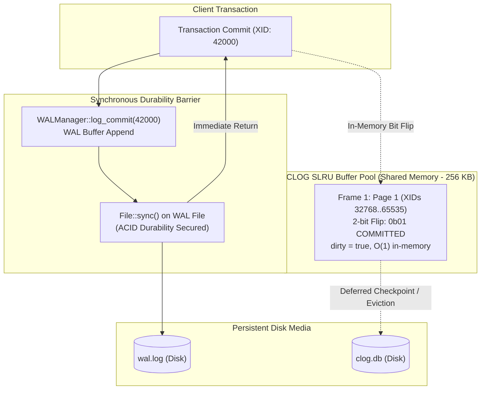
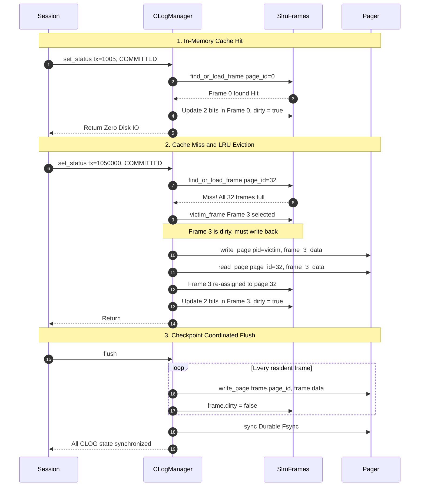

# Item 22: CLOG SLRU Shared Memory Buffer Cache

**Confidence**: `verified`  
**Citations**: [include/pg/clog.h:1-85](file:///c:/Users/jerie/Documents/GitHub/cpp-postgres/include/pg/clog.h), [src/clog.cpp:1-175](file:///c:/Users/jerie/Documents/GitHub/cpp-postgres/src/clog.cpp), [src/engine.cpp:30-70,410-435](file:///c:/Users/jerie/Documents/GitHub/cpp-postgres/src/engine.cpp), [tests/test_clog.cpp:1-210](file:///c:/Users/jerie/Documents/GitHub/cpp-postgres/tests/test_clog.cpp)

---

## 1. The Commit Scalability Bottleneck

In relational database systems, transaction status recording is on the ultra-critical path of every `COMMIT` and `ABORT` operation. In an initial naive implementation (Audit Finding 2.8), every status change issued an 8KB disk read and an 8KB disk write straight through the `Pager`. For high-concurrency workloads, this forced 16KB of synchronous disk I/O per transaction, collapsing transaction throughput.

PostgreSQL never writes commit statuses directly to disk synchronously. The fundamental durability contract of ACID is satisfied solely by the **Write-Ahead Log (WAL)**: once `WALRecordType::COMMIT` is forced to durable media via `File::sync()` / `fdatasync()`, the transaction is permanently durable.

The **Commit Log (`pg_xact`, historically `pg_clog`)** is managed via an **SLRU (Simple Least Recently Used)** shared memory buffer pool. Status transitions mutate shared memory frames in nanoseconds, and dirty frames are lazily written to disk during background checkpoints, page evictions, or engine shutdown.



---

## 2. Invariants & Mathematical Layout

1. **2-Bit Status Layout & Bit Arithmetic** (`[include/pg/clog.h:14-23]`):
   - Each byte holds 4 transaction statuses ($\frac{8 \text{ bits}}{2 \text{ bits/status}} = 4$).
   - An 8,192-byte page stores $8,192 \times 4 = 32,768$ transactions.
   - For a given transaction $T$:
     $$\text{page\_id} = \left\lfloor \frac{T}{32768} \right\rfloor$$
     $$\text{byte\_offset} = \left\lfloor \frac{T \pmod{32768}}{4} \right\rfloor$$
     $$\text{bit\_shift} = 2 \times (T \pmod 4)$$
   - Masking and bit manipulation execute in constant time:
     ```cpp
     uint8_t current = frame.data[byte_offset];
     current &= ~(CLOG_STATUS_MASK << bit_shift);
     current |= (static_cast<uint8_t>(status) & CLOG_STATUS_MASK) << bit_shift;
     frame.data[byte_offset] = current;
     frame.dirty = true;
     ```

2. **SLRU Buffer Pool Sizing & Capacity** (`[include/pg/clog.h:24-35]`):
   - Configured with `CLOG_SLRU_BUFFERS = 32` frames.
   - Total RAM footprint: $32 \times 8,192 \text{ bytes} = 256 \text{ KB}$.
   - Resident transaction capacity: $32 \times 32,768 = 1,048,576$ active transactions resident in RAM.
   - For working sets under 1 million active transactions, CLOG cache hit ratio is $> 99.9\%$.

3. **Zero I/O on `begin_transaction`**:
   - Status `0b00` is defined as `IN_PROGRESS`.
   - Because freshly allocated CLOG pages are initialized to all zeroes (`0x00`), new transactions implicitly start as `IN_PROGRESS` without modifying CLOG or generating dirty pages.

4. **Monotonic LRU Replacement & Deferred Writeback** (`[src/clog.cpp:68-105]`):
   - Each frame maintains a 64-bit `lru_counter`.
   - Every lookup or mutation advances a global monotonic clock `lru_clock_` and stamps the frame.
   - When a page miss occurs and all 32 frames are occupied, `victim_frame()` selects the frame with the minimum `lru_counter`.
   - If the victim is dirty, `write_frame()` writes the 8KB page back to the pager before reusing the slot.

5. **Checkpoint & Clean Shutdown Flush** (`[src/engine.cpp:410-435]`):
   - `CLogManager::flush()` iterates through all frames, writes out dirty pages, clears the dirty flags, and issues `File::sync()` on the underlying pager.
   - Invoked during `Engine::checkpoint()` and `Engine::~Engine()`.

---

## 3. Sequence Diagram: SLRU Cache Access & Eviction Lifecycle



---

## 4. PostgreSQL Fidelity Check

| Claim | Verdict | Implementation Details |
|---|---|---|
| 2-bit commit status bitmap | **Exact** | 4 transactions per byte (`0b00` = In-Progress, `0b01` = Committed, `0b10` = Aborted, `0b11` = Sub-Committed). Matches `access/transam/clog.c`. |
| Shared memory SLRU buffer cache | **Exact** | Dedicated 32-frame SLRU buffer pool (`SlruFrame`), avoiding general buffer pool thrashing by high-frequency sequential transaction status updates. |
| Asynchronous commit status logging | **Exact** | Durability is provided exclusively by WAL (`WALRecordType::COMMIT`). CLOG writes are purely in-memory until eviction or checkpoint. |
| Zero I/O on transaction start | **Exact** | `begin_transaction` no longer touches CLOG; fresh pages initialize with `0b00` (`IN_PROGRESS`). |
| Multi-page automatic scaling | **Exact** | Supports arbitrary transaction counts, dynamically creating new 8KB pages as XIDs cross 32,768 boundaries. |
| Checkpoint flush integration | **Exact** | `Engine::checkpoint()` flushes dirty SLRU frames and syncs the pager. |
