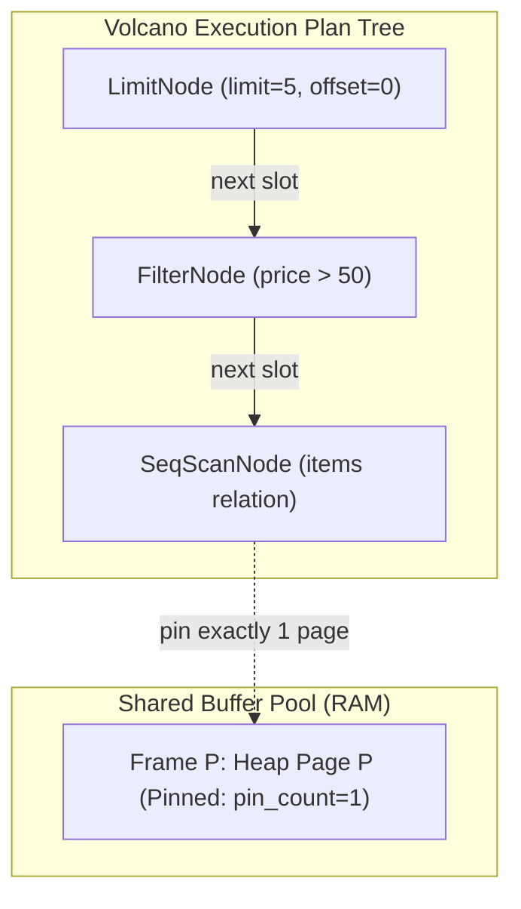
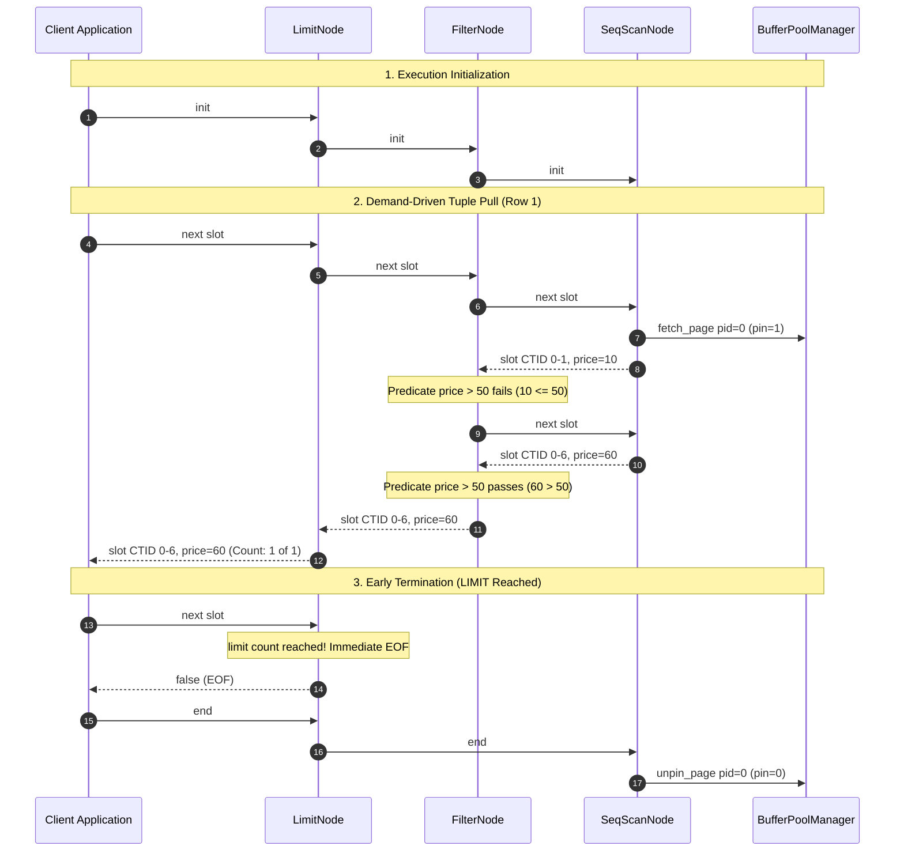

# Item 23: Volcano Iterator Query Execution Engine

**Confidence**: `verified`  
**Citations**: [include/pg/executor.h:1-170](file:///c:/Users/jerie/Documents/GitHub/cpp-postgres/include/pg/executor.h), [src/executor.cpp:1-260](file:///c:/Users/jerie/Documents/GitHub/cpp-postgres/src/executor.cpp), [src/engine.cpp:320-375,640-715](file:///c:/Users/jerie/Documents/GitHub/cpp-postgres/src/engine.cpp), [tests/test_executor.cpp:1-220](file:///c:/Users/jerie/Documents/GitHub/cpp-postgres/tests/test_executor.cpp)

---

## 1. Batch Materialization vs. Volcano Demand-Driven Iterators

In traditional relational engines, executing queries by loading all rows into a contiguous array (batch materialization) violates basic resource bounds. In an early implementation (Audit Finding 2.5), `HeapFile::seq_scan()` materialized every tuple across every disk page into an unbounded `std::vector<std::pair<CTID, HeapTuple>>`.

On a table with millions of rows, batch materialization produces three severe pathological failure modes:
1. **$O(N)$ Memory Consumption**: Memory footprint scales with relation size, causing buffer pool thrashing and memory exhaustion.
2. **Exhaustive I/O for Pipelined Queries**: A query like `SELECT * FROM items LIMIT 1` forced the engine to scan every single 8KB disk block and deserialize every tuple in the relation before returning the first result.
3. **Monolithic Query Path**: Lack of composable operators prevented query planning and runtime profiling.

PostgreSQL solves this using the **Volcano Demand-Driven Iterator Model** (Graefe, 1994), implemented across `src/backend/executor/`. Query plans form a tree of `PlanState` nodes where parent nodes pull tuples from child nodes one at a time via `ExecProcNode()`.

---

## 2. Invariants & Mathematical Guarantees

1. **Standardized Currency (`TupleTableSlot`)** (`[include/pg/executor.h:18-38]`):
   - Rather than exchanging physical byte pointers or allocating new structs per operator, operators communicate through a standardized `TupleTableSlot` (`include/executor/tuptable.h`).
   - A slot encapsulates:
     - Physical `CTID` (`page_id`, `slot_id`)
     - `HeapTuple` data payload and MVCC transaction headers (`xmin`, `xmax`, `infomask`)
     - State boolean (`is_empty`)
   - Reused across successive `next()` invocations, ensuring zero allocation overhead during tuple streaming.

2. **Single-Buffer Pinning Invariant ($O(1)$ Buffer Pool Pins)** (`[src/executor.cpp:25-65]`):
   - During sequential table scans across an arbitrary number of 8KB disk pages $P \in [1, \infty)$:
     $$\text{pinned\_frames} \le 1$$
   - When `SeqScanNode` finishes inspecting the line pointers of Page $k$, it releases the pin on Page $k$ via `curr_page_.release()` before pinning Page $k + 1$.
   - This prevents sequential scans from exhausting shared buffer pool frames or starving concurrent writers.

3. **Pipelined Early Termination Complexity** (`[src/executor.cpp:180-220]`):
   - For a relation with $P$ pages and $N$ tuples, a query requesting `LIMIT K` terminates as soon as $K$ matching tuples are produced:
     $$\text{Pages Scanned} = \min\left(P, \left\lceil \frac{K}{\text{tuples\_per\_page}} \right\rceil\right)$$
   - For `SELECT * FROM items LIMIT 1`, `Pages Scanned = 1 \ll P`. Subsequent pages are never read from disk or cached in memory.

4. **HOT Chain Resolution in Index Scans** (`[src/executor.cpp:90-135]`):
   - `IndexScanNode` looks up candidate CTIDs from `DiskBTree`.
   - For each candidate CTID, it executes `heap_.hot_search()`, traversing `t_ctid` pointers to find the version visible to the caller's snapshot.
   - Visited CTIDs are tracked to prevent duplicate emissions if multiple index entries reference the same row.

---

## 3. Sequence Diagram: Pipelined Pull Lifecycle

---

## 4. PostgreSQL Fidelity Check

| Claim | Verdict | Implementation Details |
|---|---|---|
| Demand-Driven Volcano Iterator Model | **Exact** | Reconstructs `ExecInitNode`, `ExecProcNode`, and `ExecEndNode` through `PlanNode::init()`, `PlanNode::next()`, and `PlanNode::end()`. Matches `src/backend/executor/execProcnode.c`. |
| Standardized Tuple Slot | **Exact** | `TupleTableSlot` encapsulates `CTID` and `HeapTuple` without allocating dynamic memory per tuple. Matches `include/executor/tuptable.h`. |
| Single Buffer Pin Invariant | **Exact** | `SeqScanNode` holds at most ONE `PinnedPage` at any time, releasing pins when advancing across 8KB page boundaries. |
| Pipelined Early Termination | **Exact** | `LimitNode` stops pulling immediately upon satisfying the count, avoiding disk I/O on remaining relation pages. |
| B-Tree Index Scan HOT Traversal | **Exact** | `IndexScanNode` traverses `HEAP_HOT_UPDATED` chains in shared buffers, honoring MVCC snapshots and deduplicating physical CTIDs. |
| Runtime Profiling (`EXPLAIN ANALYZE`) | **Exact** | `ExecutionEngine::explain` provides plan tree visualization with microseconds runtime and actual row counts, matching PostgreSQL's `EXPLAIN (ANALYZE)`. |
