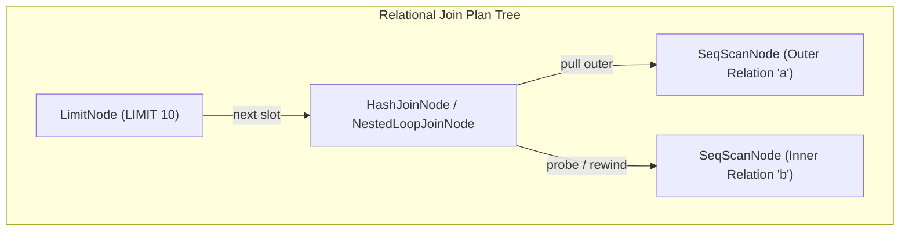
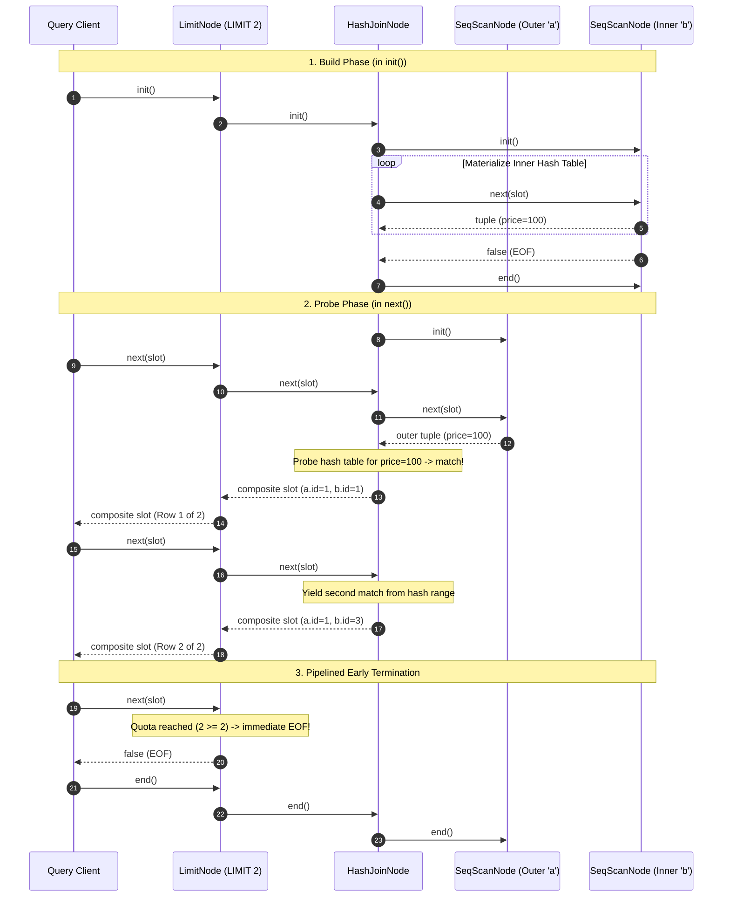

# Item 24: Volcano Relational Joins (Nested-Loop & Hash Join)

**Confidence**: `verified`  
**Citations**: [include/pg/executor.h:20-40,185-265](file:///c:/Users/jerie/Documents/GitHub/cpp-postgres/include/pg/executor.h), [src/executor.cpp:260-445](file:///c:/Users/jerie/Documents/GitHub/cpp-postgres/src/executor.cpp), [src/engine.cpp:515-545,730-795](file:///c:/Users/jerie/Documents/GitHub/cpp-postgres/src/engine.cpp), [tests/test_joins.cpp:1-245](file:///c:/Users/jerie/Documents/GitHub/cpp-postgres/tests/test_joins.cpp)

---

## 1. Multi-Relation Pipelining in the Volcano Model

In relational database systems, query workloads routinely require combining rows across multiple relations or self-joining relations on matching keys. Building upon the Volcano demand-driven execution engine (Item 23), relational joins must uphold two critical properties:

1. **Demand-Driven Pull Protocol**: Joins must produce qualifying combined tuples on demand via `next(slot)`, yielding execution control to parent nodes (e.g., `LimitNode`, `FilterNode`) without pre-computing the entire join product into memory.
2. **Standardized Currency Compatibility**: Operators must communicate through the standardized `TupleTableSlot`, cleanly representing both unary relation scans and composite join pairs (`outer` + `inner` tuples with their respective `CTID` physical locations).



---

## 2. Join Algorithms & Complexity Guarantees

```
+---------------------+-------------------+---------------------+-------------------------+
| Join Operator       | Time Complexity   | Space Complexity    | Supported Predicates    |
+---------------------+-------------------+---------------------+-------------------------+
| NestedLoopJoinNode  | O(|R| * |S|)      | O(1) Memory         | Arbitrary Predicates,   |
|                     |                   |                     | Cross-Joins (Cartesian) |
+---------------------+-------------------+---------------------+-------------------------+
| HashJoinNode        | O(|R| + |S|)      | O(|S|) Inner State  | Equi-Joins (=)          |
+---------------------+-------------------+---------------------+-------------------------+
```

### 1. Demand-Driven Nested-Loop Join (`NestedLoopJoinNode`)
- **Outer Streaming & Inner Rewind**: The outer child relation $R$ is read tuple-by-tuple. For each outer tuple, the inner relation $S$ is rewound by invoking `inner_->init()` and scanned to completion.
- **Zero Memory Overhead**: Operates entirely in $O(1)$ auxiliary RAM. No hash tables or temporary files are allocated.
- **General Predicate Evaluation**: Supports arbitrary non-equi predicates (e.g., inequalities, ranges) and full Cartesian cross-joins when no join filter is specified.

### 2. Two-Phase Classical In-Memory Hash Join (`HashJoinNode`)
- **Phase 1: Build Phase (`init()`)**: The inner child relation $S$ is scanned to exhaustion and materialized into an in-memory hash table (`std::unordered_multimap<int32_t, std::pair<CTID, HeapTuple>>`), keyed on the extracted join attribute. The inner scan cursor is closed immediately upon build completion.
- **Phase 2: Probe Phase (`next()`)**: The outer child relation $R$ is streamed tuple-by-tuple. For each outer tuple, its join key probes the hash table in $O(1)$ amortized time. Matching inner tuples are emitted sequentially.
- **Multimap Duplicate Handling**: Duplicate keys across the inner relation are supported seamlessly via `unordered_multimap::equal_range()`.

---

## 3. Sequence Diagram: Hash Join Lifecycle & Pipelined Early Termination



---

## 4. SQL REPL & EXPLAIN Plan Inspection

The SQL parser dynamically detects relational joins, routing queries to the appropriate join strategy:

```sql
-- Nested Loop Join with Join Predicate
EXPLAIN SELECT * FROM items a JOIN items b ON a.price = b.price;

-- Output:
QUERY PLAN:
->  Nested Loop (Join Filter: (a.price = b.price)) (produced_tuples=0)
    ->  Seq Scan on items (scanned_pages=0, produced_tuples=0)
    ->  Seq Scan on items (scanned_pages=0, produced_tuples=0)

-- Hash Join with Execution Profiling
EXPLAIN ANALYZE SELECT * FROM items a HASH JOIN items b ON a.price = b.price;

-- Output:
QUERY PLAN (ANALYZE: actual time=0.005 ms, rows=9):
->  Hash Join (Hash Cond: (a.price = b.price)) (hash_entries=5, produced_tuples=9)
    ->  Seq Scan on items (scanned_pages=1, produced_tuples=5)
    ->  Seq Scan on items (scanned_pages=1, produced_tuples=5)
```
