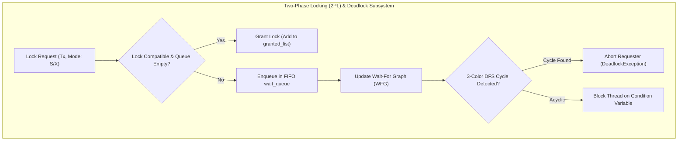
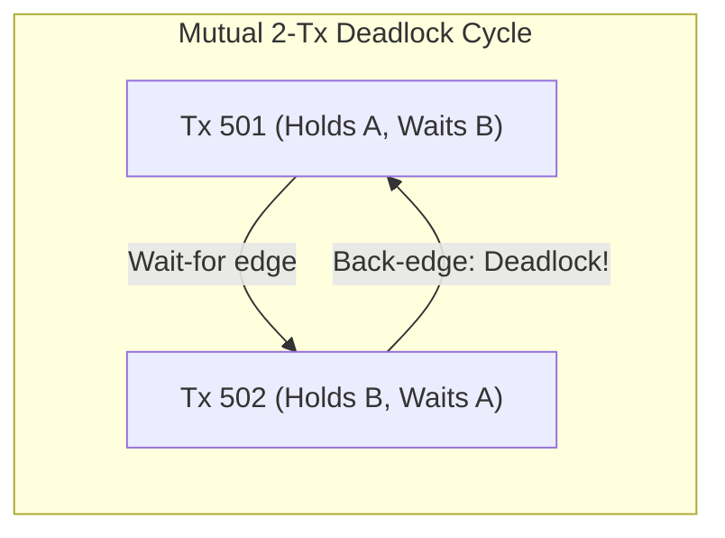
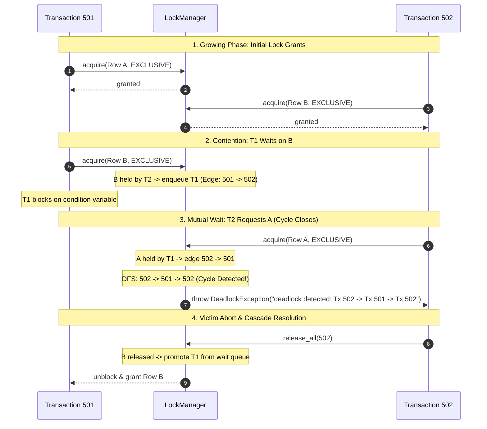

# Item 25: Two-Phase Locking (2PL) & Wait-For Graph Deadlock Detection

**Confidence**: `verified`  
**Citations**: [include/pg/lock.h:1-210](file:///c:/Users/jerie/Documents/GitHub/cpp-postgres/include/pg/lock.h), [src/lock.cpp:1-240](file:///c:/Users/jerie/Documents/GitHub/cpp-postgres/src/lock.cpp), [include/pg/session.h:1-45](file:///c:/Users/jerie/Documents/GitHub/cpp-postgres/include/pg/session.h), [tests/test_locks.cpp:1-200](file:///c:/Users/jerie/Documents/GitHub/cpp-postgres/tests/test_locks.cpp)

---

## 1. Concurrency Control: MVCC + Strict 2PL

In a relational database, MVCC (Multi-Version Concurrency Control) provides snapshot isolation for read queries: readers never acquire read locks and never block writers, and writers never block readers.

However, when two or more transactions concurrently attempt to modify the same physical tuple version (write-write conflict), MVCC alone cannot prevent lost updates. PostgreSQL enforces serializability of conflicting operations through **Strict Two-Phase Locking (Strict 2PL)** managed by the `LockManager` (`src/backend/storage/lmgr/`):

1. **Growing Phase**: Transactions acquire Shared (S) or Exclusive (X) locks on row versions (`CTID`) or relation tables during statement execution.
2. **Shrinking Phase**: All locks acquired by a transaction are held until transaction termination (`COMMIT` or `ROLLBACK`), where they are released atomically in bulk (`release_all(tx_id)`). This prevents cascading aborts and guarantees serializability.



---

## 2. Lock Compatibility Matrix & Lock Head

The `LockManager` maintains an in-memory hash table mapping each `LockResource` (Row `CTID` or Relation ID) to a `LockHead`. Each `LockHead` tracks a list of active holders (`granted_list`) and an ordered FIFO wait queue (`wait_queue`).

```
+---------------------+-------------------+---------------------+
| Requested Mode      | Existing SHARED   | Existing EXCLUSIVE  |
+---------------------+-------------------+---------------------+
| SHARED (S)          | GRANT (Compatible)| WAIT (Incompatible) |
| EXCLUSIVE (X)       | WAIT (Incompatible)| WAIT (Incompatible) |
+---------------------+-------------------+---------------------+
```

### FIFO Ordering Invariant
To prevent starvation where continuous incoming Shared lock requests starve an Exclusive lock writer, the `LockManager` strictly enforces FIFO queueing: if the `wait_queue` is non-empty, incoming Shared requests are enqueued behind earlier Exclusive requests rather than jumping ahead.

---

## 3. Wait-For Graph (WFG) & DFS Cycle Detection

When a transaction blocks in the wait queue, it introduces dependencies on all current lock holders:
$$E = \{ (T_{\text{waiter}} \to T_{\text{holder}}) \mid T_{\text{waiter}} \in \text{wait\_queue}(R), T_{\text{holder}} \in \text{granted\_list}(R) \}$$

A deadlock occurs if and only if the directed graph $G = (V, E)$ contains a cycle.

### 3-Color Depth-First Search (DFS)
The `LockManager` executes a 3-color topological cycle detection algorithm whenever a transaction is about to block:
- **WHITE (0)**: Node unvisited.
- **GRAY (1)**: Node currently on the active recursion call stack.
- **BLACK (2)**: Node and all descendants fully explored.

If DFS encounters an edge pointing to a **GRAY** node, a back-edge is confirmed, proving a directed cycle.



---

## 4. Sequence Diagram: Deadlock Detection & Victim Abort


