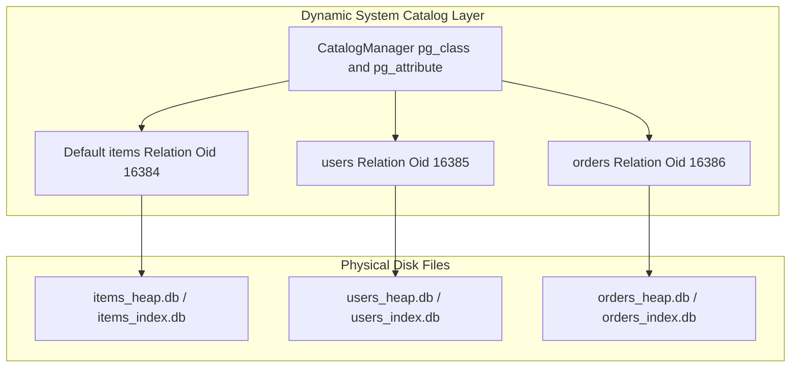
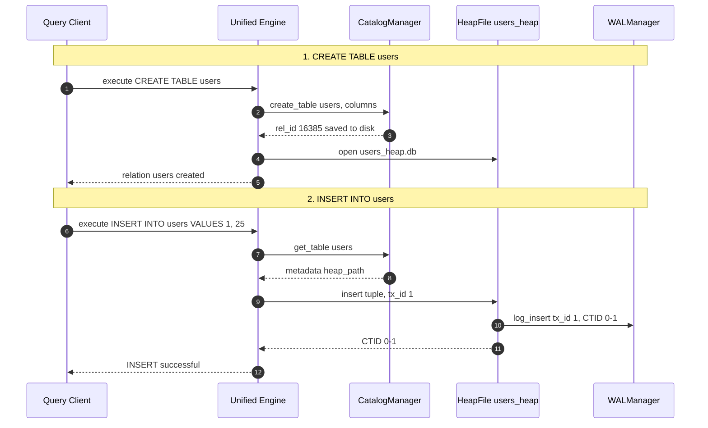

# Item 26: Dynamic Catalogs & Multi-Table DDL (`pg_class`, `pg_attribute`)

**Confidence**: `verified`  
**Citations**: [include/pg/catalog.h:1-65](file:///c:/Users/jerie/Documents/GitHub/cpp-postgres/include/pg/catalog.h), [src/catalog.cpp:1-120](file:///c:/Users/jerie/Documents/GitHub/cpp-postgres/src/catalog.cpp), [include/pg/engine.h:75-115](file:///c:/Users/jerie/Documents/GitHub/cpp-postgres/include/pg/engine.h), [src/engine.cpp:550-670,710-840](file:///c:/Users/jerie/Documents/GitHub/cpp-postgres/src/engine.cpp), [tests/test_catalog.cpp:1-150](file:///c:/Users/jerie/Documents/GitHub/cpp-postgres/tests/test_catalog.cpp)

---

## 1. Hardcoded Relations vs. Dynamic System Catalogs

In a relational database system, the schema is not immutable or hardcoded into the binary. In classical PostgreSQL (`src/include/catalog/`), relation descriptors, attribute definitions, types, and constraints are maintained as metadata records within **System Catalogs**:
- `pg_class`: Catalogs every table, index, sequence, and view with attributes such as relation name (`relname`), object identifier (`Oid`), physical file node (`relfilenode`), and page count.
- `pg_attribute`: Catalogs individual columns within each relation, tracking column name (`attname`), data type (`atttypid`), column length (`attlen`), and ordinal position (`attnum`).

Milestone 26 elevates our engine from a single-table prototype into a full multi-relation storage engine supporting dynamic schema definition (`CREATE TABLE`), schema inspection (`SHOW TABLES`, `DESCRIBE`), table drop (`DROP TABLE`), and physical file isolation.



---

## 2. Dynamic DDL Lifecycle & Storage Isolation

When a DDL statement is executed, the `Engine` coordinates with the `CatalogManager` and the storage subsystem:

1. **`CREATE TABLE <name> (<columns>)`**:
   - Assigns a monotonically increasing relation OID starting at `16384` (PostgreSQL's `FirstNormalObjectId`).
   - Registers relation metadata in `<db_prefix>_catalog.db`.
   - Initializes dedicated physical storage files (`<prefix>_<name>_heap.db` and `<prefix>_<name>_index.db`).
   - Binds the new relation into the dynamic relation cache with active WAL logging and buffer pool management.
2. **`DROP TABLE <name>`**:
   - Validates that system-critical relations (e.g., `items`) cannot be dropped.
   - Closes and flushes cached `HeapFile` and `DiskBTree` instances.
   - Deletes underlying physical `.db` files from disk.
   - Removes schema records from the system catalog.

---

## 3. Sequence Diagram: Multi-Table Creation & Isolated Insertion



---

## 4. SQL REPL & Schema Inspection Commands

The SQL parser dynamically detects and formats catalog inspection and DDL queries:

```sql
-- Create dynamic schema relation
CREATE TABLE users (user_id INT, age INT);

-- List all registered relations
SHOW TABLES;

-- Output:
+--------+----------------------+
| Rel ID | Relation Name        |
+--------+----------------------+
|  16384 | items                |
|  16385 | users                |
+--------+----------------------+
(2 relations)

-- Inspect column schema
DESCRIBE users;

-- Output:
Table "users" (oid=16385):
+-----+----------------------+------+--------+
| Pos | Column Name          | Type | Length |
+-----+----------------------+------+--------+
|   1 | user_id              |  INT |      4 |
|   2 | age                  |  INT |      4 |
+-----+----------------------+------+--------+
```
