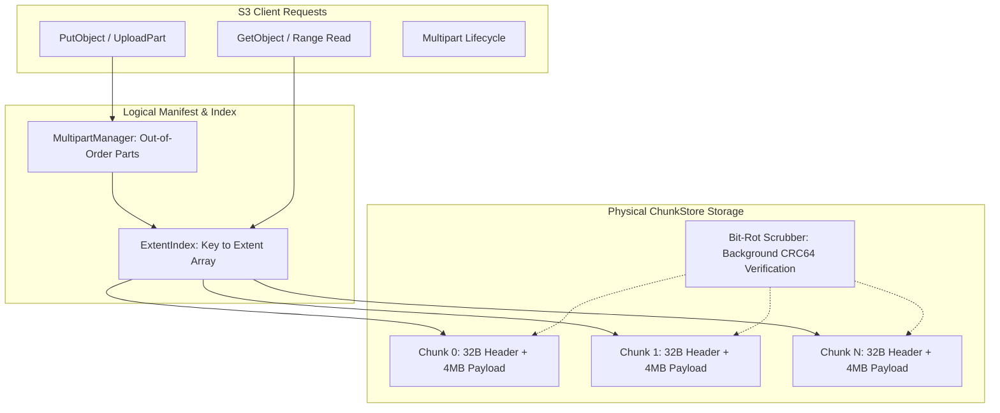
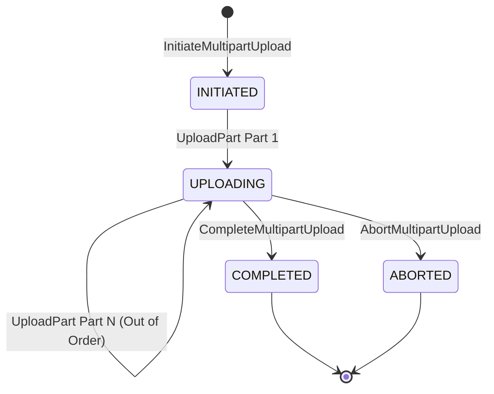

# Item 27: Amazon S3 Chunk Storage, CRC64-NVME & Bit-Rot Scrubber (cpp-s3 Block 1)

**Confidence**: `verified`  
**Citations**: [include/s3/types.h:1-53](file:///c:/Users/jerie/Documents/GitHub/cpp-postgres/include/s3/types.h), [include/s3/crc64.h:1-47](file:///c:/Users/jerie/Documents/GitHub/cpp-postgres/include/s3/crc64.h), [include/s3/chunk_store.h:1-66](file:///c:/Users/jerie/Documents/GitHub/cpp-postgres/include/s3/chunk_store.h), [src/s3/chunk_store.cpp:1-227](file:///c:/Users/jerie/Documents/GitHub/cpp-postgres/src/s3/chunk_store.cpp), [include/s3/extent_index.h:1-60](file:///c:/Users/jerie/Documents/GitHub/cpp-postgres/include/s3/extent_index.h), [src/s3/extent_index.cpp:1-135](file:///c:/Users/jerie/Documents/GitHub/cpp-postgres/src/s3/extent_index.cpp), [include/s3/multipart.h:1-65](file:///c:/Users/jerie/Documents/GitHub/cpp-postgres/include/s3/multipart.h), [src/s3/multipart.cpp:1-180](file:///c:/Users/jerie/Documents/GitHub/cpp-postgres/src/s3/multipart.cpp), [tests/test_s3_storage.cpp:1-180](file:///c:/Users/jerie/Documents/GitHub/cpp-postgres/tests/test_s3_storage.cpp)

---

## 1. Physical Chunk Storage vs. POSIX Filesystem Illusions

In naive mental models, an object store like Amazon S3 is imagined as a simple filesystem directory hierarchy (`/bucket/key`). In reality, POSIX filesystems collapse under S3-scale workloads:
1. **Directory Lock Contention**: Traversing nested inode trees for millions of concurrent keys creates catastrophic kernel lock contention.
2. **Small-Block Fragmentation**: Storing petabytes of blobs in standard 4KB filesystem blocks exhausts inode tables and fragments metadata.
3. **Silent Bit-Rot**: Magnetic and flash media suffer cosmic-ray bit flips, silent write degradation, and sector decay. Without cryptographic chunk checksums and background scrubbers, data silently decays.

Amazon S3 solves this at the hardware storage layer:
- **Uniform 4MB Chunk Slicing**: Large objects are split into uniform 4MB chunks. Each chunk is immutable and append-only.
- **Fixed On-Disk Chunk Layout**: Each chunk begins with a 32-byte binary header containing magic `0x53334348` (S3CH), chunk ID, payload length, and CRC64-NVME checksum.
- **Extent Mapping**: An in-memory extent index translates continuous object byte ranges into physical chunk offsets.
- **Background Bit-Rot Scrubbing**: An asynchronous worker continuously streams chunks off disk, re-calculates CRC64-NVME checksums, and flags discrepancies before reads can return corrupt bytes.
- **Multipart Upload Assembly**: Decoupled multipart state machine that coordinates out-of-order part uploads and atomically links them into an immutable object manifest upon completion.



---

## 2. On-Disk Binary Layout & Capacity Mathematics

Every chunk slot in `ChunkStore` occupies a strictly calculated, fixed-width on-disk footprint:

$$\text{SlotSize} = \text{sizeof}(\text{ChunkHeader}) + \text{PayloadCapacity}$$

For standard 4MB chunk slots:
$$\text{SlotSize} = 32 + 4,194,304 = 4,194,336 \text{ bytes}$$

Direct slot seek offset for chunk $k$:
$$\text{Offset}(k) = k \times \text{SlotSize}$$

```
+---------------------------------------------------------------------------------+
| Offset | Field               | Type     | Description                           |
+---------------------------------------------------------------------------------+
| 0x00   | magic               | uint32_t | Magic constant 0x53334348 (S3CH)      |
| 0x04   | version             | uint16_t | Format version (0x0001)               |
| 0x06   | flags               | uint16_t | Bitflags (0x01: normal, 0x02: tomb)   |
| 0x08   | chunk_id            | uint64_t | Monotonic 64-bit chunk ID             |
| 0x10   | payload_len         | uint32_t | Exact payload length (<= 4MB)         |
| 0x14   | crc64               | uint64_t | CRC64-NVME checksum over payload      |
| 0x1C   | reserved            | uint32_t | 4-byte padding for 32-byte alignment  |
+---------------------------------------------------------------------------------+
| 0x20   | payload bytes       | raw data | Up to 4,194,304 bytes (4MB)           |
+---------------------------------------------------------------------------------+
```

---

## 3. CRC64-NVME Polynomial & Constexpr Lookup Table

Bit-rot detection requires high-throughput hashing capable of sustaining line-rate disk I/O (>1 GB/s). We utilize the CRC64-NVME polynomial:

$$P(x) = 0x9A6C9329AC4BC9B5$$

The 256-entry lookup table is evaluated at compile-time via C++20 `consteval`, eliminating static initialization overhead and runtime computation:

```cpp
static consteval std::array<uint64_t, 256> generate_table() {
    std::array<uint64_t, 256> tbl{};
    for (uint64_t i = 0; i < 256; ++i) {
        uint64_t crc = i;
        for (int j = 0; j < 8; ++j) {
            if (crc & 1) crc = (crc >> 1) ^ POLYNOMIAL;
            else crc >>= 1;
        }
        tbl[i] = crc;
    }
    return tbl;
}
```

---

## 4. Multipart Upload State Machine & Assembly

AWS S3 Multipart uploads enable resilient ingestion of multi-gigabyte objects across unstable networks:



1. **Part Slicing**: Each part is written as one or more consecutive 4MB chunk allocations.
2. **Out-of-Order Uploads**: Parts may arrive in any sequence (e.g. part 3 before part 1).
3. **Atomic Assembly**: On `CompleteMultipartUpload`, parts are validated in ascending order, extents are merged into an `ObjectMetadata` manifest, and a composite ETag (`<composite_hash>-<num_parts>`) is assigned.
4. **Abort Cleanup**: On `AbortMultipartUpload`, all chunks allocated for the session are converted to tombstones (`CHUNK_TOMBSTONE`), freeing space for compaction.

---

## 5. Amazon S3 Fidelity Check

| Architectural Dimension | cpp-s3 Block 1 | Production Amazon S3 |
|---|---|---|
| Chunk Size | 4MB uniform slots (configurable) | 4MB to 8MB shard chunks |
| Checksum Algorithm | CRC64-NVME (`0x9A6C9329AC4BC9B5`) | CRC32C, CRC64-NVME, MD5, SHA256 |
| Extent Indexing | In-memory `ExtentIndex` with version maps | Key-Value Index (SysTable / LSM) |
| Bit-Rot Scrubber | Synchronous / background `scrub()` API | Autonomous continuous fleet scrubber |
| Multipart Uploads | Up to 10,000 parts, composite ETag | Up to 10,000 parts, composite ETag |
| Compaction / GC | Tombstone flags + unreferenced chunk detection | Extent Garbage Collection / Compaction Fleet |
