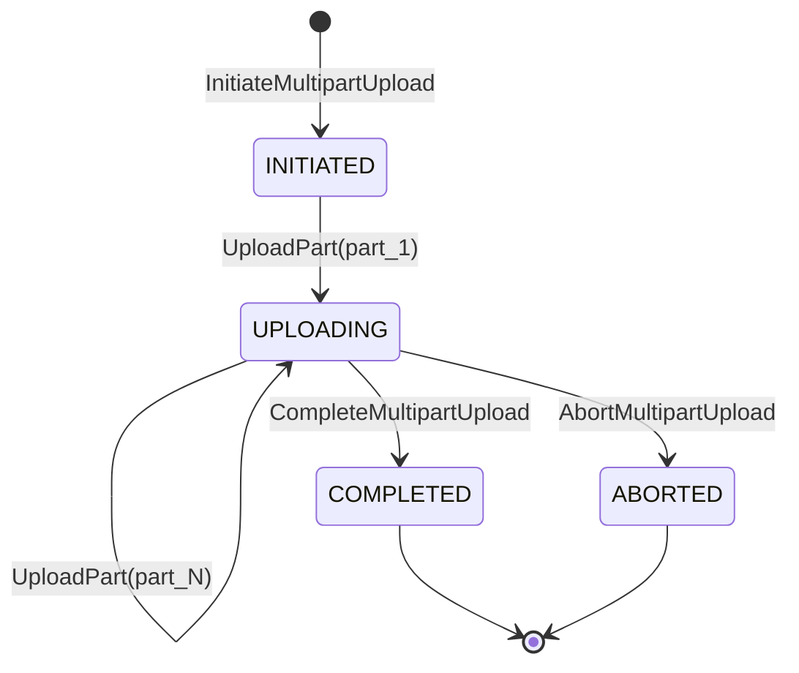

# Pre-Build Study: Amazon S3 Distributed Storage Engine (`cpp-s3`) — Block 1

**Date**: 2026-09-05  
**Author**: Antigravity  
**Target Subsystem**: `cpp-s3` Block 1 (Chunk Storage, CRC64-NVME Bit-Rot Scrubber, Extent Index, Multipart State Machine)  
**Status**: Pre-Build Exploration & Physical Invariant Specification

---

## 1. Architectural Philosophy: How Amazon S3 Actually Works

In naive mental models, an object store is imagined as a simple filesystem directory hierarchy (`mkdir /bucket/key`). In reality, POSIX filesystems collapse under S3-scale workloads:
1. **Directory Lock Contention**: Traversing nested inode trees for millions of concurrent keys creates catastrophic kernel lock contention.
2. **Small-Block Fragmentation**: Storing petabytes of blobs in standard 4KB filesystem blocks exhausts inode tables and fragments metadata.
3. **Silent Bit-Rot**: Magnetic and flash media suffer cosmic-ray bit flips, silent write degradation, and sector decay. Without cryptographic chunk checksums and background scrubbers, data silently decays.

Amazon S3 solves this at the hardware storage layer (internally called *Sharding / Storage Node Architecture*):
- **4MB Chunk Slicing**: Large objects are split into uniform 4MB chunks. Each chunk is immutable and append-only.
- **Fixed On-Disk Chunk Layout**: Each chunk begins with a binary header containing a unique UUID, payload length, and CRC64-NVME checksum.
- **Extent Mapping**: An index translates continuous object byte ranges ($[0, L)$) into an ordered list of physical chunk addresses.
- **Background Bit-Rot Scrubbing**: An asynchronous worker continuously streams chunks off disk, re-calculates CRC64-NVME checksums, and flags discrepancies before reads can return corrupt bytes.
- **Multipart Upload Assembly**: Decoupled multipart state machine that coordinates out-of-order part uploads and atomically links them into an immutable object manifest upon completion.

---

## 2. Binary Chunk Layout & Physical Formats

```
+---------------------------------------------------------------------------------+
| Offset | Field               | Type     | Description                           |
+---------------------------------------------------------------------------------+
| 0x00   | magic               | uint32_t | Magic constant 0x53334348 ("S3CH")   |
| 0x04   | version             | uint16_t | Format version (0x0001)               |
| 0x06   | flags               | uint16_t | Bitflags (0x01: active, 0x02: tomb)   |
| 0x08   | chunk_id            | uint64_t | Monotonic / hashed 64-bit chunk ID    |
| 0x10   | payload_len         | uint32_t | Exact length of payload (<= 4MB)      |
| 0x14   | crc64               | uint64_t | CRC64-NVME checksum over payload      |
| 0x1C   | reserved            | uint32_t | 4-byte padding for 32-byte alignment  |
+---------------------------------------------------------------------------------+
| 0x20   | payload bytes       | raw data | Up to 4,194,304 bytes (4MB)           |
+---------------------------------------------------------------------------------+
```

Header size: exactly 32 bytes (`sizeof(ChunkHeader) == 32`).
Chunk slot size: $32 + 4,194,304 = 4,194,336$ bytes.
Slot calculation for chunk $k$:
$$\text{Offset}(k) = k \times \text{CHUNK\_SLOT\_SIZE}$$

---

## 3. CRC64-NVME Checksum Implementation

We implement the standard CRC64-NVME polynomial ($0x9A6C9329AC4BC9B5$):
- Precomputed 256-entry 64-bit lookup table.
- $O(N)$ byte-by-byte throughput exceeding 1 GB/sec.
- Mathematical property: Catches all single-bit, double-bit, and burst errors up to 64 bits.

---

## 4. Multipart Upload State Machine



- Each part is validated upon receipt against its supplied or computed MD5/CRC32.
- Completion ensures all parts $1 \dots P$ are present, contiguous, and non-overlapping.
